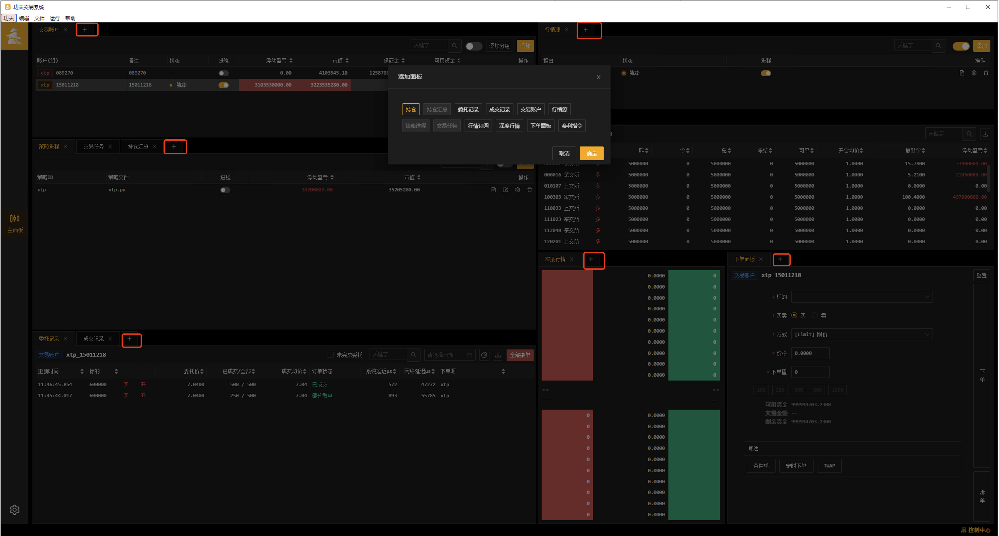
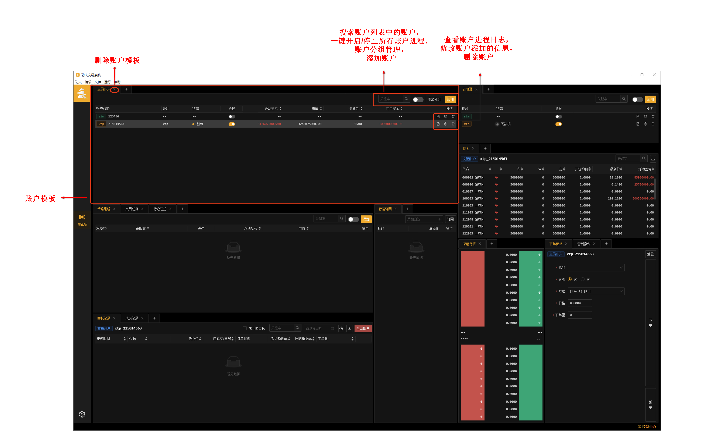
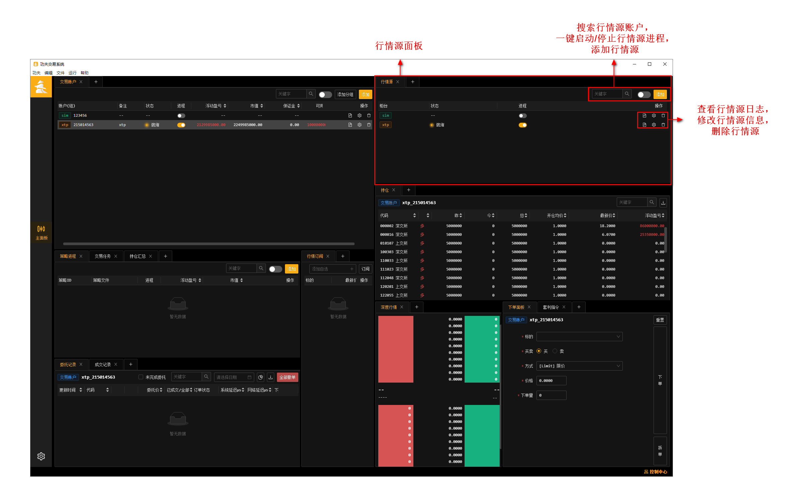

上手指导
=========

注意事项:

- 安装新版本之前,需要将旧版本先卸载.

- 定时任务中建议策略启动时间提前想要运行的时间一分钟
    - 原因 : 策略启动一般会有一到两秒准备时间,随着系统当天运行的时间得增长，交易系统内数据的增多，策略启动准备时间也会相应增长，但一般10s就可以开始交易,为了最大程度保护策略的正常运行,建议提前一分钟启动.

- 名词解释 :
    - TD : 交易账户 , 添加TD就是添加交易账户信息.
    - MD : 行情源账户 , 添加MD就是添加行情源信息.(每个柜台同时只能存在一个行情源)
    - strategy : 策略 , 添加strategy就是添加策略信息
    - KF_home文件夹 : 功夫软件中添加的账户/行情/策略/定时任务/交易日志/数据等信息所在
    - KF_home文件所在 : 功夫软件左上角--文件--打开功夫资源目录(KF_HOME)

界面布局
-------------

 - KungFu是一款支持跨柜台多账户交易的量化交易系统，系统目前支持的柜台有：XTP（股票），CTP（期货），后续会不断添加对其他柜台的支持。

 - 为了方便用户对账户进行管理，我们在系统内提供了账户模块，在账户模块中，用户可以对账户进行添加、编辑以及删除，也可以查看每一个账户的实时运行状态、运行日志、持仓情况、委托情况、成交情况以及盈亏情况。

 - 添加一个账户在kungfu交易系统中，一个账户由一个行情进程（md）以及一个交易进程（td）组成，行情进程用来接受行情，交易进程用来下撤单。

添加面板
~~~~~~~~~~~~~
 - 在每个面板的名称旁边,都有个 + (如下图红框位置) 标识 , 这个就是添加面板标识. 为使前端界面整洁,会隐藏某个功能面板,点击 + 可以展示隐藏的面板.反之点击面板名称旁边的 ×,可以隐藏面板

设置交易环境
-------------

添加账户
~~~~~~~~~~~~~

添加账户步骤:

- 点击账户面板交易账户列表左上角的添加按钮
- 选择账户对应的柜台
- 填写账户信息表单，点击确定
- 操作成功后，交易账户面板列表中会新增刚添加账户的交易进程.

启动交易进程
~~~~~~~~~~~~~

添加完账户后，交易账户列表会出现一条新的交易进程，需要保证其正常运行，才能正常进行交易，点击交易账户列表内的进程按钮,并且状态为 “就绪” 后,交易进程会与交易柜台进行连接，从交易柜台中获取该账户最新的资金与持仓信息，并同步到KungFu系统的数据库中.

添加行情
~~~~~~~~~~~~~

- 点击行情源面板左上角的添加按钮

- 选择账户对应的柜台

- 填写账户信息表单，点击确定

- 操作成功后，行情源列表中会新增刚添加行情的交易进程.

- 每个柜台同时只能存在一个行情源

启动行情进程
~~~~~~~~~~~~~

.. image:: _images/行情开启.png
   :width: 1500px
   :height: 1000px

行情进程的运行用来保证策略能够接收到行情，点击行情源列表内的进程按钮，启动行情进程,状态为”就绪”,表示连接上了行情柜台.

设置策略
--------------

.. image:: _images/策略面板.png
   :width: 1500px
   :height: 1000px

添加策略
~~~~~~~~~~~~~

- 进入策略面板，点击策略列表的添加按钮

- 输入策略的名称 ,添加成功后，策略名称不能修改，选择策略绑定的本地文件

- 添加成功后，点击运行按钮

功夫系统本质上是为策略程序提供了一个运行环境。在系统中，每一个策略都是运行在一个单独的进程里，通过策略列表的开关进行管理，策略运行时打印的日志及交易实时数据都会呈现在系统中。

备注：

- 策略所在位置要和功夫系统安装目录在同一个盘符下面

- 在启动策略之前，需要保证策略使用的行情/交易进程连接处于就绪状态

启动/关闭策略
~~~~~~~~~~~~~

    进入策略面板，点击策略进程按钮,开启策略.关闭策略,点击正在运行的策略进程,关闭进程

账户/行情对应字段
------------------

sim柜台
~~~~~~~~~~~~~~~~~~~~~

 - sim的交易账户柜台(td),只需填写账户(随意填写)与撮合模式 ,行情源柜台(md)选择sim柜台后回车即可,无需填写信息

ctp交易柜台账户信息
~~~~~~~~~~~~~~~~~~~~~

.. list-table::
   :header-rows: 1
   :width: 1000px

   * - 字段
     - 字段含义
   * - account_name
     - 账户别名（例如：ctp测试）
   * - account_id
     - 账户名称（例如：089270）
   * - password
     - 账户密码（例如：123456）
   * - broker_id
     - 券商代码（例如：9999）
   * - auth_code
     - 授权码，实盘由券商提供，模拟盘为 0000000000000000
   * - product_info
     - 软件信息，KUNGFU
   * - app_id
     - 申请授权码的时候提交的id，实盘填写 TAURUS_KUNGFU_2.0，模拟盘填写 simnow_client_test
   * - td_uri
     - 交易柜台地址 （以 “tcp://“ 开头）（例：tcp://180.168.146.187:11***）
   * - broker_marginRatio
     - 开启请求对应Broker保证金比例,不开启则使用交易所默认保证金比例
   * - sync_external_order
     - 开启后则同步用户在其他交易软件的订单
   * - License Code
     - 账户授权码 (官网上方–许可购买)

ctp行情柜台信息
~~~~~~~~~~~~~~~~~~

.. list-table::
   :header-rows: 1
   :width: 1000px

   * - 字段
     - 字段含义
   * - account_id
     - 账户名称（例如：089270）
   * - password
     - 账户密码（例如：123456）
   * - broker_id
     - 券商代码（例如：9999）
   * - td_uri
     - 交易柜台地址 （以 “tcp://“ 开头）（例：tcp://180.168.146.187:11***）

xtp交易柜台账户信息
~~~~~~~~~~~~~~~~~~~~~

.. list-table::
   :header-rows: 1
   :width: 1000px

   * - 字段
     - 字段含义
   * - account_name
     - 账户别名（例如：ctp测试）
   * - account_id
     - 账户名称
   * - password
     - 账户密码
   * - software_key
     - 用户开发软件Key
   * - td_ip
     - 交易柜台IP地址
   * - td_port
     - 交易柜台端口
   * - client_id
     - 1~99任意数字，用于区分同一账户多点登陆
   * - sync_external_order
     - 开启后则同步用户在其他交易软件的订单
   * - License Code
     - 账户授权码 (官网上方–许可购买)

xtp行情柜台信息
~~~~~~~~~~~~~~~~~~

.. list-table::
   :header-rows: 1
   :width: 1000px

   * - 字段
     - 字段含义
   * - account_id
     - 账户名称
   * - password
     - 账户密码
   * - md_ip
     - 行情柜台IP地址
   * - md_port
     - 行情柜台端口
   * - protocol
     - 接收行情协议 TCP或者UDP
   * - buffer_size
     - 设置采用UDP协议时的接受缓冲区大小
   * - client_id
     - 1~99任意数字，用于区分同一账户多点登陆