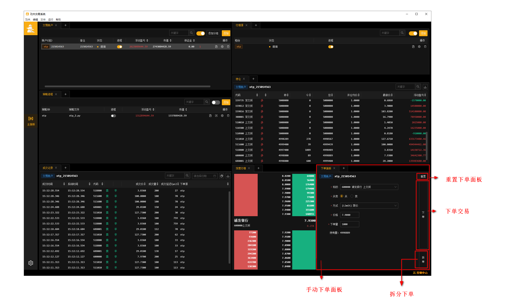

客户端使用手册
================

交易账户面板
---------------

在日常使用过程中，用户可以根据实际需要，在交易账户面板对系统内的账户进行维护，用户可以修改已有的账户信息，或者删除不需要的账户。

.. image:: _images/账户面板.png
   :width: 1500px
   :height: 1000px

账户修改
~~~~~~~~~

用户可以对已有账户的信息（除账户名外）进行修改，具体的点击账户的设置按钮后会有该账户的信息表单，修改完成后保存；如果账户的交易柜台连接处于开启状态，修改成功后，需要手动重启该账户的交易连接后，修改才能生效。

账户日志
~~~~~~~~~

用户可以点击账户后面的运行日志按钮，在新的窗口打开账户的实时运行日志，方便用户实时地监控账户的运行情况

账户删除
~~~~~~~~~

在交易账户列表，点击删除按钮可以删除不需要的交易账户，但是，在删除交易账户之前，需要保证：

- 需要删除的交易账户的交易连接已经关闭

需要注意的是，删除账户会把与该账户有关的所有信息都删除，其中包括账户委托记录、账户成交记录，账户交易日志等信息。

行情源面板
-------------------

行情进程的原理是绑定柜台下账户，从账户信息的的行情地址中获取行情，每个柜台同时只能存在一个行情源。

.. image:: _images/行情源面板.png
   :width: 1500px
   :height: 1000px

行情信息修改
~~~~~~~~~~~~~

用户可以对已有行情源的信息（除账户名外）进行修改，具体的点击行情源的设置按钮后会有该行情源的信息表单，修改完成后保存；如果行情源的交易柜台连接处于开启状态，修改成功后，需要手动重启该账户的交易连接后，修改才能生效。

行情日志
~~~~~~~~~

用户可以点击行情源后面的运行日志按钮，在新的窗口打开行情源的实时运行日志，方便用户实时地监控行情源的运行情况

行情删除
~~~~~~~~~

    删除前须确保要删除的行情源进程是关闭状态

策略面板
-------------

在KungFu交易系统中，策略模块相当于系统的策略池，用户可以根据实际需要，在策略模块中对已有策略进行编辑修改和删除，同时可以查看到每一个策略实时的持仓情况、委托情况、成交情况、盈亏情况以及交易日志。

更换策略文件
~~~~~~~~~~~~~

在实际使用中，如果用户需要修改策略的本地文件路径，可以点击策略右侧相应的设置按钮，重新绑定新的策略文件。

如果策略正在运行，需要重启策略后，策略新绑定的文件路径才能生效。

编辑策略代码
~~~~~~~~~~~~~

在KungFu交易系统中，内嵌了IDE，用户可以在KungFu系统中编写本地策略，点击策略右侧相应的编辑按钮，会有策略编辑IDE弹窗，在弹窗内，用户可以对策略绑定的本地文件进行编辑，在KungFu内嵌的IDE中，支持

删除策略
~~~~~~~~~~~~~

在删除不需要的策略之前，需要保证策略处于关闭状态，需要注意的是，策略删除成功后，系统会将该策略的所有相关信息都删除，其中包括策略持仓信息、策略委托信息、策略成交信息、策略盈亏信息、策略交易日志信息。

持仓面板
-------------------

在交易账户列表/策略列表选中需要查看持仓的账户/策略，在持仓面板就会显示该账户/策略订阅的持仓信息，其中包括：

- 代码：持仓标的的代码

- 多空：持仓的方向

- 昨：该标的的昨仓

- 今：该标的的今仓

- 总：该标的的总持仓

- 开仓均价

- 最新价

- 浮动盈亏

用户可以通过搜索标的代码来定位自己需要查看的标的持仓，可以通过点击导出按钮，导出账户的持仓明细

说明：账户的持仓信息会在启动账户的交易进程的时候，与该账户在交易柜台的持仓信息进行同步，并且保持每60秒同步一次，保证系统内会维护该账户的持仓信息保持正确.

持仓汇总面板
-------------------

持仓汇总会展示账户列表中所有开启过的账户的持仓信息.

委托面板
-------------------

在交易账户列表/策略列表，选中需要查看委托记录的账户/ 策略，在委托模块就可以看到该账户的委托记录。

在委托面板中，默认显示的是该账户/策略的全部委托；点击未完成委托按钮后，会显示该账户/策略当日所有的未完成委托记录; 用户可以通过点击导出按钮，导出该账户某一时间段内的历史委托记录;

- 更新时间：该笔委托的更新时间

- 代码：该笔委托的标的代码

- 买卖：该笔委托的买卖方向

- 开平：该笔委托对应的仓位开平方向

- 委托价：该笔委托对应的委托价格

- 已成交/全部：该笔委托已成交的数量与该笔委托的委托总量

- 订单状态：该笔委托当前的状态

- 系统延迟

- 网络延迟

- 下单源：触发该笔委托的下单方式

- × : 单独撤单

用户也可以通过搜索关键字的方式定位自己需要的委托记录，搜索的对象为委托记录里面的：

- 代码名称

- 策略名称

功夫量化交易系统支持用户对未完成委托进行撤单操作，点击全部撤单按钮后，系统会对当前该账户的所有未完成订单进行撤单操作；

委托订单状态对应表
~~~~~~~~~~~~~~~~~~

.. list-table::
   :header-rows: 1

   * - 字段
     - 字段说明
   * - 等待
     - 委托订单请求已发送，等待柜台返回信息，非最终状态
   * - 错误
     - 委托订单请求失败，最终状态
   * - 全部成交
     - 委托订单请求已全部成交，最终状态
   * - 全部撤销
     - 委托订单请求已全部撤销，最终状态
   * - 部分撤销部分成交
     - 委托订单部分撤销部分成交，最终状态

委托统计
~~~~~~~~~~

委托统计可以清晰的表现委托情况

注意 :

- 委托统计数量：下单的数量

- 委托价统计：以标的为主,相同标的为一条

成交面板
------------

在交易账户列表/策略列表，选中需要查看成交记录的账户/ 策略，在成交面板就可以看到该账户的面板记录。

在当日成交记录中，我们展示了每一笔成交记录的：

- 成交时间：该笔交易完成的时间

- 系统时间

- 代码：该笔交易的标的代码

- 买卖：该笔交易的买卖方向

- 开平：该笔交易对应的仓位开平方向

- 成交价：该笔交易标的的成交价格

- 成交量：该笔交易标的的成交数量

- 成交延迟

- 目标账户

用户可以通过点击导出按钮，导出某一时间段内的该账户的成交记录；

用户也可以通过搜索关键字的方式定位自己需要的成交记录，搜索的对象为成交记录里面的：

- 标的代码

- 策略

成交统计
~~~~~~~~~

.. image:: _images/成交统计.png
   :width: 1500px
   :height: 1000px

成交统计可以清晰的表现成交情况

注意 :

- 成交统计数量：下单后成交的数量

- 成交价统计：以标的为主,相同标的为一条

行情订阅面板
--------------

行情订阅面板可以单独订阅某个标的展示其行情信息

深度行情面板
-------------

深度行情面板展示了标的价格走势以及对应价格市场的交易数量

点击持仓面板中标的代码/行情订阅/持仓汇总的时候深度行情面板也会联动展示.

下单面板
-----------

下单面板用于手动下单交易

点击持仓面板中标的代码/行情订阅/持仓汇总的时候下单面板也会联动填写下单部分信息

套利指令面板
-----------------

套利指令面板用于下单交易套利交易

控制中心面板
----------------

为了方便用户实时监控系统进程和账户的交易连接状态以及柜台的行情,策略的连接状态，在系统页面的右下角设置了账户状态监控浮窗.

账户监控
~~~~~~~~~~~~

用户还可以在状态浮窗中启停账户的交易连接以及柜台的行情连接以及策略

进程监控
~~~~~~~~~~~~~

用户可以实时地监控功夫交易系统的主控进程,存储服务以及计算服务的状态.

如果发现进程出现报错，用户可以打开进程的运行日志，通过详细的运行日志，定位进程报错的原因；

全局设置面板
----------------

点击左下角按钮或者左上角的功夫-设置进入全局设置

系统设置
~~~~~~~~~~~~~~

- 全局日志级别 ：对系统内所有日志级别进行设置，低于设置级别不展示

- 语言 ：前端使用语言(修改后需重启功夫)

- 交易进程自动重启 : 交易进程断开时是否自动重启, 如果打开, 则当交易进程出错后, 会尝试重连三次, 如果关闭, 则不会；在重启过程中（重启开始到交易进程就绪）, 策略内查询到的持仓会为0, 需要在策略内通过 on_deregister, on_broker_state_change这两个方法来判断柜台状态是否断开/重启就绪

- 跳过归档 : 仅删除上个交易日留下的journal与log文件, 不再压缩打包, 归档后无法恢复之前的内存数据, 会加快启动速度

性能
~~~~~~~~~~~~~~

- 开启极速模式 ：开启极速模式会极大的降低系统延迟, 并会使 CPU 使用效率达到100%, 重启后生效

- 跳过UI进程计算 ：UI进程不再处理计算逻辑, 完全通过计算进程更新数据, 减轻UI进程性能占用, 重启后生效

- 纯监控模式 : 该模式下仅可监控进程运行状态, UI进行性能占用达到最低, 重启后生效

策略
~~~~~~~~~~~~~~

当某些模块在功夫内置的python中没有时，可以使用本地python，将所需模块下载到本地使用  **本地Python版本必须是 3.9.x 版本**

- 使用本地python ：开启后使用本地python

- 选择python路径 ：

    - 选择本地python的可执行程序

    - 安装.whl文件 ：进入功夫的安装目录，依次进入 Kungfu -> resources -> app -> dist -> public - > python文件夹，打开cmd ， pip install kungfu-2.4.0-xxxx.whl

交易
~~~~~~~~~~~~~~

- 成交提示音 ：下单成交时会发出提示音设置 : 进入全局设置

- 乌龙指阈值 ：

    - 系统在用户进行手动下单时，若委托方向为买入，当委托价高于 最新价 ×（1 + 阈值）时，系统会自动弹窗报警提醒，

    - 系统在用户进行手动下单时，若委托方向为卖出，当委托价低于 最新价 ×（1 - 阈值）时，系统会自动弹窗报警提醒.

- 平仓阈值 :

    - 系统在用户进行手动下单时，若买卖方向与交易标的头寸方向相反，同时委托量与交易标的持仓量相同，当委托量大于平仓提醒阈值时，系统弹窗提醒是否全部平仓.

- 交易限制 : 可以设置某个标的的成交量和单笔成交价

- 两融 : 开启会在账户面板中展示两融相关信息

代码编辑器
~~~~~~~~~~~~~~

- 缩进类别 ：使用“TAB”键还是"Space"键作为缩进按钮

- 缩进长度 ：以空格为标准，选择一个缩进的距离，可以选择两个空格或者四个空格.

期货手续费
~~~~~~~~~~~~~~

账户中拥有的持仓标的会请求交易所对应的手续费，没有持仓则需要设置.

定时启停
~~~~~~~~~~~~~~

- 使用定时起停 ：开启定时起停

- 定时起停任务列表 ：定时启动（停止） 账户进程/行情进程/策略进程，重启主控进程

- 注意 : 如果重启主控进程,并且启动其他进程(如:账户进程,行情源进程,策略进程),那么启动其他进程，要比重启主控进程晚至少1min以上