命令行使用手册
====================

简介
--------

功夫 CLI 系统是基于 Linux 操作系统的命令行监控交互界面，告别 Linux shell 小黑屋，通过简洁的界面，所有交易所需要数据一览无遗，操作灵活、简单。

安装
--------

下载含有KungFu-CLI功能的功夫交易系统Linux安装包 Kungfu-version.rpm 或者是 Kungfu-version.AppImage.

注意 : 安装包的具体名字要看下载的版本 (比如 : Kungfu-1.0.10-linux-x86_64-latest.rpm , Kungfu-1.0.10-linux-x86_64-latest.AppImage)

Kungfu-version.rpm 安装包，安装命令为

::

    yum install Kungfu-version.rpm
    # yum install Kungfu-1.0.10-linux-x86_64-latest.rpm

Kungfu-version.AppImage 安装包
    需要将 appimage 抽出，生成 squashfs-root 文件夹（该文件夹名称以系统生成为准），再将其内容复制到 /opt/Kungfu (如果opt下没有Kungfu文件夹,需要自己创建) 目录下

::

    ./Kungfu-version.AppImage --appimage-extract
    # ./Kungfu-1.0.10-linux-x86_64-latest.AppImage --appimage-extract

    cp -R squashfs-root/* /opt/Kungfu

在Linux系统安装成功后，需要把kungfu/resources/下的文件权限改为777

::

    sudo chmod 777 -R /opt/Kungfu/resources/

卸载
--------

安装新版本之前需要先卸载旧版本,不建议覆盖安装

::

    yum remove Kungfu

文件路径
--------

安装完成后，执行路径

::

    cd /opt/Kungfu/resources/kfc

KF_home资源目录(账户/行情信息/数据/key文件/日志文件/缓存等数据存放) 路径如下

::

    cd ~/.config/kungfu/home

日志存放 路径如下

::

    cd ~/.config/kungfu/home/logview/日期/

账户/行情/策略的添加信息存放路径

::

    cd ~/.config/kungfu/home/runtime/system/etc/kungfu/db/live/config.db

功能说明
--------

监控所有进程
~~~~~~~~~~~~

在KungFu CLI文件目录内，输入命令

::

    $ ./kfc cli monit

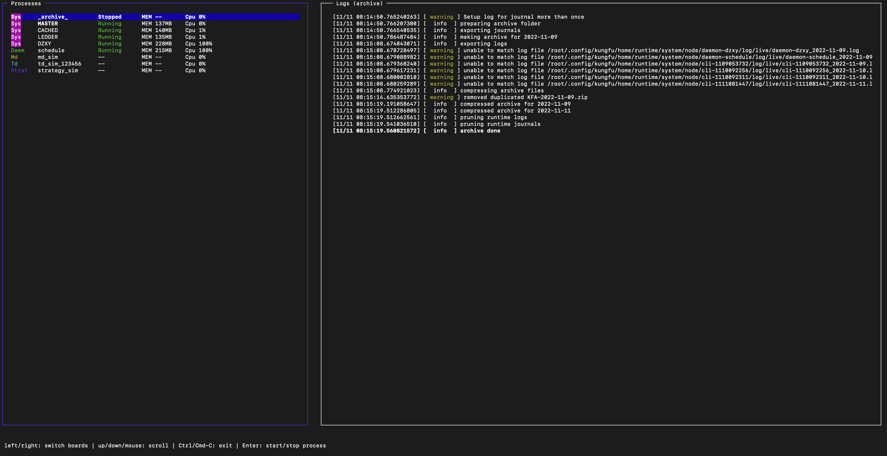

界面左侧会显示系统内所有的进程，其中包括：

- ARCHIVE : 归档进程

- MASTER：主控进程

- LEDGER：数据进程

- CACHED : 缓存进程

- DZXY : 斗转星移

- schedule : 定时启停任务进程

- MD：行情柜台进程

- TD：交易柜台进程

- Strat：策略进程

进程解释 :

 - 归档进程 : 把KF_HOME 里runtime下面所有journal跟log，打包到 KF_HOME/archive 目录下,然后压缩.

 - 主控进程 : 程序主进程.

 - 数据进程 : 管理行情数据,交易数据等.

 - 缓存进程 : 管理行情数据,交易数据等数据缓存

 - 斗转星移 : 为了不阻塞cli monit 的界面渲染,把性能消耗大的数据读取展示操作放在了单独的DZXY进程里,再通过进程通信把数据转到monit界面上.

 - 定时启停任务进程 : 管理所有定时任务

同时显示每一个进程对应的状态，通过上下键移动光标选择进程，选中后通过回车键可以启动或停止该进程；在界面右侧会显示进程的实时运行日志

master进程默认关闭，需要手动开启master进程后，系统才能正常运行。

开启 master进程, ARCHIVE / LEDGER / CACHED / DZXY 会同步开启.

**ARCHIVE 进程状态 "Stopped"是没关系的, 其他进程必须是 "Running" 才可以启动 td , md 进程**

**td , md 进程状态为就绪 "Ready" 才可以打开策略**

添加账户
~~~~~~~~~~~~

在KungFu CLI文件目录内，输入命令行

::

    $ ./kfc cli add

通过上下按键选择添加交易账户(td) / 行情(md) / 策略(strategy)，然后选择柜台,目前支持sim模拟柜台,CTP期货柜台以及XTP股票柜台，回车确定，然后输入对应的账户表单

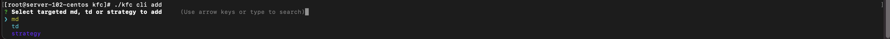

注意 :

 - 1.行情中同一柜台只能添加一个账户

 - 2.sim的交易账户柜台(td),只需填写账户(随意填写)与撮合模式 ,行情源柜台(md)选择sim柜台后回车即可,无需填写信息

ctp交易柜台(TD)账户信息

.. list-table::
   :header-rows: 1
   :width: 1000px

   * - 字段
     - 字段含义
   * - account_name
     - 账户别名（例如：ctp测试）
   * - account_id
     - 账户名称（例如：089270）
   * - password
     - 账户密码（例如：123456）
   * - broker_id
     - 券商代码（例如：9999）
   * - auth_code
     - 授权码，实盘由券商提供，模拟盘为 0000000000000000
   * - product_info
     - 软件信息，KUNGFU
   * - app_id
     - 申请授权码的时候提交的id，实盘填写 TAURUS_KUNGFU_2.0，模拟盘填写 simnow_client_test
   * - td_uri
     - 交易柜台地址 （以 “tcp://“ 开头）（例：tcp://180.168.146.187:11***）
   * - broker_marginRatio
     - 开启请求对应Broker保证金比例,不开启则使用交易所默认保证金比例
   * - sync_external_order
     - 开启后则同步用户在其他交易软件的订单
   * - license_code
     - 账户授权码 (官网上方–许可购买)

ctp行情柜台(MD)信息

.. list-table::
   :header-rows: 1
   :width: 1000px

   * - 字段
     - 字段含义
   * - account_id
     - 账户名称（例如：089270）
   * - password
     - 账户密码（例如：123456）
   * - broker_id
     - 券商代码（例如：9999）
   * - td_uri
     - 交易柜台地址 （以 “tcp://“ 开头）（例：tcp://180.168.146.187:11***）

xtp交易柜台(TD)账户信息

.. list-table::
   :header-rows: 1
   :width: 1000px

   * - 字段
     - 字段含义
   * - account_name
     - 账户别名（例如：ctp测试）
   * - account_id
     - 账户名称
   * - password
     - 账户密码
   * - software_key
     - 用户开发软件Key
   * - td_ip
     - 交易柜台IP地址
   * - td_port
     - 交易柜台端口
   * - client_id
     - 1~99任意数字，用于区分同一账户多点登陆
   * - sync_external_order
     - 开启后则同步用户在其他交易软件的订单
   * - license_code
     - 账户授权码 (官网上方–许可购买)

xtp行情柜台(MD)信息

.. list-table::
   :header-rows: 1
   :width: 1000px

   * - 字段
     - 字段含义
   * - account_id
     - 账户名称
   * - password
     - 账户密码
   * - md_ip
     - 行情柜台IP地址
   * - md_port
     - 行情柜台端口
   * - protocol
     - 接收行情协议 TCP或者UDP  (非必填)
   * - buffer_size
     - 设置采用UDP协议时的接受缓冲区大小(非必填)
   * - client_id
     - 1~99任意数字，用于区分同一账户多点登陆

添加策略
~~~~~~~~~~~~

在KungFu CLI文件目录内，输入命令

::

    $ ./kfc cli add

选择 strategy 添加策略

- strategy_id  (需保证该策略ID唯一)   : 输入策略id（不能与已有的策略id重复,不能带有下划线以及特殊符号）

- strategy_path : 策略文件所在的本地路径(路径为绝对路径,比如 : /home/strategy/demo.py)

删除账户/行情/策略信息
~~~~~~~~~~~~~~~~~~~~~~~~~~~

在KungFu CLI文件目录内，输入命令

::

    $ ./kfc cli remove

界面会显示当前系统内的所有交易账户(td)/行情(md)以及策略(strategy)，通过上下键移动光标，选中需要删除的，回车删除

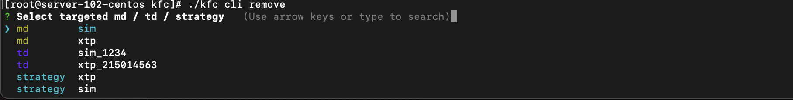

更改已添加的账户/行情/策略信息
~~~~~~~~~~~~~~~~~~~~~~~~~~~~~~~~

在KungFu CLI文件目录内，输入命令

界面会显示当前系统内的所有交易账户(td)/行情(md)以及策略(strategy)，通过上下键移动光标，选中需要更改的信息,回车确定.如果要更改某信息,比如地址,在到达地址选项的时候写入新地址后回车确定,如果不更改本信息,直接回车下一个.

::

    $ ./kfc cli update

展示已添加的账户/行情/策略信息
~~~~~~~~~~~~~~~~~~~~~~~~~~~~~~~~

在KungFu CLI文件目录内，输入命令

::

    $ ./kfc cli list

监控单进程
~~~~~~~~~~~~

在KungFu CLI文件目录内，输入命令
::

    $ ./kfc cli monit -l

界面显示系统内所有的账户进程以及策略进程，通过上下键移动光标选择需要监控的进程，回车确认

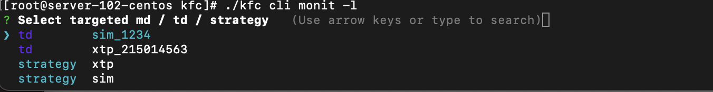

当选中账户进程，界面会显示该账户的详细情况，在界面的左上方会显示账户的行情进程状态以及交易进程状态，通过上下键移动光标，回车键进行启动和关闭进程

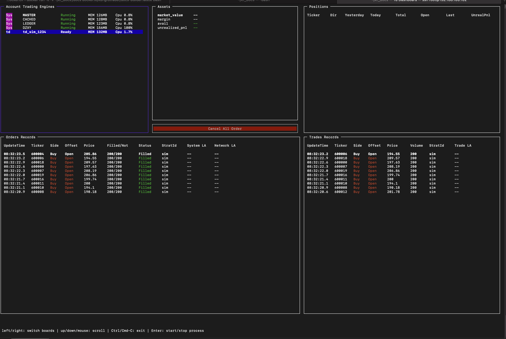

- :ref:`Assets窗口`，显示当前账户资金盈亏信息

- :ref:`Positions窗口`，显示当前账户的持仓信息

- :ref:`Order Records窗口`，显示该账户的委托记录

- :ref:`Trade Records窗口`，显示该账户的成交记录

- Cancel All Order：撤单按钮，选中撤单按钮后，通过回车键可以对该账户下所有未完成委托进行撤单操作

当选中策略进程，界面会显示该策略的详细情况，在界面的左上方会显示策略的运行情况，可以通过回车键进行启动和关闭进程

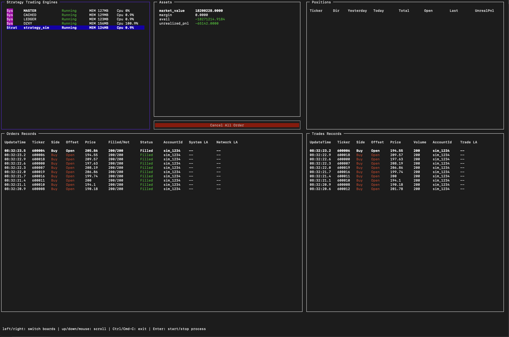

- :ref:`Assets窗口`，显示当前策略资金盈亏信息

- :ref:`Positions窗口`，显示当前策略的持仓信息

- :ref:`Order Records窗口`，显示该策略的委托记录

- :ref:`Trade Records窗口`，显示该策略的成交记录

- Cancel All Order：撤单按钮，选中撤单按钮后，通过回车键可以对该策略下所有未完成委托进行撤单操作

关闭功夫进程
~~~~~~~~~~~~~~~~~~~~~~

在KungFu CLI文件目录内，输入命令

::

    $ ./kfc cli shutdown

定时启停
~~~~~~~~~~~~~~

开启定时启停任务
^^^^^^^^^^^^^^^^^^

注意 :
    - **定时启停默认是关闭的,使用需要先开启**
    - **system 主控进程只能重启 , td/md/strategy 可以设置开启与停止**
    - **添加任务之后需要重启schedule进程**
    - **如果要 system/td/md/strategy  按顺序启动,每个之间时间间隔60s左右**

::

    $ ./kfc cli schedule active

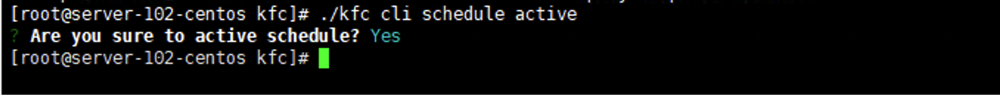

关闭定时启停任务
^^^^^^^^^^^^^^^^^

::

    $ ./kfc cli schedule  inactive

.. image:: _images/关闭启停_cli.png
   :width: 1500px
   :height: 150px

添加定时启停任务任务
^^^^^^^^^^^^^^^^^^^^^

::

    $ ./kfc cli schedule  add

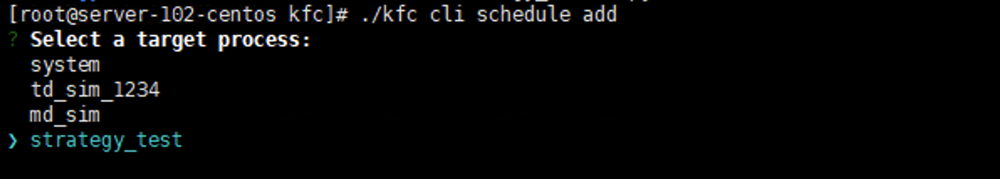

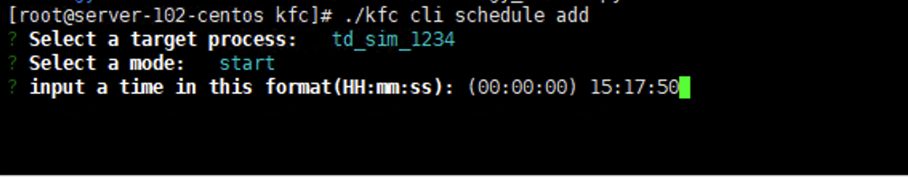

更改定时启停任务
^^^^^^^^^^^^^^^^^

::

    $ ./kfc cli schedule  update

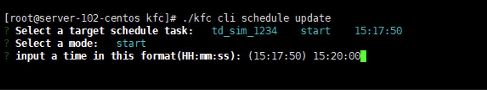

删除定时启停任务
^^^^^^^^^^^^^^^^^^

::

    $ ./kfc cli schedule  delete

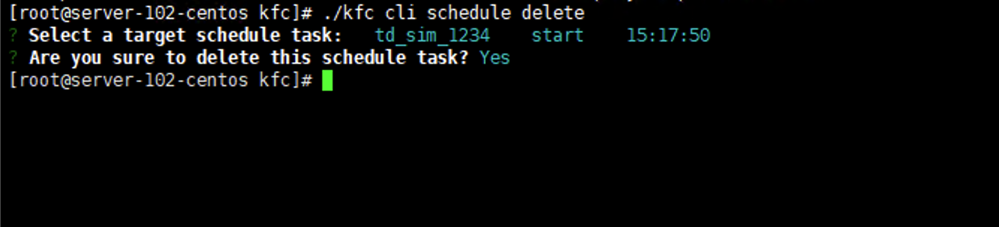

查看定时启停任务
^^^^^^^^^^^^^^^^^^

::

    $ ./kfc cli schedule  show

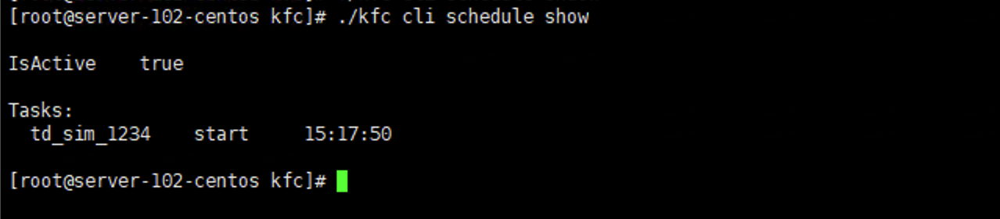

全局设置
~~~~~~~~~~~~~~

在KungFu CLI文件目录内，输入命令

::

    $ ./kfc cli config

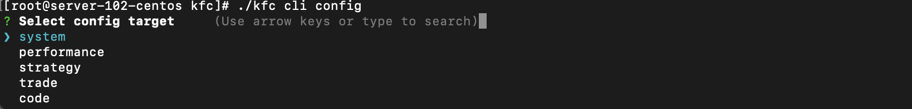

- system : 系统设置

- performance : 性能设置

- strategy : 使用本地python

- trade : 交易设置

- code : 代码编辑器设置

系统设置
^^^^^^^^^^^^

.. image:: _images/设置日志等级_cli.png
   :width: 1500px
   :height: 150px

- Update logLevel   : 全局日志设置 (日志有6个级别，日志文件只会记录等于和高于设置级别的日志内容。日志级别从低到高分别是为：)

    - trace
    - debug
    - info
    - warning
    - error
    - critical

- Update language : 选择语言，修改后重启功夫生效

- Update autoRestartTd  : 交易进程断开时是否自动重启, 如果打开, 则当交易进程出错后, 会尝试重连三次, 如果关闭, 则不会；在重启过程中（重启开始到交易进程就绪）, 策略内查询到的持仓会为0, 需要在策略内通过 on_deregister, on_broker_state_change这两个方法来判断柜台状态是否断开/重启就绪

- Update bypassArchive : 跳过归档 (仅删除上个交易日留下的journal与log文件, 不再压缩打包, 归档后无法恢复之前的内存数据,会加快启动速度)

性能设置
^^^^^^^^^^^^

.. image:: _images/开启极速模式_cli.png
   :width: 1500px
   :height: 130px

- 开启极速模式 ：cpu利用率达到100%，极大的降低系统延迟。(只有当 CPU 核数大于 4 时才能开启)

- 跳过UI进程计算 ：UI进程不再处理计算逻辑, 完全通过计算进程更新数据, 减轻UI进程性能占用, 重启后生效。

- 纯监控模式:该模式下仅可监控进程运行状态, UI进行性能占用达到最低, 重启后生效

使用本地python
^^^^^^^^^^^^^^

当要使用功夫的python中没有的模块,可以使用本地python,下载安装模块到本地.本地Python版本必须为 3.9.x

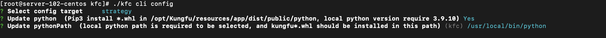

- 使用本地python并下载 .whl 依赖  (不再使用的时候选择 no)

- 填写本地python路径

- 下载依赖 ： pip install /opt/Kungfu/resources/app/dist/public/python/kungfu-xxx.whl

交易设置
^^^^^^^^^^^^

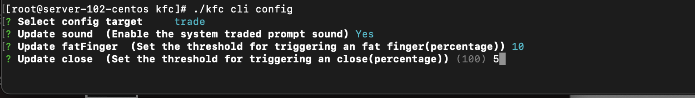

- 成交提示音 ：Linux命令行版本不支持

- 乌龙指阈值 ：Linux命令行版本不支持

- 平仓阈值 : Linux命令行版本不支持

- 设置交易限制 : Linux命令行版本不支持

- 两融 : Linux命令行版本不支持

编辑器设置
^^^^^^^^^^^^^^

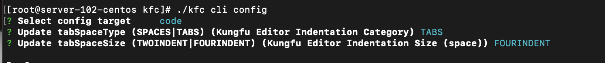

- 缩进类别 ：Linux命令行版本不支持

- 缩进长度 ：Linux命令行版本不支持

获取帮助
~~~~~~~~~~~~~~

在KungFu CLI文件夹内，输入命令行
::

    $ ./kfc cli -h

界面会显示KungFu CLI所有支持的命令以及相应的解释

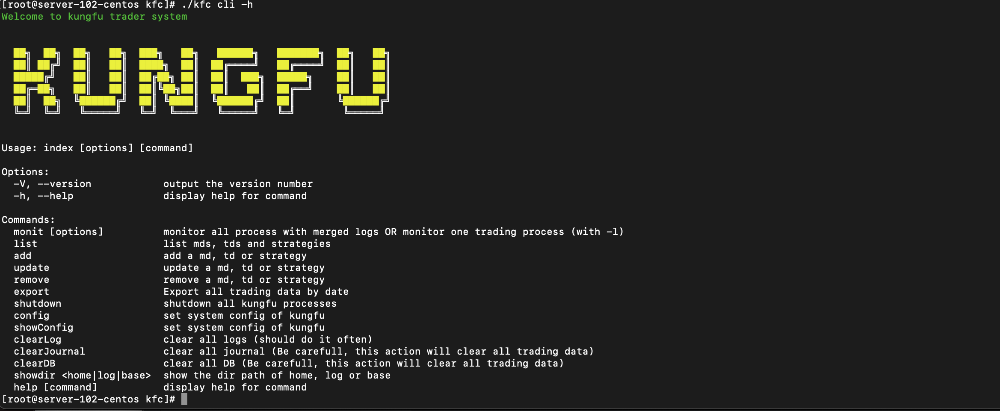

窗口字段
--------

.. _Assets窗口:

Asets 窗口
~~~~~~~~~~~~~~~~~

.. list-table::
   :width: 100%
   :align: left

   * - 字段
     - 字段含义
   * - UnRealizedPnl
     - 未实现盈亏
   * - Avail
     - 可用资金
   * - MarketValue
     - 市值（股票）
   * - Margin
     - 保证金（期货）

.. _Positions窗口:

Positions 窗口
~~~~~~~~~~~~~~~~~

.. list-table::
   :width: 100%
   :align: left

   * - 字段
     - 字段含义
   * - Ticker
     - 标的代码
   * - Dir
     - 仓位状态(多空)
   * - Yesterday
     - 昨仓
   * - Today
     - 今仓
   * - Total
     - 总持仓
   * - Open
     - 开仓均价
   * - Last
     - 最新价
   * - UnrealPnl
     - 未实现盈亏

.. _Order Records窗口:

Order Records 窗口
~~~~~~~~~~~~~~~~~~~~~~~~~~~

.. list-table::
   :width: 100%
   :align: left

   * - 字段
     - 字段含义
   * - UpdateTime
     - 更新时间
   * - Ticker
     - 标的代码
   * - Side
     - 买卖方向
   * - Offset
     - 开平方向
   * - Price
     - 委托价格
   * - Filled/Not
     - 已完成/全部
   * - Status
     - 委托状态
   * - StratId(AccountId)
     - 发出委托的策略 or 账户
   * - System LA
     - 系统延迟
   * - Network LA
     - 网络延迟

.. _Trade Records窗口:

Trade Records 窗口
~~~~~~~~~~~~~~~~~~~~~~~~~~~

.. list-table::
   :width: 100%
   :align: left

   * - 字段
     - 字段含义
   * - UpdateTime
     - 更新时间
   * - Ticker
     - 标的代码
   * - Side
     - 买卖方向
   * - Offset
     - 开平方向
   * - Price
     - 成交价格
   * - Volume
     - 数量
   * - StratId(AccountId)
     - 发出委托的策略 or 账户
   * - Trade LA
     - 成交延迟