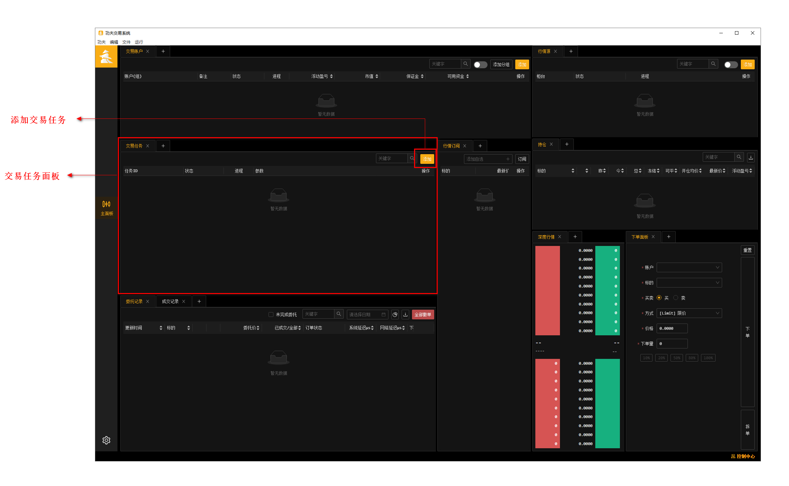
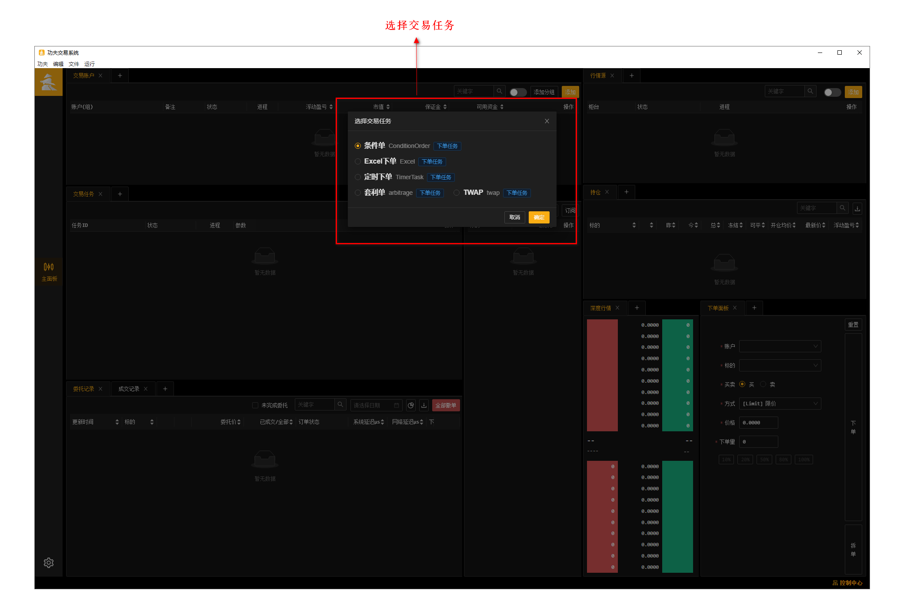
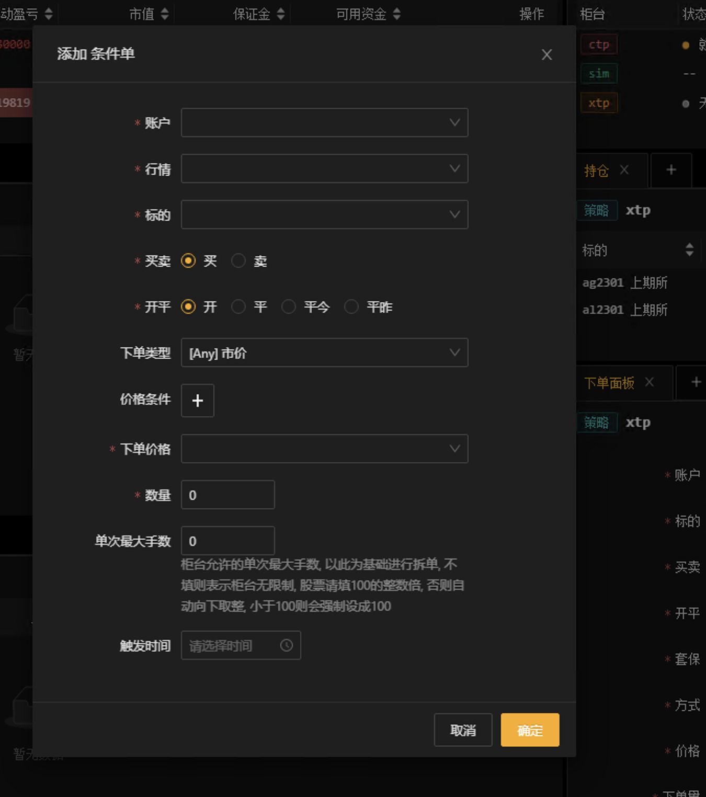
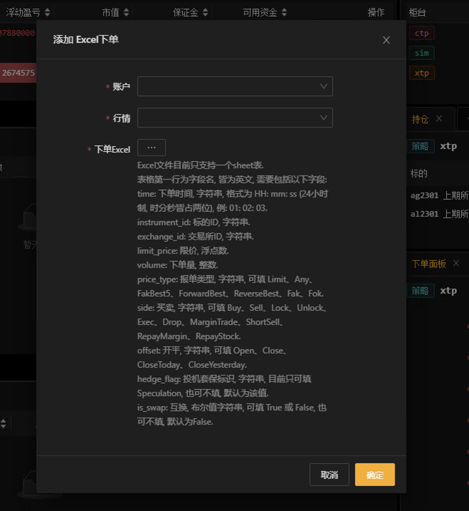
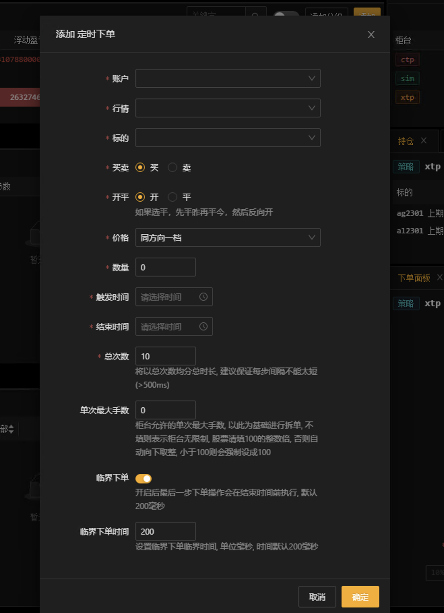
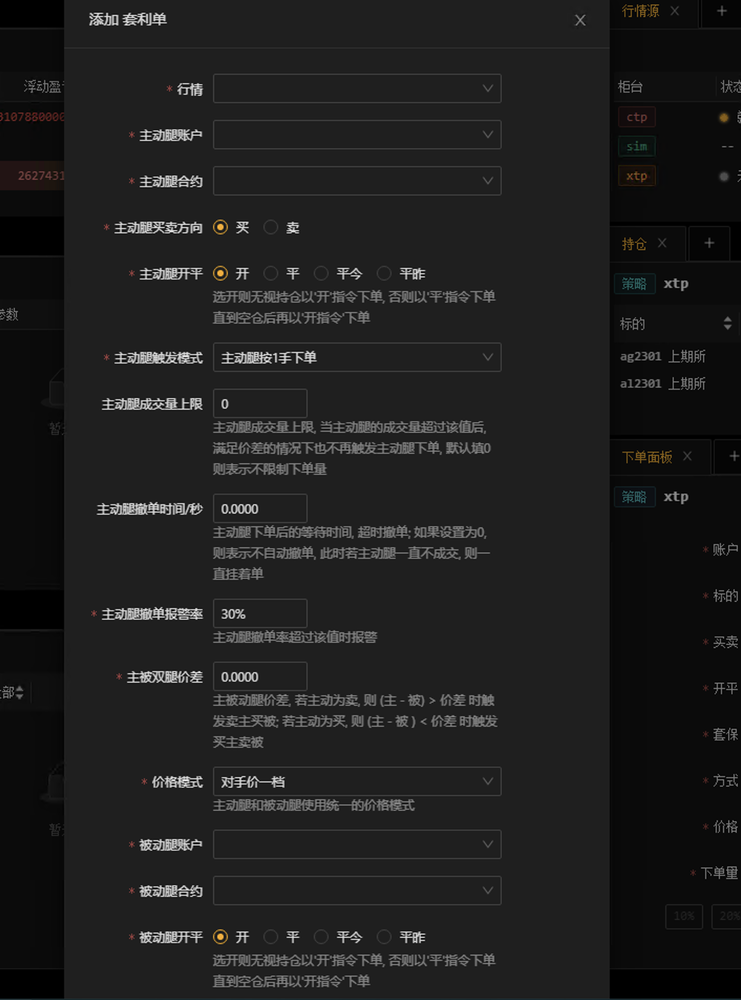
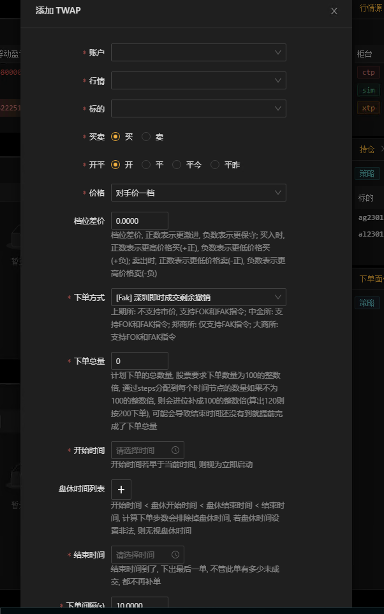

交易任务
--------------

**选择交易任务面板,点击添加按钮,添加想要的交易任务**

条件单
~~~~~~~~~~~~

设置下单的价格条件,触发这个条件进行交易下单

说明

 - 条件单可以接受两个类型的条件为约束，一个是价格条件，一个是时间条件

 - 当仅有价格条件时 会在当前价格满足大于小于等于触发价格时下单

 - 当仅有时间条件时 会在到达目标设定时间点时下单

 - 当价格条件跟时间条件同时存在时，哪个条件先满足，以哪个条件下单

 - 单次最大手数：若设置下单数量1000，而单比最大下单量为100，则会在下单时，拆为10份，每次100，一同下出。

Excel下单
~~~~~~~~~~~~

实现多标的,不同时间下单的需求.

说明

 - 通过读取选择的 Excel 文件，按照格式要求进行解析，按照每行 time 字段的具体时间设置定时下单任务。

 - 当所有任务完成后将会关闭本 Excel 下单任务。

 - Excel 文件目前只支持一个 sheet 表。

- 表格第一行为字段名，皆为英文，需要包括以下字段：

   - time ：下单时间，字符串，格式为 HH：mm：ss （24 小时制，时分秒皆占两位），例：01：02：03。

   - instrument_id ：标的 ID，字符串。

   - exchange_id ：交易所 ID，字符串。

   - limit_price ：限价，浮点数。

   - volume ：下单量，整数。

   - price_type ：报单类型，字符串，可填 Limit、Any、FakBest5、ForwardBest、ReverseBest、Fak、Fok。

   - side ：买卖，字符串，可填 Buy、Sell、Lock、Unlock、Exec、Drop、MarginTrade、ShortSell、RepayMargin、RepayStock。

   - offset ：开平，字符串，可填 Open、Close、CloseToday、CloseYesterday。

   - hedge_flag ：投机套保标识，字符串，目前只可填 Speculation，也可不填，默认为该值。

   - is_swap ：互换，布尔值字符串，可填 True 或 False，也可不填，默认为 False。

定时任务
~~~~~~~~~~~~

定时任务可以在设置的时间段内,按照参数设置的数量和次数进行匀速下单,可以做到临界下单的功能.

说明

 - 按照设置的时间长度，步数，将总数量为n的订单拆为每隔一段时间执行一次。如总时间为1min，步数为10，则会每隔6s下一次单。

 - 每次下单会先将上一步未完成订单撤掉，然后将上一步未完成数量加入剩余数量，除以剩余步数，来得到每步下单数量

 - 最后一步会将剩余所有数量以涨跌停价格（市价）下出去

 - 如果设置了临界时间，最后一单将会在 结束时间 - 临界时间的时间点下单。如总时间为1min，步数为10，则最后一单本应该在结束时间前6s下单，但如果此时设置了临界时间200ms，则最后一单会在结束时间前200ms下单。（注：临界时间最小50ms）

 - 单比最大下单量：如计算出的结果为该次下单数量1000，而单比最大下单量为100，则会在该交易周期，下10次，每次100。

套利单
~~~~~~~~~~~

套利模式下单

说明

 - 按照设置的主动腿买卖方向, 价差, 当收到行情时触发两腿的差价计算, 当满足价差条件时先下主动腿, 当主动腿成交后再下单被动腿.

 - 主动腿和被动腿开平选项, 选开则无视持仓以'开'指令下单, 否则以对应的平仓指令下单直到持仓数量不足, 再以'开指令'下单.

 - 等待时间: 单腿下单后的等待时间, 超时撤单

 - 报警率: 主动腿撤单的数量 / 主动腿下单的数量 > 报警率时触发报警

 - 例如主动腿au2212, 被动腿au2210, 主动腿方向为买, 双腿价差为10, 主动腿触发模式为按对手价一档量下单, 等待时间为5s, au2212对手一档量为10, au2212 - au2210 <= 10, 先报单买入10手au2212, 成交了5手au2212, 收到au2212的成交推送时, 立即下单卖出5手被动腿au2210; 5秒后主动腿剩余5手没有成交, 触发撤单, 最终交易结果为买入了5手au2212, 卖出了5手au2210.

-------------------------------------------------------------------------------------------------------------------------------------------------------------------------------------------------------------------------------------------------------------------------------------------------------------------------

 - 被动腿第一次撤单后会根据 "被动腿第二次下单价格调整" 调整下单价格第二次下单, 买则加, 卖则减

 - 被动腿第二次撤单后会报警提示交易员, 需要手动下单被动腿以保证主动腿和被动腿成交量相等

 - 注: 手动下单被动腿的order不会进行定时撤单, 当交易员手动撤单或者交易所撤单后, 不会触发第二次自动下单

-------------------------------------------------------------------------------------------------------------------------------------------------------------------------------------------------------------------------------------------------------------------------------------------------------------------------

 - 交易任务可以设置主动腿成交上限, 成交数量到达设定值以后, 不再触发下单

 - 交易任务允许交易员手动下单主动腿

 - 注: 手动下单主动腿的order不会进行定时撤单, 主动腿成交后会触发被动腿自动下单

-------------------------------------------------------------------------------------------------------------------------------------------------------------------------------------------------------------------------------------------------------------------------------------------------------------------------

 - 可以设置主动腿成交量上限, 当主动腿 已成交 + 交易中 >= 成交量上限 时, 不再触发主动腿下单

 - 当 主动腿成交量 == 被动腿成交量 并且 被动腿成交量 >= 主动腿成交量上限 时, 关闭交易任务

 - 手动下单主动腿的数量会记入成交量上限统计计算中, 但是手动下单的数量不会被 成交量上限 阻拦

 - 例如: 成交量上限设置为50手, 当前主动腿已成交45手, 手动下单10手, 此时主动腿可能会成交55手, 之后会阻止交易任务继续触发主动腿下单, 当被动腿成交量也达到55手后, 交易任务自动关闭

twap任务
~~~~~~~~~~~

根据 (结束时间-开始时间)/下单间隔 计算出 下单步数steps, 将下单总量平均分配到每一步的时间节点下单, 每个时间节点会将该时间前已确认撤单的数量加进来补单

说明

 - 按照设置的时间长度, 间隔时间, 将总数量为n的订单拆为每隔一段时间执行一次. 如总时间为1min, 时间间隔为10s, 计算得到步数为7(0s, 10s, 20s, 30s, 40s, 50s, 60s), 则会每隔10秒下一次单, 每次下单数量为n/7; 如果总时间为1min, 时间间隔为11s, 60/11=5.45, 实际为6个时间段, 第六段只有5s, 则总步数还是7(0s, 11s, 22s, 33s, 44s, 55s, 60s).

 - 每次下单会先将上一步未完成订单撤掉, 该次下单数量加上上一次累计未成交数量. 例如下单总量为7000, 总时间为1min, 时间间隔为10s, 计算得到总步数为7, 第一步下单数量为1000, 第二步下单时间到时, 第一步只成交了500手, 先撤掉上一步的订单, 第二步下单量为 1000 + 500 = 1500.

 - 如果总下单量太少, 总时间太长, 导致根据步数计算得到的每一步下单量太小, 小于柜台要求的每单最小下单量, 则这一步不会下单, 把下单量累积到下一步. 例如 下单总量为500, 总时间为1min, 时间间隔为7秒, 60/7=8.57, 计算得到总步数为10, 第一步下单量为50, 则第一步取消下单, 把下单量累积到第二步, 第二步下单100. (股票柜台最小下单单位数量为100)

 - 档位差价, 正数表示更激进, 负数表示更保守; 买入时, 正数表示更高价格买(+正), 负数表示更低价格买(+负); 卖出时, 正数表示更低价格卖(-正), 负数表示更高价格卖(-负)

 - 单次最大手数: 柜台允许的单次最大手数, 以此为基础进行拆单, 不填则表示柜台无限制, 股票请填100的整数倍, 否则自动向下取整, 小于100则会强制设成100
