新手引导
============

名词解释
~~~~~~~~~~~~~
    - TD : 交易账户。 “添加TD”即指“添加交易账户信息”
    - MD : 行情源账户。 “添加MD”即指“添加行情源信息(每个柜台仅允许一个行情源存在)”
    - strategy : 策略。 “添加strategy”即指“添加策略文件”
    - KF_home文件夹 : 功夫软件中添加的账户/行情/策略/定时任务/交易日志/数据等信息所在
    - KF_home文件路径 ：客户端左侧边栏-全局设置窗中允许修改储存路径； 功夫软件(windows版本)左上角 - 文件 - 打开功夫资源目录(KF_HOME)

注意事项
~~~~~~~~~~~~~

- 安装新版本之前，需先将旧版本卸载

- 使用定时任务时，建议策略的启动时间设置为期望运行时刻前1-2分钟

    - 原因 : 策略的启动一般情况下需要1-2秒的准备时间；但当系统内交易数据随当天运行时间的增长而增多时，策略启动准备时间也会相应增长。一般情况下，10秒左右即可进入交易。因而，为了最大程度保护策略的正常运行,建议提前一分钟启动。

界面布局
~~~~~~~~~~~~~

 - KungFu是一款支持跨柜台多账户交易的量化交易系统， **标准版** 系统目前支持的柜台有：XTP（股票），CTP（期货），sim（功夫模拟）。高配版支持交易接口定制，可适配全部主流柜台。

 - 为了方便用户进行多账户下单，Kungfu系统提供了账户模块，在账户模块中，用户可以对账户进行添加、编辑以及删除，也可以分别查看不同账户的实时运行状态、运行日志、持仓情况、委托情况、成交情况以及盈亏情况。

 - 在kungfu交易系统中，每个账户由一个行情进程（md）以及一个交易进程（td）组成，行情进程用来接收行情信息，交易进程用来下单、撤单。

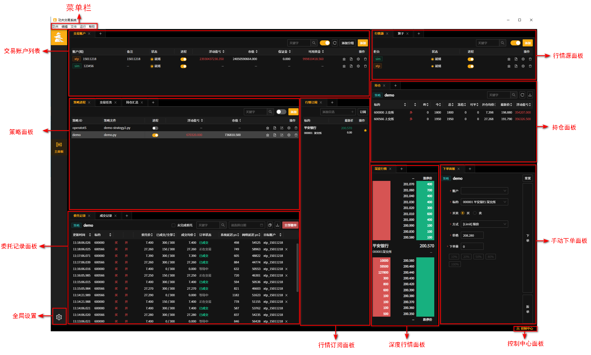

-----

添加面板
~~~~~~~~~~~~~
 - 面板名称旁，均有添加面板按钮“+”(如下图红框位置)

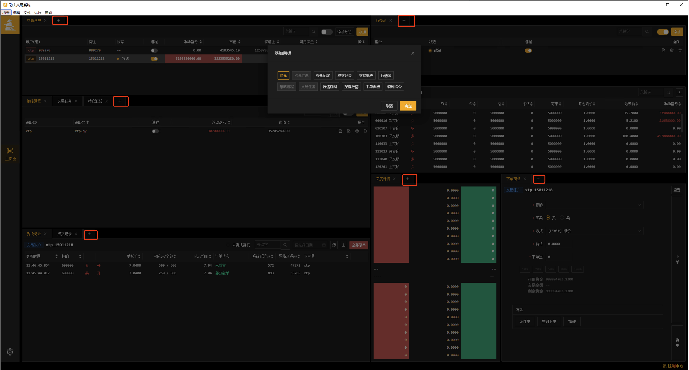

-----

快速尝试
~~~~~~~~~~~~~
以sim柜台为例，按照添加账户、启动账户进程、添加行情源、启动行情源进程、添加策略、策略运行的顺序进行演示。

添加账户
----------

(1) 点击交易账户面板的“添加”按钮。

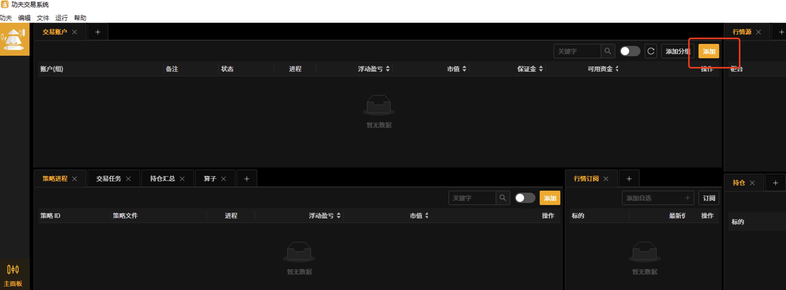

(2) 选择添加账户所使用的柜台 : sim (模拟柜台)。

    **注 : 第一步选择sim柜台，点击确认后选择想测试的撮合模式。sim柜台数据为随机数据，仅供参考**

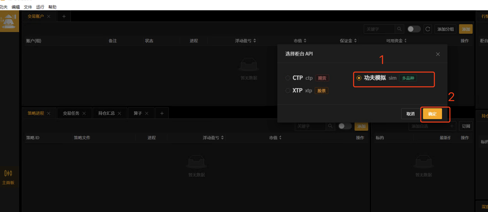

(3) 添加“sim账户”信息。
    
    **在第一步选择sim柜台 , 第二步点击确认，会弹出账号设置弹窗**

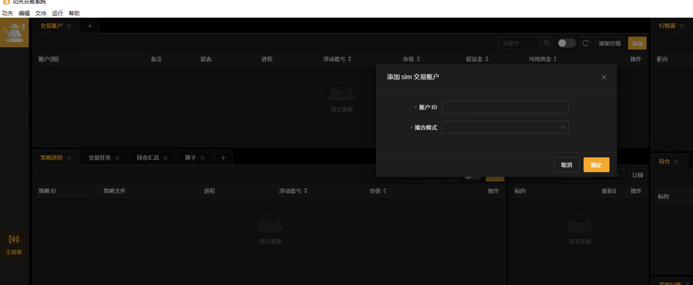

.. note:: 填写账户信息，请参考以下表格。

.. list-table::
   :header-rows: 1

   * - 字段
     - 字段说明
   * - 账户ID
     - 交易的账户id（ 随意填写 ， 例如 :  123456 ， test）
   * - 撮合模式
     - 用户可从“失败、等待中、撤单、部分成交部分撤单、部分成交部分等待、成交、多笔成交”中选择其一，使用此账户下单委托的订单状态将模拟为撮合状态设置的模式，以便测试时使用

**本次测试设置的 账户ID : 123456 ; 撮合模式 : 成交**

完成填写后，点击“确定”完成账户配置。

账户启动
----------

点击账户的进程按钮运行账户。

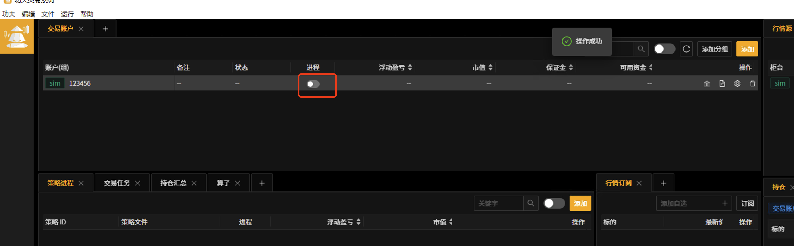

进程状态为 “就绪” 时表示账户登录成功。

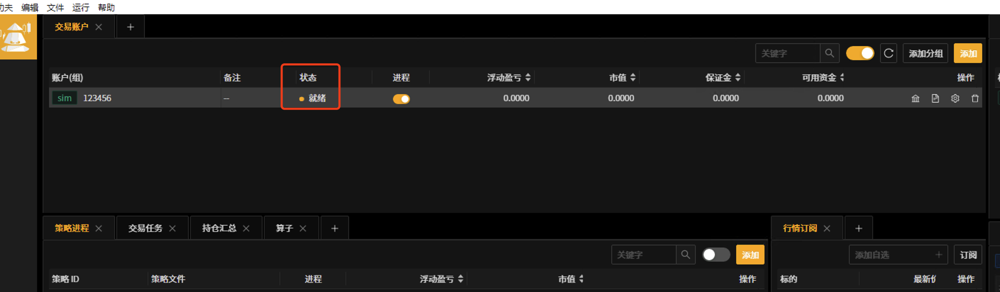

-----

行情源添加
----------

(1) 点击行情源面板的右上方的“添加”按钮。

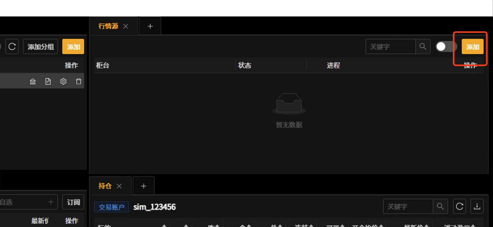

(2) 选择添加账户所使用的柜台 : sim (模拟柜台)。

   **注 : 选择sim柜台 , 二次确认后，完成功夫模拟行情柜台的配置**

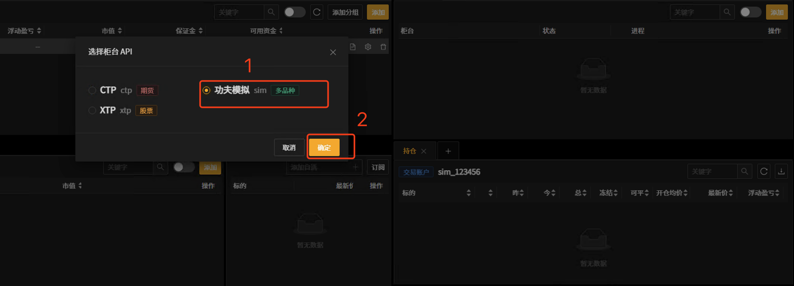

行情源启动
----------

点击行情源的进程按钮运行行情。

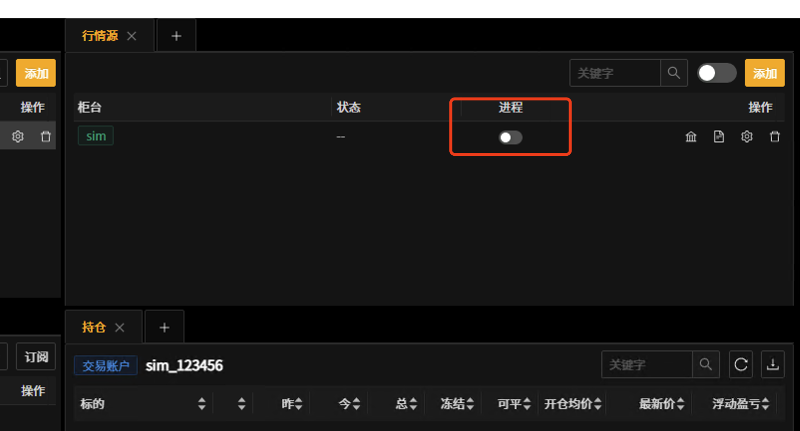

当进程状态为"就绪"时，表示行情接入成功。

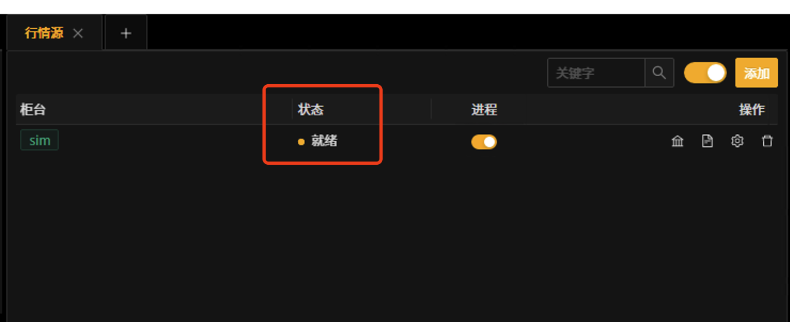

-----

策略添加
---------------

(1) 点击策略面板的右上方的“添加”按钮。

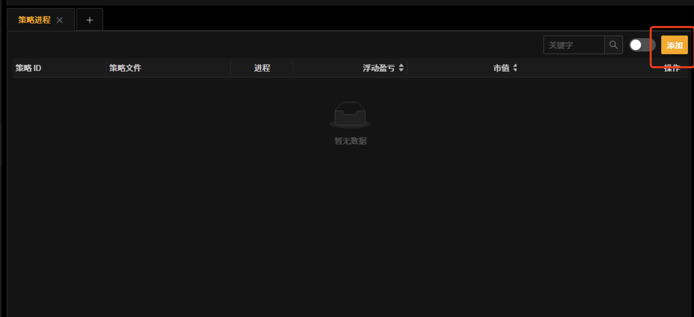

(2) 添加策略相关信息。

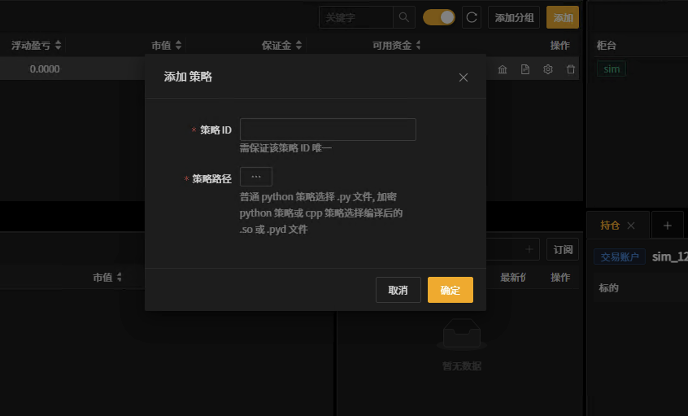

.. list-table::
   :header-rows: 1

   * - 字段
     - 字段说明
   * - 策略ID
     - 策略名称，策略ID不允许重复
   * - 策略路径
     - 从本地选择 .py 策略文件

完成填写后，点击“确定”完成策略添加。

策略demo : 

::

    # -*- coding: UTF-8 -*-
    import kungfu.yijinjing.time as kft
    from kungfu.wingchun.constants import *

    # 股票柜台
    SOURCE = "sim"
    # 要链接的账户
    ACCOUNT = "123456"
    # 准备订阅的标的
    tickers = ["600000", "600001"]
    # 下单数量
    VOLUME = 200
    # 标的对应的交易所
    EXCHANGE = Exchange.SSE

    # 启动前回调，添加交易账户，订阅行情，策略初始化计算等
    def pre_start(context):
        # 添加交易账户 (注意: SOURCE/ACCOUNT 需要与交易账户面板中状态为 "就绪" 的柜台id/账户id一致,如下图一) 
        context.add_account(SOURCE, ACCOUNT)

        # 订阅行情 (注意: SOURCE 需要与行情源面板中状态为 "就绪" 的柜台id一致,如下图二)
        context.subscribe(SOURCE, tickers, EXCHANGE)

    # 启动准备工作完成后回调，策略只能在本函数回调以后才能进行获取持仓和报单
    def post_start(context):
        context.log.warning("post_start")

    # 收到快照行情时回调，行情信息通过quote对象获取
    def on_quote(context, quote, location,dest):
        context.log.info("[on_quote] {}".format(quote))
        if quote.instrument_id in tickers:
            order_id = context.insert_order(quote.instrument_id, EXCHANGE, SOURCE, ACCOUNT, quote.last_price, VOLUME,
                                            PriceType.Limit, Side.Buy, Offset.Open)
            context.log.info("(order_id){} (ticker){}".format(order_id, quote.instrument_id))

    # 收到订单状态回报时回调
    def on_order(context, order, location,dest):
        context.log.info("[on_order] {}".format(order))

    # 收到成交信息回报时回调
    def on_trade(context, trade, location,dest):
        context.log.info("[on_trade] {}".format(trade))

- :ref:`quote对象 <Quote对象>` 说明:订阅标的有行情推送的时候会触发on_quote函数,quote对象为标的的快照行情信息 

- :ref:`order对象 <Order对象>` 说明:当订单状态发生改变时触发on_order, order对象为订单回报信息 

- :ref:`trade对象 <Trade对象>` 说明:当订单成交会触发on_trade, trade对象为订单成交信息 

图一

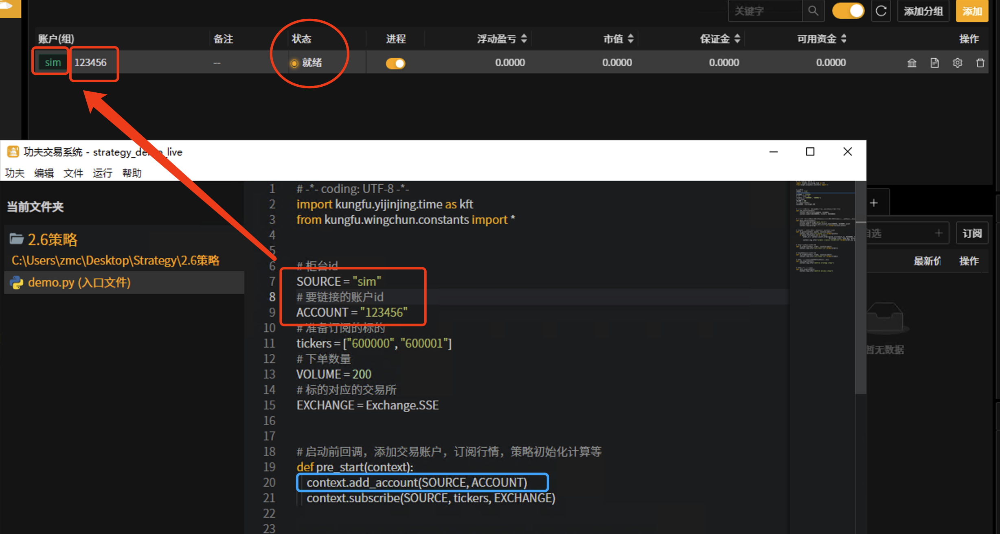

图二 

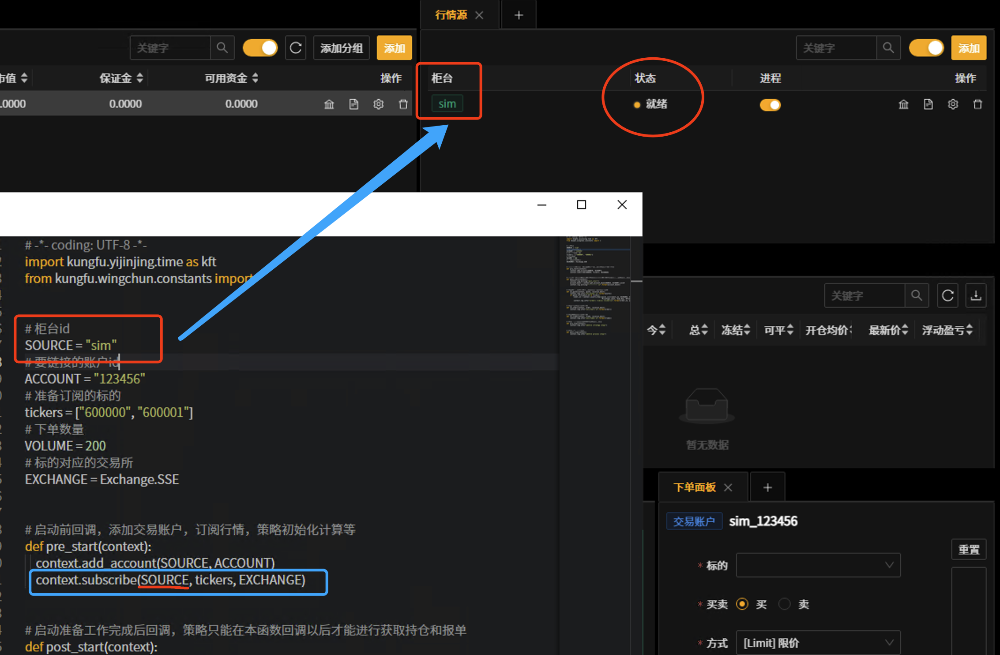

启动策略
----------

点击策略进程按钮开启策略进程，再次点击策略进程按钮则停止运行中的策略。

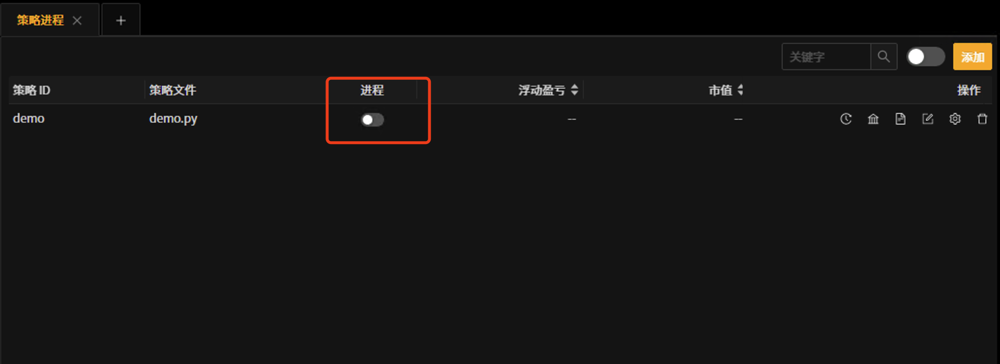

