客户端使用手册
===================

功夫交易系统以功能为组，将功能放置在不同的“面板”中。

面板的灵活性使得用户可对页面布局进行自由调整，且具有更加灵活的统计能力，如持仓面板可根据点选内容的不同，对策略、账户、交易算法的持仓进行分别统计。针对不常用的功能，用户可进行隐藏，简化页面信息。

.. include:: ../../shared/v3/001-td.rst

.. include:: ../../shared/v3/002-md.rst

策略进程面板
-------------

策略进程面板相当于策略池，允许用户导入策略文件、编辑代码。代码修改将实时储存。结合功夫灵活的多面板调度，用户可选中具体策略，在持仓面板中查看该策略实时持仓、在委托面板中查看该策略的委托情况、在成交记录面板中查看该策略的委托成交情况、在策略进程面板监控策略盈亏表现、运行情况。

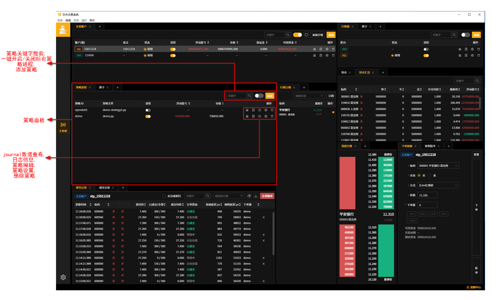

-----

添加策略
~~~~~~~~~~~~~

点击“添加”按钮

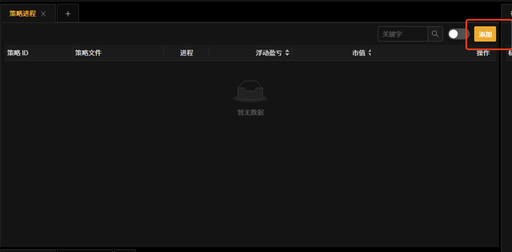

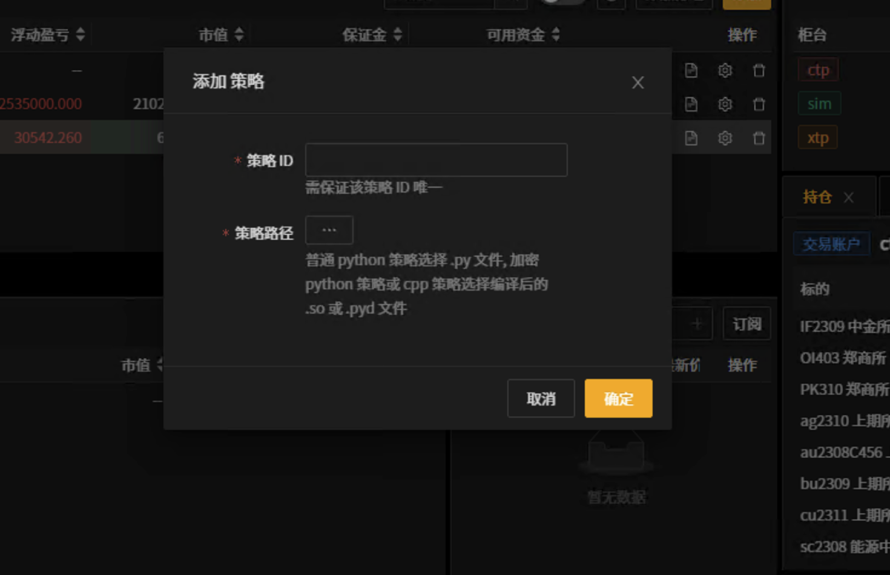

.. list-table::
   :header-rows: 1

   * - 字段
     - 字段说明
   * - 策略ID
     - 策略名称，策略ID不允许重复
   * - 策略路径
     - 从本地选择 .py 策略文件

点击"确定"完成策略添加

**注意**：

- 策略文件所在位置需要与功夫系统安装目录在同一个盘
- 启动策略前，需确认策略使用的交易进程(TD)/行情进程(MD)连接是否处于就绪状态，TD、MD未就绪将导致策略下单失败

------

启动策略
~~~~~~~~~

点击策略进程按钮开启策略进程，再次点击策略进程按钮则停止策略运行。

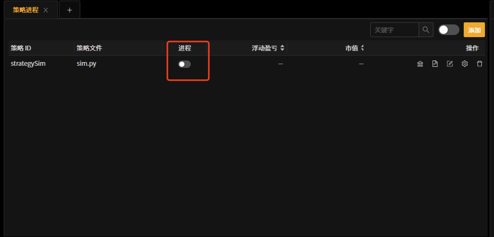

-----

策略日志查看
~~~~~~~~~~~~~

点击日志按钮,在新窗口查看策略运行日志

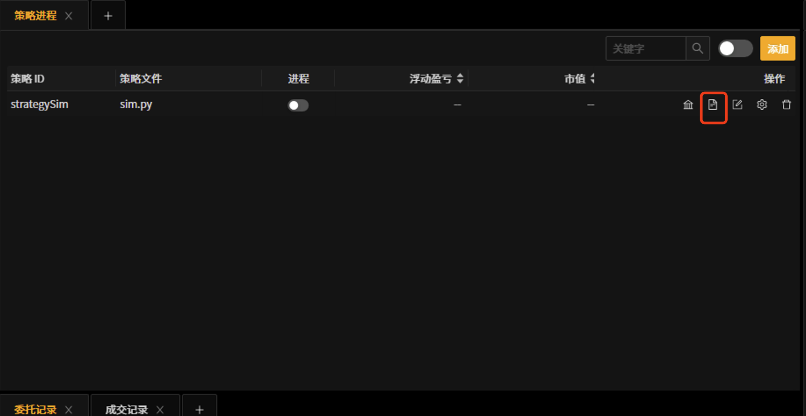

-----

编辑策略代码
~~~~~~~~~~~~~

功夫客户端中内嵌了IDE，用户可在客户端中编辑本地策略。

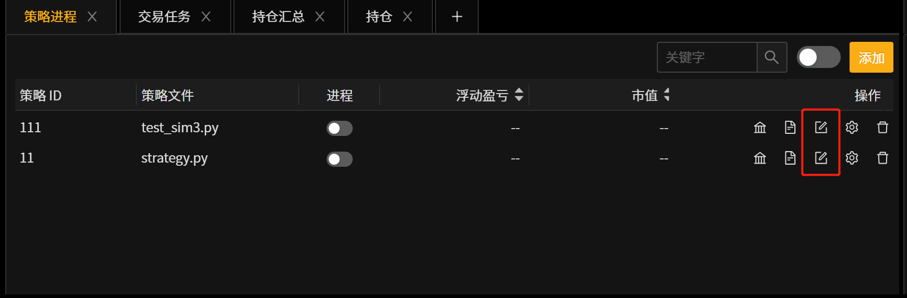
  
点击编辑按钮，将弹出策略编辑弹窗，修改将实时保存。

**注：若编辑代码时策略进程仍处于运行状态，修改的代码将不会实时生效，重启策略进程后生效。**

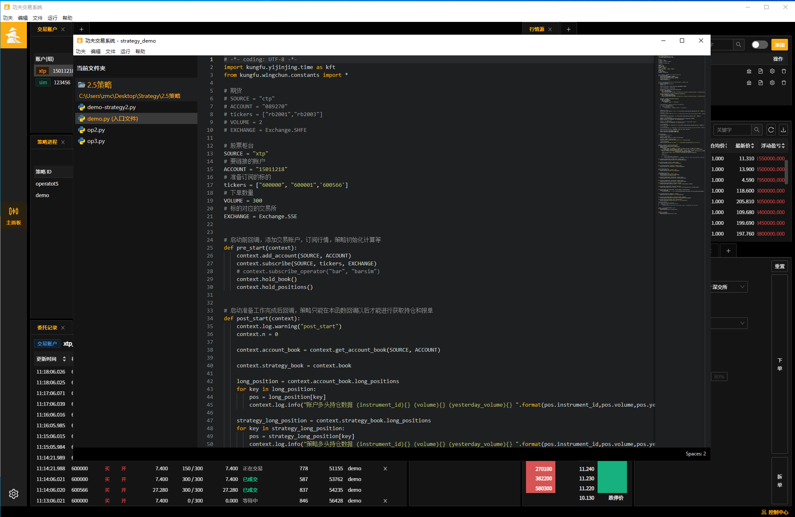

-----

删除策略
~~~~~~~~~~~~~

点击策略后方的删除按钮即可删除，删除后策略进程将关闭

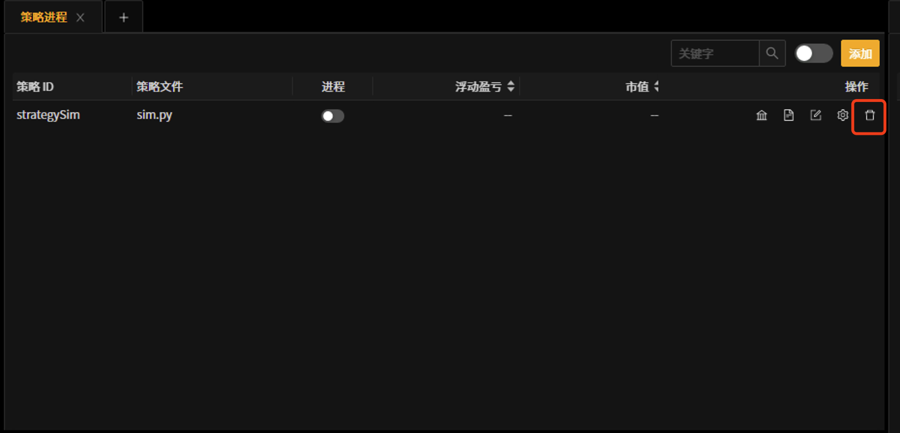

-----

journal工具
~~~~~~~~~~~~~~~~~~~
journal是功夫交易系统中记录进程行为的数据文件。journal文件具有极其丰富的数据信息，如Quote行情信息中记录了十档报价详细信息。**用户可通过journal工具定位信息，复盘策略运行状况、排查策略运行问题**

journal工具给用户提供多种 **数据定位方式** ：通过时间戳定位、消息类型过滤、关键字搜索

查看单一进程的journal文件
+++++++++++++++++++++++++++++++++++++
目前交易账户、行情源、策略进程、交易任务、算子面板均支持使用journal工具

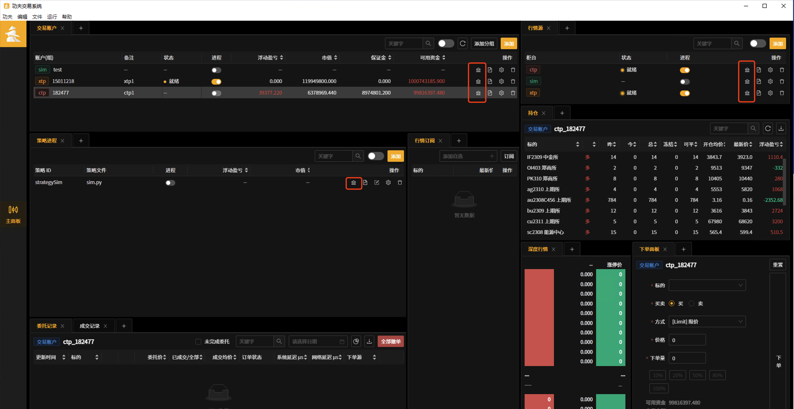

-----

查看所有进程的journal文件
+++++++++++++++++++++++++++++++++++++

点击文件（左上角） -- 查看所有journal 即可打开journal工具，将显示所有进程的journal信息

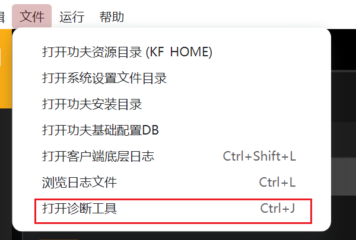

-----

定位journal信息
+++++++++++++++++++++++++++++++++++++
支持的筛选方式：过滤信道、过滤消息类型、按时间戳跳转

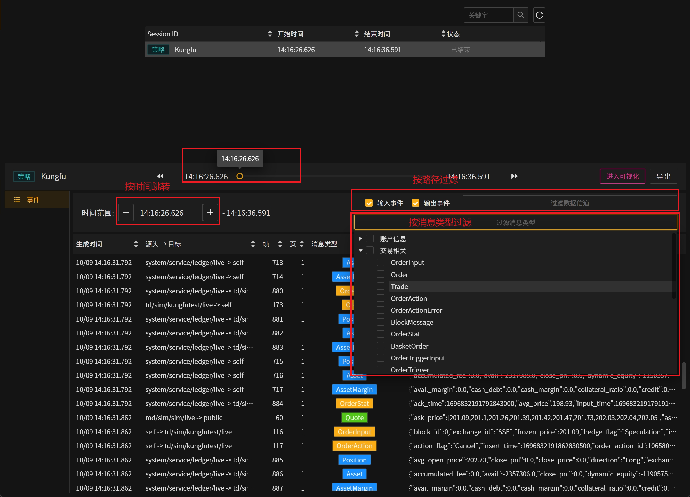

-----

关键字搜索功能
+++++++++++++++++++++++++++++++++++++

使用ctrl+f可调出搜索框，可使用快捷键enter跳转到下一个搜索结果

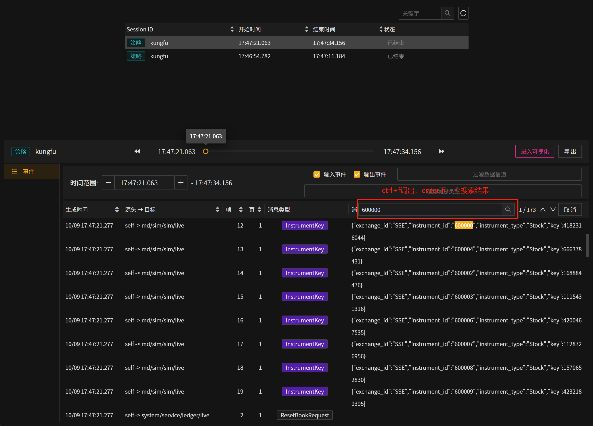

-----

Journal数据可视化工具
+++++++++++++++++++++++++++++++++++++
(1) 点击进程后方的journal图标，打开journal工具

(2) 点击“进入可视化”按钮

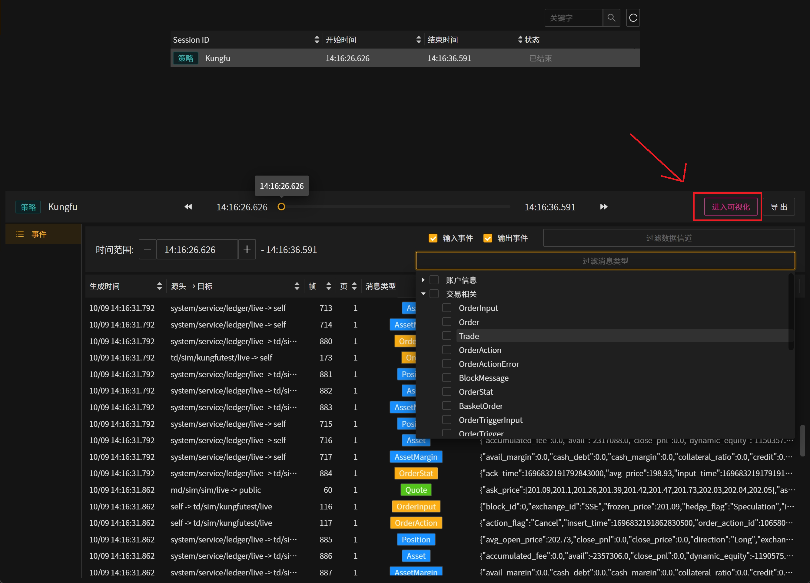

(3) 显示journal可视化图表

journal可视化可以帮助用户跟踪策略的下单情况，用户能够：

- 快速查看策略中每个标的总体下单次数、分布状况
- 查看下单时相对行情价的偏移量
- 查看同一订单号（order_id）下单、撤单情况

**注** ：由于journal数据量较大，一次仅加载2000条数据，若策略运行时间较长，需要用户手动下滑加载更多数据

- **左侧session栏**：可切换session，查看同一策略不同运行时间的journal记录
- **左侧标的栏**：展示session中，该策略中不同标的行情获取及下单情况
- **右侧图表**：展示可视化下单、撤单、行情信号。信号可点击，点击后下方列表将跳转到对应的journal记录
- **下方journal记录**：以列表方式展示journal详情。记录可点击，若点击的记录为图例中的信号，则图表将高亮对应信号。

**操作tips**

- **鼠标滚轮滑动**：增加/减少展示内容的时间跨度
- **单击信号图例**：筛选出order_id相同的信号（包括委托、委托回报、撤单），且下方journal记录将跳转到对应位置；点击空白处即可回到正常状态。
- **单击下方记录详情** ：图上将跳转到该时间段，若该信号为委托、委托回报、撤单信号，则信号将高亮。

.. include:: ../../shared/v3/004-operator.rst

.. include:: ../../shared/v3/005-position.rst

.. include:: ../../shared/v3/006-position_all.rst

.. include:: ../../shared/v3/007-order.rst

.. include:: ../../shared/v3/008-trade.rst

.. include:: ../../shared/v3/016-tradingtask.rst

.. include:: ../../shared/v3/009-subscribe.rst

.. include:: ../../shared/v3/010-level2_quote.rst

.. include:: ../../shared/v3/011-orderinput.rst

.. include:: ../../shared/v3/015-trigger_order.rst

全局设置
----------------
点击左下角设置按钮 或 快捷键“ctrl”+“，”进入全局设置页面。

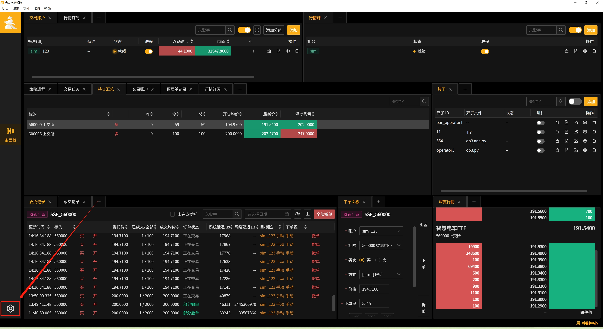

-----

系统
~~~~~~~~~~~~~~

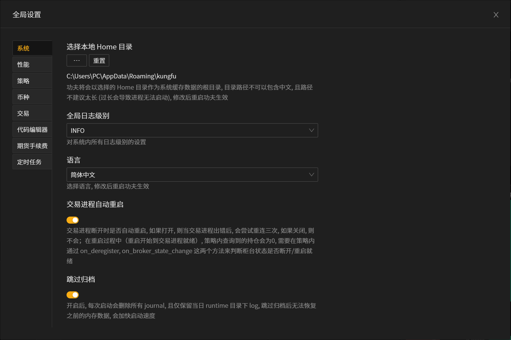

- **选择本地Home路径** : 可修改Kf_home存放路径，目录路径不允许包含中文。

- **全局日志级别** ：对系统内所有日志级别进行设置，低于设置级别的日志将再不展示（如默认为info级别日志，不会显示级别更高的trace、debug级别日志）。

- **语言** ：界面语言，目前支持中文、English(修改后重启客户端生效)。

- **交易进程自动重启** : 如果打开， 交易进程出错后， 会继续尝试重连三次。如果关闭， 则不进行任何重试操作。重启过程中（即重启开始到交易进程就绪）， 策略内查询到的持仓会为0， 需要在策略内通过 on_deregister， on_broker_state_change这两个方法来判断柜台状态为断开/就绪。

- **跳过归档** : 开启后， 每次启动会删除所有 journal， 且仅保留当日 runtime 目录下 log， 跳过归档后无法恢复之前的内存数据， 会加快启动速度。

- **跳过归档（开发者模式）** ：非开发者请勿开启此选项。开启后，每次启动客户端时不进行任何归档操作，保留所有 journal 和 log 文件，帮助开发者更快地使用 journal 工具排查问题, 重启后生效。当普通跳过归档与开发者跳过归档同时开启时，开发者模式跳过归档功能优先生效。

-----

性能
~~~~~~~~~~~~~~

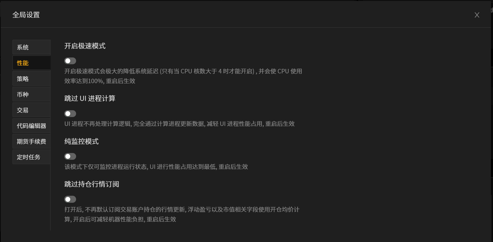

- **开启极速模式** ： (仅当CPU核数大于4时才允许开启)开启极速模式会极大的降低系统延迟，并会使 CPU 使用效率达到100%，重启后生效。

- **跳过UI进程计算** ：UI进程不再处理计算逻辑，完全通过计算进程更新数据，减轻UI进程性能占用，重启后生效。

- **纯监控模式** : 该模式下仅监控进程运行状态，UI性能占用可以达到最低，重启后生效。

- **跳过持仓行情订阅** : 打开后，不再默认订阅交易账户持仓的行情更新，浮动盈亏以及市值相关字段使用开仓均价计算，开启后可减轻机器性能负担，重启后生效。

-----

策略
~~~~~~~~~~~~~~

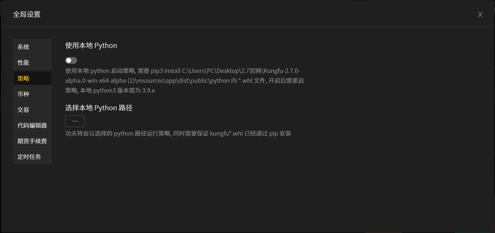

当某些模块在功夫内置的python中没有时，可以使用本地python，将所需模块下载到本地使用  **本地Python版本必须是 3.9.x 版本** 。
- 使用本地python ：开启后使用本地python。
- 选择python路径 ：
 - 选择本地python的可执行程序。
 - 安装.whl文件 ：进入功夫的安装目录(快捷进入:左上角-文件-功夫安装目录)，依次进入 Kungfu -> resources -> app -> dist -> public - > python文件夹，打开cmd ， pip install kungfu-2.4.0-xxxx.whl 。

-----

币种
~~~~~~~~~

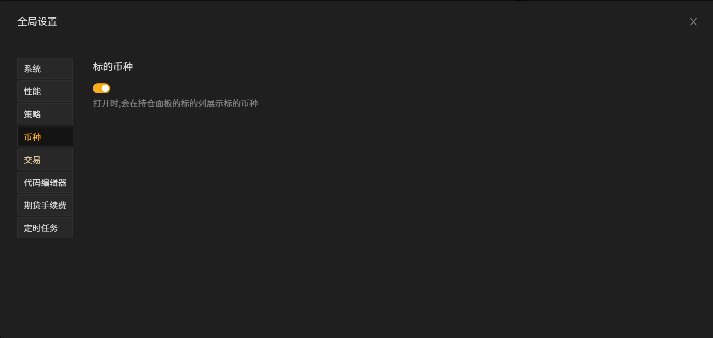

打开后，持仓面板标的列展示标的币种（仅支持otc柜台显示币种）

-----

交易
~~~~~~~~~~~~~~

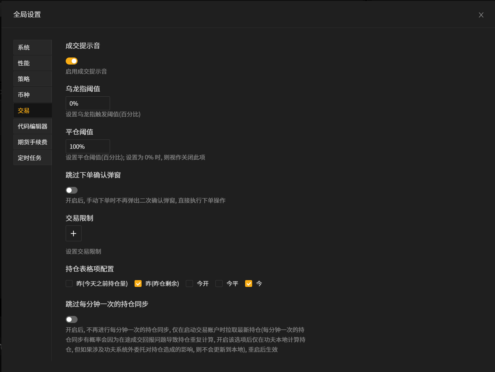

- **成交提示音** ：开启后，下单成交时会发出提示音。

- **乌龙指阈值** ：在用户下单时，若检测到买价高于市场价过多或卖价低于市场价过多时弹窗提示。

.. note::   **乌龙指阈值** 触发机制：

    - 用户手动下单，委托方向为 **买** 时，当委托价 **高于** 最新价 ×（1 + 阈值）时，系统将弹窗提醒。
    - 用户手动下单，委托方向为 **卖** 时，当委托价 **低于** 最新价 ×（1 - 阈值）时，系统将弹窗提醒。

- **平仓阈值** :在用户下单时，若检测到扣除平仓数量后，仓位低于平仓阈值，将弹窗提示。

.. note::   **平仓阈值** 触发机制：
   
   - 用户平仓时，当（持仓量-平仓量） / 持仓量 < 平仓阈值时，系统将弹窗提醒。

- **跳过下单确认弹窗** ： 打开后，用户在“下单面板”点击下单按钮后，将直接下单，不再弹出确认弹窗。

- **交易限制** : 可对具体标的进行成交量、成交价的限制。

- **持仓表格项配置** ： 默认勾选昨（昨仓剩余量）+今，配置后，将在“持仓”“持仓汇总”面板显示，用户可根据需求自行配置。

.. warning:: 建议在持仓表格配置项中不要勾选2个“昨”。勾选后，持仓面板不会对2个昨进行特殊标识，均显示“昨”，可能造成混淆。

- **跳过每分钟一次的持仓同步** ：当未使用功夫客户端以外系统进行下单时，建议开启。开启后，仅通过本地维护持仓，可避免传输延迟导致同步柜台持仓、本地持仓计算时序错误带来的风险。

-----

代码编辑器
~~~~~~~~~~~~~~

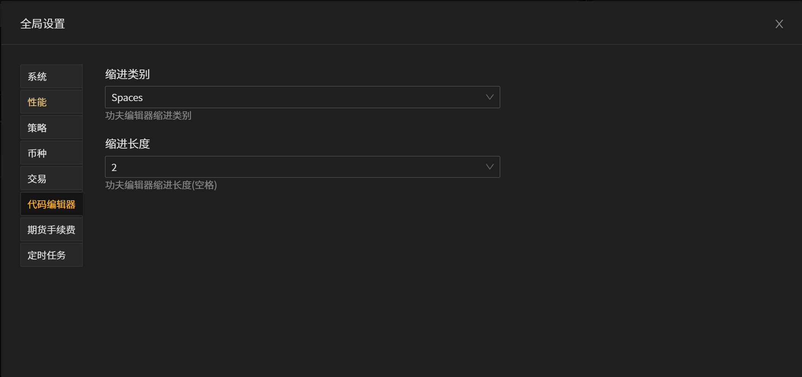

- **缩进类别** ：可选择使用“TAB”键或"Space"键作为缩进按钮。

- **缩进长度** ：以空格为标准，选择一个缩进的距离，可以选择两个空格或者四个空格。

-----

期货手续费
~~~~~~~~~~~~~~~~

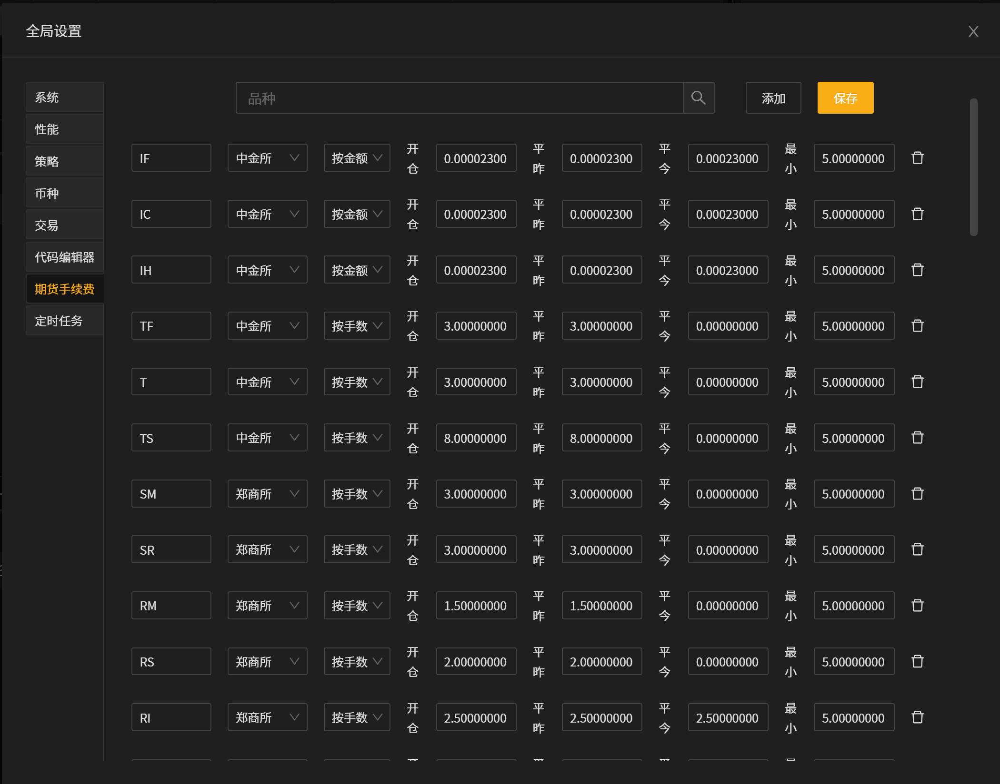

账户中拥有的持仓标的会自动请求交易所对应的手续费，没有持仓时，需要手动设置。

-----

定时任务
~~~~~~~~~~~~~~~~~~~~~

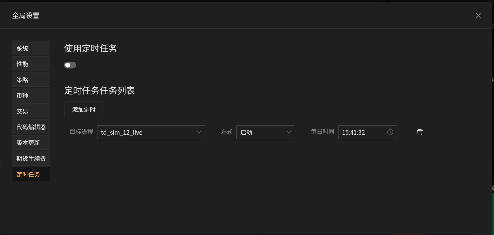

- **定时任务** ：用户可添加定时任务，达到不重启客户端情况下，每日自动重启td、md等进程/自动启动结束策略的效果。

-----

.. include:: ../../shared/v3/012-task_manager.rst