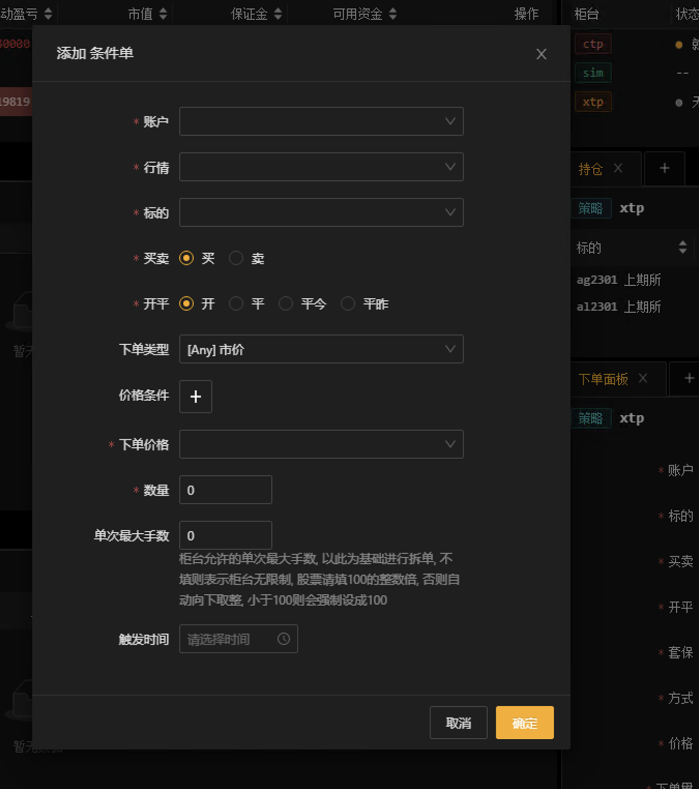

==============
快速开始
==============

交易任务
=============

从零开始构建一个交易任务
-------------------------

1. 根据目录结构创建文件
^^^^^^^^^^^^^^^^^^^^^^^^^

源码目录结构::

    kfx-task-condition-demo/
    ├── src/
    │   └── python
    |       └── ConditionOrder
    |           └── __init__.py                 # python交易任务策略代码
    ├── README.md                               # 交易任务说明
    └── package.json                            # 编译配置信息

交易任务实现代码 __init__.py

.. code-block:: python
    :linenos:

    import kungfu
    from kungfu.wingchun.constants import *
    import json
    import time
    import math
    import threading
    from datetime import datetime
    from pykungfu import wingchun as wc

    yjj = kungfu.__binding__.yijinjing

    class Config(object):
        def __init__(self, param):
            sourceAccountList = param["accountId"].split("_")
            self.marketSource = param["marketSource"]
            exchangeTicker = param["ticker"].split("_")
            self.side = Side(param["side"])
            self.offset = Offset(param["offset"])
            self.priceType = PriceType(param["priceType"])
            self.volume = int(param["volume"])
            self.maxLot = int(param.get("maxLot", 0))
            self.startTime = str_to_nanotime(param.get("startTime", "0"))
            self.orderPrice = param["orderPrice"]
            self.source = ""
            if len(sourceAccountList) == 2 and len(exchangeTicker) == 5:
                self.source = sourceAccountList[0]
                self.account = sourceAccountList[1]
                self.exchange = exchangeTicker[0]
                self.ticker = exchangeTicker[1]
            self.priceCondition = param["priceCondition"]

    class PriceCondition(object):
        def __init__(self, param):
            self.currentPrice = int(param["currentPrice"])
            self.compare = int(param["compare"])
            self.triggerPrice = float(param["triggerPrice"])

    def update_strategy_state(state, value, context):
        strategy_state = lf.types.StrategyStateUpdate()

        if state == lf.enums.StrategyState.Normal:
            strategy_state.value = str(value)
            context.log.info(str(value))
        elif state == lf.enums.StrategyState.Warn:
            strategy_state.value = str(value)
            context.log.warn(str(value))
        else:
            strategy_state.value = str(value)
            context.log.error(str(value))

        strategy_state.state = state

        context.update_strategy_state(strategy_state)

    def pre_start(context):
        context.MIN_VOL = 0
        context.time_trigger = False
        context.price = -1.0
        context.order_placed = False
        context.log.info("参数 {}".format(context.arguments))
        args_dict = json.loads(context.arguments)

        context.config = Config(args_dict)
        context.trigger_info = ""
        if context.config.startTime > 0:
            date_time_for_nano = datetime.fromtimestamp(
                context.config.startTime / (10**9)
            )
            time_str = date_time_for_nano.strftime("%Y-%m-%d %H:%M:%S.%f")
            context.trigger_info = "时间满足" + time_str
        if (not context.config.priceCondition) and context.config.startTime == 0:
            update_strategy_state(
                lf.enums.StrategyState.Error,
                "触发时间和触发价格没设置.",
                context,
            )
            context.log.info("触发时间和触发价格都没设置")
            context.req_deregister()
            return
        if context.config.source:
            context.add_account(context.config.source, context.config.account)
            context.subscribe(
                context.config.marketSource,
                [context.config.ticker],
                context.config.exchange,
            )

            update_strategy_state(
                lf.enums.StrategyState.Normal,
                "正常",
                context,
            )

        ins_type = wc.utils.get_instrument_type(
            context.config.exchange, context.config.ticker
        )
        context.log.info("(标的类型) {}".format(ins_type))
        if context.MIN_VOL == 0:
            context.MIN_VOL = type_to_minvol(ins_type)

    def str_to_nanotime(tm):
        if tm is None or tm == "" or tm == "Invalid Date":
            return 0
        if tm.isdigit():  # in milliseconds
            return int(tm) * 10**6
        else:
            year_month_day = time.strftime("%Y-%m-%d", time.localtime())
            ymdhms = year_month_day + " " + tm.split(" ")[1]
            timeArray = time.strptime(ymdhms, "%Y-%m-%d %H:%M:%S")
            nano = int(time.mktime(timeArray) * 10**9)
            return nano

    def type_to_minvol(argument):
        switcher = {
            InstrumentType.Stock: int(100),
            InstrumentType.Future: int(1),
            InstrumentType.Bond: int(1),
            InstrumentType.StockOption: int(1),
            InstrumentType.Fund: int(1),
            InstrumentType.TechStock: int(200),
            InstrumentType.Index: int(1),
        }
        return switcher.get(argument, int(1))

    def place_order(context):
        if not context.order_placed:
            if context.price < 0:
                update_strategy_state(
                    lf.enums.StrategyState.Warn,
                    "没有收到行情",
                    context,
                )
                context.log.error("没有收到行情, 无法下单, 请检查行情连接")
                context.req_deregister()
                return

            rest_volume = context.config.volume
            if context.config.maxLot == 0 or context.config.maxLot >= context.config.volume:
                order_volume = rest_volume
            else:
                order_volume = context.config.maxLot
            order_volume = int(
                math.ceil(float(order_volume) / context.MIN_VOL) * context.MIN_VOL
            )
            i_order = 0
            vol_list = dict()
            now_nano = time.time_ns()
            while rest_volume > 0:
                i_order += 1
                volume = (
                    order_volume
                    if order_volume <= rest_volume
                    else int(
                        math.ceil(float(rest_volume) / context.MIN_VOL) * context.MIN_VOL
                    )
                )
                order_id = context.insert_order(
                    context.config.ticker,
                    context.config.exchange,
                    context.config.source,
                    context.config.account,
                    context.price,
                    volume,
                    context.config.priceType,
                    context.config.side,
                    context.config.offset,
                )
                rest_volume -= order_volume
                vol_list[order_id] = volume
            context.order_placed = True
            date_time_for_nano = datetime.fromtimestamp(now_nano / (10**9))
            time_str = date_time_for_nano.strftime("%Y-%m-%d %H:%M:%S.%f")
            context.log.info(
                "-------------------- {} 开始下单 时间 {} --------------------".format(
                    context.trigger_info, time_str
                )
            )
            for key, val in vol_list.items():
                context.log.info("订单号 {}, 下单数量 {} 下单价格 {}".format(key, val, context.price))

            update_strategy_state(
                lf.enums.StrategyState.Normal,
                "下单完成, 退出任务",
                context,
            )
            context.log.info("下单完成, 退出任务")
            context.req_deregister()

    def post_start(context):
        start = context.config.startTime - 60000000

        if context.config.startTime > 0:
            context.add_timer(context.config.startTime, lambda ctx, event: place_order(ctx))

    def on_quote(context, quote, source_location, dest):
        if context.config.orderPrice == "0":
            context.price = quote.last_price
        elif context.config.orderPrice == "1":
            if context.config.side == Side.Buy:
                context.price = quote.ask_price[0]
            else:
                context.price = quote.bid_price[0]
        elif context.config.orderPrice == "2":
            if context.config.side == Side.Buy:
                context.price = quote.bid_price[0]
            else:
                context.price = quote.ask_price[0]

        if context.config.priceCondition:
            for i, item in enumerate(context.config.priceCondition):
                is_price_triggerred = True
                if item["currentPrice"] == "1":
                    quote_price = quote.bid_price[0]
                elif item["currentPrice"] == "-1":
                    quote_price = quote.ask_price[0]
                else:
                    quote_price = quote.last_price
                if item["compare"] == "1":
                    is_price_triggerred = quote_price >= float(item["triggerPrice"])
                    if is_price_triggerred:
                        context.trigger_info = "价格大于等于" + str(item["triggerPrice"])
                elif item["compare"] == "2":
                    is_price_triggerred = quote_price > float(item["triggerPrice"])
                    if is_price_triggerred:
                        context.trigger_info = "价格大于" + str(item["triggerPrice"])
                elif item["compare"] == "3":
                    is_price_triggerred = quote_price <= float(item["triggerPrice"])
                    if is_price_triggerred:
                        context.trigger_info = "价格小于等于" + str(item["triggerPrice"])
                elif item["compare"] == "4":
                    is_price_triggerred = quote_price < float(item["triggerPrice"])
                    if is_price_triggerred:
                        context.trigger_info = "价格小于" + str(item["triggerPrice"])
                else:
                    return
                if not is_price_triggerred:
                    return
            place_order(context)

配置文件package.json

.. code-block:: json
    :linenos:

    {
        "name": "@kungfu-trader/kfx-task-condition",
        "author": {
            "name": "kungfu-trader",
            "email": "info@kungfu.link"
        },
        "kungfuBuild": {
            "python": {
                "dependencies": {}
            }
        },
        "kungfuConfig": {
            "key": "ConditionOrder",
            "name": "条件单",
            "ui_config": {
                "position": "make_order"
            },
            "language": {
                "zh-CN": {
                    "accountId": "账户",
                    "marketSource": "行情",
                    "ticker": "标的",
                    "side": "买卖",
                    "offset": "开平",
                    "priceType": "下单类型",
                    "priceCondition": "价格条件",
                    "currentPrice": "当前价格",
                    "currentPrice_0": "买一价",
                    "currentPrice_1": "卖一价",
                    "currentPrice_2": "最新价",
                    "compare": "比较符",
                    "triggerPrice": "触发价格",
                    "orderPrice": "下单价格",
                    "orderPrice_0": "最新价",
                    "orderPrice_1": "对手价一档",
                    "orderPrice_2": "同方向一档",
                    "volume": "数量",
                    "maxLot": "单次最大手数",
                    "maxLotTip": "柜台允许的单次最大手数, 以此为基础进行拆单, 不填则表示柜台无限制, 股票请填100的整数倍, 否则自动向下取整, 小于100则会强制设成100",
                    "startTime": "触发时间"
                },
                "en-US": {
                    "accountId": "Account Id",
                    "marketSource": "Market Source",
                    "ticker": "Ticker",
                    "side": "Side",
                    "offset": "Offset",
                    "priceType": "Price Type",
                    "priceCondition": "Price Condition",
                    "currentPrice": "Current Price",
                    "currentPrice_0": "Buy First Price",
                    "currentPrice_1": "Sell First Price",
                    "currentPrice_2": "Latest Price",
                    "compare": "Compare",
                    "triggerPrice": "Trigger Price",
                    "orderPrice": "Order Price",
                    "orderPrice_0": "Latest Price",
                    "orderPrice_1": "Opponent First Level Price",
                    "orderPrice_2": "Same Side First Level Price",
                    "volume": "Volume",
                    "maxLot": "Max Lot",
                    "maxLotTip": "The single max hands that counter allow, this is the basis for the dismantling of the order. If you don't fill in the form, it means the counter is unlimited. Please fill in an integer multiple of 100, otherwise it will be rounded down automatically. If it is less than 100, it will be set to 100.",
                    "startTime": "Trigger Time"
                }
            },
            "config": {
                "strategy": {
                    "type": "trade",
                    "settings": [
                        {
                            "key": "accountId",
                            "name": "ConditionOrder.accountId",
                            "type": "td",
                            "required": true,
                            "showArg": true
                        },
                        {
                            "key": "marketSource",
                            "name": "ConditionOrder.marketSource",
                            "type": "md",
                            "required": true,
                            "showArg": true
                        },
                        {
                            "key": "ticker",
                            "name": "ConditionOrder.ticker",
                            "type": "instrument",
                            "required": true,
                            "showArg": true
                        },
                        {
                            "key": "side",
                            "name": "ConditionOrder.side",
                            "type": "side",
                            "default": 0,
                            "required": true,
                            "showArg": true
                        },
                        {
                            "key": "offset",
                            "name": "ConditionOrder.offset",
                            "type": "offset",
                            "default": 0,
                            "required": true,
                            "showArg": true
                        },
                        {
                            "key": "priceType",
                            "name": "ConditionOrder.priceType",
                            "type": "priceType",
                            "default": "1",
                            "required": false
                        },
                        {
                            "key": "priceCondition",
                            "name": "ConditionOrder.priceCondition",
                            "type": "table",
                            "columns": [
                                {
                                    "key": "currentPrice",
                                    "name": "ConditionOrder.currentPrice",
                                    "type": "select",
                                    "options": [
                                        {
                                            "label": "ConditionOrder.currentPrice_0",
                                            "value": "1"
                                        },
                                        {
                                            "label": "ConditionOrder.currentPrice_1",
                                            "value": "-1"
                                        },
                                        {
                                            "label": "ConditionOrder.currentPrice_2",
                                            "value": "0"
                                        }
                                    ],
                                    "default": "0",
                                    "required": true
                                },
                                {
                                    "key": "compare",
                                    "name": "ConditionOrder.compare",
                                    "type": "select",
                                    "options": [
                                        {
                                            "label": ">=",
                                            "value": "1"
                                        },
                                        {
                                            "label": ">",
                                            "value": "2"
                                        },
                                        {
                                            "label": "<=",
                                            "value": "3"
                                        },
                                        {
                                            "label": "<",
                                            "value": "4"
                                        }
                                    ],
                                    "default": "1",
                                    "required": true
                                },
                                {
                                    "key": "triggerPrice",
                                    "name": "ConditionOrder.triggerPrice",
                                    "type": "float",
                                    "required": true
                                }
                            ],
                            "required": false
                        },
                        {
                            "key": "orderPrice",
                            "name": "ConditionOrder.orderPrice",
                            "type": "select",
                            "options": [
                                {
                                    "label": "ConditionOrder.orderPrice_0",
                                    "value": "0"
                                },
                                {
                                    "label": "ConditionOrder.orderPrice_1",
                                    "value": "1"
                                },
                                {
                                    "label": "ConditionOrder.orderPrice_2",
                                    "value": "2"
                                }
                            ],
                            "required": true
                        },
                        {
                            "key": "volume",
                            "name": "ConditionOrder.volume",
                            "type": "int",
                            "min": 0,
                            "required": true
                        },
                        {
                            "key": "maxLot",
                            "name": "ConditionOrder.maxLot",
                            "type": "int",
                            "min": 0,
                            "tip": "ConditionOrder.maxLotTip",
                            "required": false,
                            "default": 0
                        },
                        {
                            "key": "startTime",
                            "name": "ConditionOrder.startTime",
                            "type": "timePicker",
                            "required": false
                        }
                    ]
                }
            }
        }
    }

说明文档README.md

.. code-block:: markdown
    :linenos:
    
    # 条件单 ConditionOrder

    - 条件单可以接受两个类型的条件为约束，一个是价格条件，一个是时间条件
    - 当仅有价格条件时 会在当前价格满足大于小于等于触发价格时下单
    - 当仅有时间条件时 会在到达目标设定时间点时下单
    - 当价格条件跟时间条件同时存在时，哪个条件先满足，以哪个条件下单
    - 单次最大手数：若设置下单数量1000，而单比最大下单量为100，则会在下单时，拆为10份，每次100，一同下出。

------------------------

2. 在编译生成二进制文件
^^^^^^^^^^^^^^^^^^^^^^^^^

在命令行中进入到目录kfx-task-condition-demo/,
执行kfs编译命令 kfs extension build.

假设功夫软件安装在Windows的D盘的根目录, 即目录为 D:/Kungfu;

假设功夫软件安装在Linux的/opt/Kungfu

.. code-block:: bash    
    
    # Linux
    /opt/Kungfu/resources/kfc/kfs extension build
    # Windows
    D:/Kungfu/resources/kfc/kfs.exe extension build

编译后文件目录结构::

    kfx-task-condition-demo/
    ├── src/
    │   └── python
    |       └── ConditionOrder
    |           └── __init__.py                 
    ├── README.md                               
    ├── package.json         
    ├── __pypackages__/                                         # Python模块库, 自动生成
    ├── dist/                                                   # 编译打包出来的二进制文件
    |   └── ConditionOrder
    |       └── ConditionOrder.cp39-win_amd64.pyd                        # 二进制文件
    ├── pdm.lock                                                # build后下载依赖库自动生成的文件
    └── pyproject.toml                                          # build后下载依赖库自动生成的文件

---------------------------

3. 将文件拷贝到插件目录
^^^^^^^^^^^^^^^^^^^^^^^^^^^^^^

在命令行中进入到目录kfx-task-condition-demo/, 执行以下命令将二进制文件所在的目录拷贝到Kungfu插件目录

.. code-block:: shell

    # Linux
    cp -r ./dist/ConditionOrder/  /opt/Kungfu/resources/app/kungfu-extensions/
    # Windows
    Copy-Item -Path ./dist/ConditionOrder/ -Destination D:/Kungfu/resources/app/kungfu-extensions/ConditionOrder/ -Recurse -Force   

---------------------------

4. 添加交易任务
^^^^^^^^^^^^^^^^^^^^^

重启Kungfu图形客户端, 从主面板中的"交易任务"模块, 点击右上角的"添加"按钮, 在弹出的"选择交易任务"面板中选择"条件单"

---------------------------------------

交易任务和策略的区别
---------------------

1. 前端参数
^^^^^^^^^^^^^^^^^^^^^^^^^^^^^^^^^^^^^

交易任务可以接收前端配置的参数, 前端配置的参数会以一个json字符串格式传入到 context.arguments.

策略不可以.

2. 交易进度统计
^^^^^^^^^^^^^^^^^^^^

交易任务可以在成交和委托回调中, 统计成交进度, 或是属于交易任务特有的指标, 前端界面可以显示这些信息, 同时还可以进行异常报警提示.

策略不可以