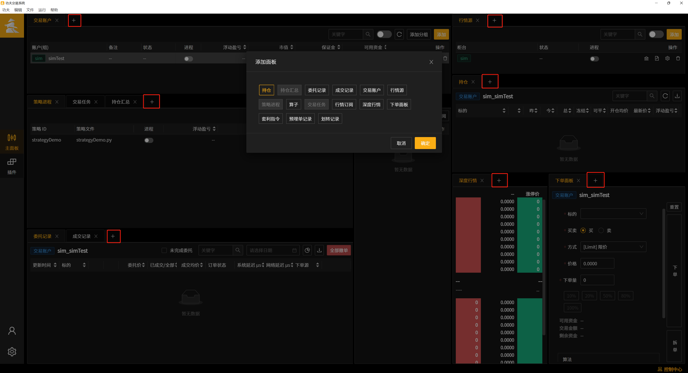

上手指导
=========

名词解释
---------------------

    - TD : 交易账户。 “添加TD”即指“添加交易账户信息”
    - MD : 行情源账户。 “添加MD”即指“添加行情源信息(每个柜台仅允许一个行情源存在)”
    - strategy : 策略。 “添加strategy”即指“添加策略文件”
    - KF_home文件夹 : 功夫软件中添加的账户/行情/策略/定时任务/交易日志/数据等信息所在
    - KF_home文件路径 ：客户端左侧边栏-全局设置窗中允许修改储存路径； 功夫软件(windows版本)左上角 - 文件 - 打开功夫资源目录(KF_HOME)

-----

注意事项
-------------------

- 安装新版本之前，需先将旧版本卸载

- 使用定时任务时，建议策略的启动时间设置为期望运行时刻前1-2分钟
    - 原因 : 策略的启动一般情况下需要1-2秒的准备时间；但当系统内交易数据随当天运行时间的增长而增多时，策略启动准备时间也会相应增长。一般情况下，10秒左右即可进入交易。因而，为了最大程度保护策略的正常运行,建议提前一分钟启动。

-----

界面布局
-------------

 - KungFu是一款支持跨柜台多账户交易的量化交易系统， **标准版** 系统目前支持的柜台有：XTP（股票），CTP（期货）。高配版支持交易接口定制，可适配全部主流柜台。

 - 为了方便用户进行多账户下单，Kungfu系统提供了账户模块，在账户模块中，用户可以对账户进行添加、编辑以及删除，也可以分别查看不同账户的实时运行状态、运行日志、持仓情况、委托情况、成交情况以及盈亏情况。

 - 在kungfu交易系统中，每个账户由一个行情进程（md）以及一个交易进程（td）组成，行情进程用来接收行情信息，交易进程用来下单、撤单。

.. note:: Kungfu的功能模块体现为不同面板，界面灵活，可自由配置。

         交易前需要添加交易账户（TD）、行情源（MD）并启动进程。

         在此基础上，可搭配不同面板完成策略下单、算法下单、手动下单、预埋单等操作

-----

添加面板/隐藏面板
~~~~~~~~~~~~~~~~~~~~~~~~~~
 - 如果在界面上找不到想使用的面板，请手动添加。
  
 - 点击面板名称旁“+”按钮即可添加面板(如下图红框位置)；不常用的面板也可以通过点击面板旁的“×”隐藏面板

-----

修改布局
~~~~~~~~~~~~~~~~
Kungfu支持自定义面板位置、区域高度及宽度。

- **调整面板所在的位置**：长按面板名并拖拽到对应位置松开鼠标，即可完成面板位置调整

- **调整区域的高度及宽度**：鼠标移动到区域间空隙处，鼠标指针变为调整状态时，即可调整区域的高度、宽度

-----

快速尝试
---------------
已预置了行情、账户、策略Demo，无需配置即可体验交易流程。按照行情源-》交易账户-》策略进程的顺序依次启动进程即可体验一键准备账户、策略下单流程。

