命令行使用手册
====================

简介
--------

功夫 CLI 系统是基于 Linux 操作系统的命令行监控交互界面，告别 Linux shell 小黑屋，通过简洁的界面，所有交易所需要数据一览无遗，操作灵活、简单。

安装
--------

下载含有Kungfu-CLI功能的功夫交易系统Linux安装包 Kungfu-version.rpm 或者是 Kungfu-version.AppImage.

注意 : 安装包的具体名字要看下载的版本 (比如 : Kungfu-1.1.0-linux-x86_64-latest.rpm , Kungfu-1.1.0-linux-x86_64-latest.AppImage)

Kungfu-version.rpm 安装包，安装命令为

::

    yum install Kungfu-version.rpm
    # yum install Kungfu-1.1.0-linux-x86_64-latest.rpm

Kungfu-version.AppImage 安装包
    需要将 appimage 抽出，生成 squashfs-root 文件夹（该文件夹名称以系统生成为准），再将其内容复制到 /opt/Kungfu (如果opt下没有Kungfu文件夹,需要自己创建) 目录下

::

    ./Kungfu-version.AppImage --appimage-extract
    # ./Kungfu-1.1.0-linux-x86_64-latest.AppImage --appimage-extract

    cp -R squashfs-root/* /opt/Kungfu

在Linux系统安装成功后，需要把Kungfu/resources/下的文件权限改为777

::

    sudo chmod 777 -R /opt/Kungfu/resources/

卸载
--------

安装新版本之前需要先卸载旧版本,不建议覆盖安装

::
    # 对于安装的是.rpm包 的卸载命令 :
    yum remove Kungfu

    # 对于安装的是.appimage安装部, 卸载直接删除 /opt/Kungfu 文件夹即可

文件路径
--------

安装完成后，执行路径

::

    cd /opt/Kungfu/resources/kfc

KF_home资源目录(账户/行情信息/数据/key文件/日志文件/缓存等数据存放) 路径如下

::

    cd ~/.config/Kungfu/home

日志存放 路径如下

::

    cd ~/.config/Kungfu/home/logview/日期/

账户/行情/策略的添加信息存放路径

::

    cd ~/.config/Kungfu/home/runtime/system/etc/Kungfu/db/live/config.db

功能说明
--------

监控所有进程
~~~~~~~~~~~~

在Kungfu CLI文件目录内，输入命令

::

    $ ./kfc cli monit

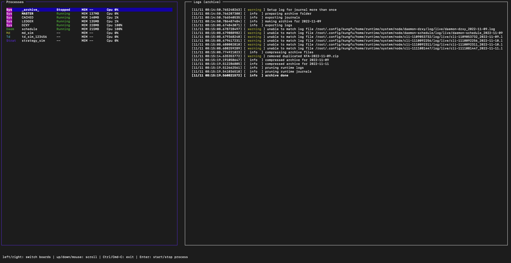

界面左侧会显示系统内所有的进程，其中包括：

- ARCHIVE : 归档进程

- MASTER：主控进程

- LEDGER：数据进程

- CACHED : 缓存进程

- DZXY : 斗转星移

- schedule : 定时启停任务进程

- MD：行情柜台进程

- TD：交易柜台进程

- Strat：策略进程

进程解释 :

 - 归档进程 : 把KF_HOME 里runtime下面所有journal跟log，打包到 KF_HOME/archive 目录下,然后压缩.

 - 主控进程 : 程序主进程.

 - 数据进程 : 管理行情数据,交易数据等.

 - 缓存进程 : 管理行情数据,交易数据等数据缓存

 - 斗转星移 : 为了不阻塞cli monit 的界面渲染,把性能消耗大的数据读取展示操作放在了单独的DZXY进程里,再通过进程通信把数据转到monit界面上.

 - 定时启停任务进程 : 管理所有定时任务

同时显示每一个进程对应的状态，通过上下键移动光标选择进程，选中后通过回车键可以启动或停止该进程；在界面右侧会显示进程的实时运行日志

master进程默认关闭，需要手动开启master进程后，系统才能正常运行。

开启 master进程, ARCHIVE / LEDGER / CACHED / DZXY 会同步开启.

**ARCHIVE 进程状态 "Stopped"是没关系的, 其他进程必须是 "Running" 才可以启动 td , md 进程**

**td , md 进程状态为就绪 "Ready" 才可以打开策略**

-----

添加账户
~~~~~~~~~~~~

在Kungfu CLI文件目录内，输入命令行

::

    $ ./kfc cli add

通过上下按键选择添加交易账户(td) / 行情(md) / 策略(strategy)，然后选择柜台,目前支持sim模拟柜台,CTP期货柜台以及XTP股票柜台，回车确定，然后输入对应的账户表单

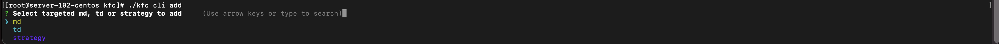

注意 :

 - 1.行情中同一柜台只能添加一个账户

 - 2.sim的交易账户柜台(td),只需填写账户(随意填写)与撮合模式 ,行情源柜台(md)选择sim柜台后回车即可,无需填写信息

ctp交易柜台(TD)账户信息

.. list-table::
   :header-rows: 1

   * - 字段
     - 字段含义
   * - account_name
     - 账户别名（例如：ctp测试）
   * - account_id
     - 账户名称（例如：089270）
   * - password
     - 账户密码（例如：123456）
   * - broker_id
     - 期货券商代，码实盘由券商提供，simnow模拟盘填写 9999
   * - auth_code
     - 穿透认证码，实盘由券商提供，simnow模拟盘填写 0000000000000000
   * - product_info
     - 客户端名称，Kungfu
   * - app_id
     - 客户端识别号，实盘填写 TAURUS_Kungfu_2.0，simnow模拟盘填写 simnow_client_test
   * - td_ip
     - 交易ip （例：180.168.146.187）
   * - td_port
     - 交易端口 （例：10201）
   * - sync_external_order
     - 开启后则同步用户在其他交易软件的订单
   * - recover_order_trade
     - 开启后，启动账户时将从柜台拉取本交易日的订单
   * - license_code
     - 账户授权码 (官网的许可购买页面进行购买)

ctp行情柜台(MD)信息

.. list-table::
   :header-rows: 1

   * - 字段
     - 字段含义
   * - account_id
     - 账户名称（例如：089270）
   * - password
     - 账户密码（例如：123456）
   * - broker_id
     - 实盘由期货券商提供. (如果账户为simnow的模拟账户填写  9999)
   * - md_ip
     - 行情ip （例：180.168.146.187）
   * - md_port
     - 行情端口 （例：10201）

xtp交易柜台(TD)账户信息

.. list-table::
   :header-rows: 1

   * - 字段
     - 字段含义
   * - account_name
     - 账户别名（例如：xtp测试）
   * - account_id
     - 账户名称
   * - password
     - 账户密码
   * - software_key
     - 用户开发软件Key,券商提供
   * - td_ip
     - 交易柜台IP地址
   * - td_port
     - 交易柜台端口
   * - client_id
     - 1~99任意数字，用于区分同一账户多点登陆
   * - sync_external_order
     - 开启后则同步用户在其他交易软件的订单
   * - recover_order_trade
     - 开启后，启动账户时将从柜台拉取本交易日的订单
   * - license_code
     - 账户授权码 (官网的许可购买页面进行购买)

xtp行情柜台(MD)信息

.. list-table::
   :header-rows: 1

   * - 字段
     - 字段含义
   * - account_id
     - 账户名称
   * - password
     - 账户密码
   * - md_ip
     - 行情柜台IP地址
   * - md_port
     - 行情柜台端口
   * - protocol
     - 接收行情协议 TCP或者UDP
   * - buffer_size
     - 设置缓冲区大小
   * - client_id
     - 1~99任意数字，用于区分同一账户多点登陆
   * - query_instruments
     - 是否查询query_instruments, 开启后会查询所有可交易标的, 流量太大频繁查询可能导致账号或ip被XTP拉黑
     
-----

添加策略
~~~~~~~~~~~~

在Kungfu CLI文件目录内，输入命令

::

    $ ./kfc cli add

选择 strategy 添加策略

- strategy_id  (需保证该策略ID唯一)   : 输入策略id（不能与已有的策略id重复,不能带有下划线以及特殊符号）

- strategy_path : 策略文件所在的本地路径(路径为绝对路径,比如 : /home/strategy/demo.py)

-----

删除账户/行情/策略信息
~~~~~~~~~~~~~~~~~~~~~~~~~~~

在Kungfu CLI文件目录内，输入命令

::

    $ ./kfc cli remove

界面会显示当前系统内的所有交易账户(td)/行情(md)以及策略(strategy)，通过上下键移动光标，选中需要删除的，回车删除

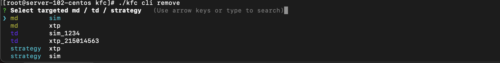

-----

更改已添加的账户/行情/策略信息
~~~~~~~~~~~~~~~~~~~~~~~~~~~~~~~~

在Kungfu CLI文件目录内，输入命令

界面会显示当前系统内的所有交易账户(td)/行情(md)以及策略(strategy)，通过上下键移动光标，选中需要更改的信息,回车确定.如果要更改某信息,比如地址,在到达地址选项的时候写入新地址后回车确定,如果不更改本信息,直接回车下一个.

::

    $ ./kfc cli update

-----

展示已添加的账户/行情/策略信息
~~~~~~~~~~~~~~~~~~~~~~~~~~~~~~~~

在Kungfu CLI文件目录内，输入命令

::

    $ ./kfc cli list

-----

添加算子插件-bar数据
~~~~~~~~~~~~~~~~~~~~~~~~

(1) 在Kungfu CLI文件目录内，输入命令add

::

    $ ./kfc cli add

(2) 选择算子"operator"，点击回车

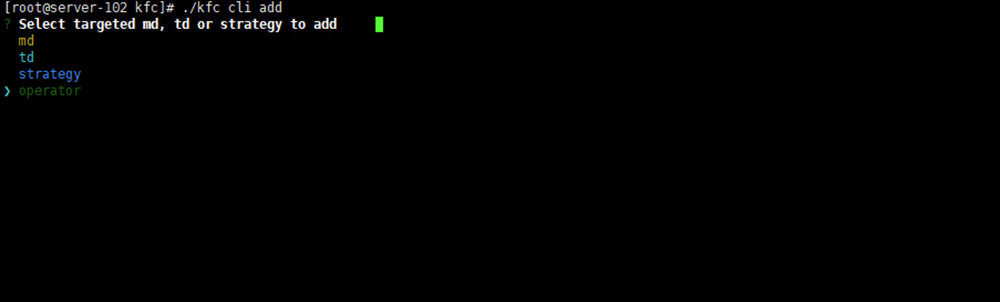

(3) 选择 "extension"算子插件，回车确认

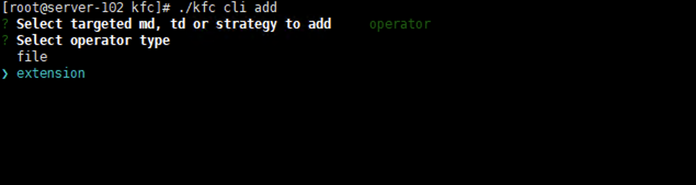

(4) 目前官方封装好的插件只有一个bar数据

选择Bar bar，表示使用算子插件bar数据；回车确认

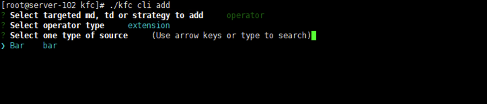

(5) 按照表单填写数据

.. list-table::
   :header-rows: 1

   * - 字段
     - 字段含义
   * - Select one type of source
     - 算子类型，选择 Bar
   * - id
     - 算子id，不允许重复，其他策略/算子调用该算子的标识
   * - source
     - 选择行情源，如xtp、ctp、sim
   * - instruments
     - 选择标的，允许输入多个标的，使用逗号分隔；允许多选，多选请查看下方步骤
   * - period
     - 计算周期，单位为秒，可看作计算结果推送间隔

单选标的：点击空格，前方出现绿色按钮表示选中，再次点击空格取消选中。 点击回车确认选择标的

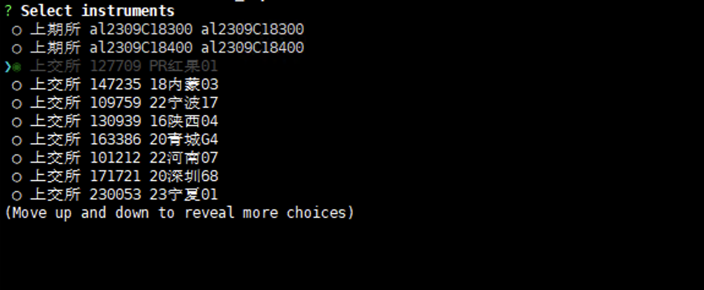

多选标的：与单选标的同理，回车确认好第一个标的后，通过上下键选择其他标的并回车确认。

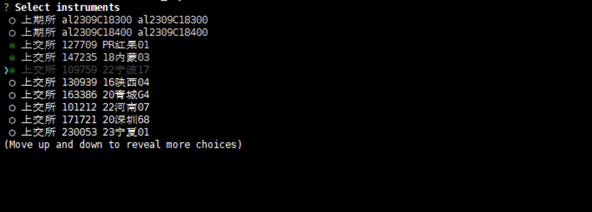

(6) 标的选择完毕，再次点击回车键确定，成功创建算子插件bar数据

-----

添加算子文件
~~~~~~~~~~~~~~~~~~~~~~~~

(1) 在Kungfu CLI文件目录内，输入命令add

::

    $ ./kfc cli add

(2) 选择算子"operator"，点击回车

(3) 选择 "file"算子文件，回车确认

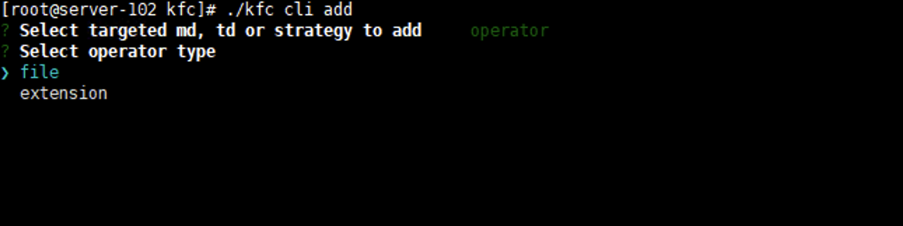

(4) 按照表单填写数据

.. list-table::
   :header-rows: 1

   * - 字段
     - 字段含义
   * - id
     - 输入算子id，不允许重复，其他策略/算子调用该算子的标识
   * - file_path
     - 输入算子文件路径

(5) 算子文件路径输入完毕，点击回车确认，成功创建算子文件

-----

监控单进程
~~~~~~~~~~~~

在Kungfu CLI文件目录内，输入命令
::

    $ ./kfc cli monit -l

界面显示系统内所有的账户进程以及策略进程，通过上下键移动光标选择需要监控的进程，回车确认

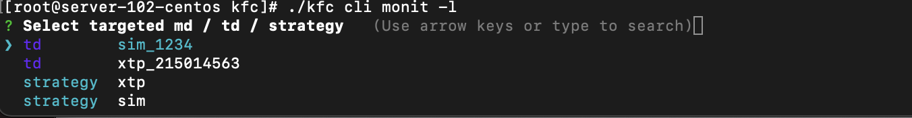

当选中账户进程，界面会显示该账户的详细情况，在界面的左上方会显示账户的行情进程状态以及交易进程状态，通过上下键移动光标，回车键进行启动和关闭进程

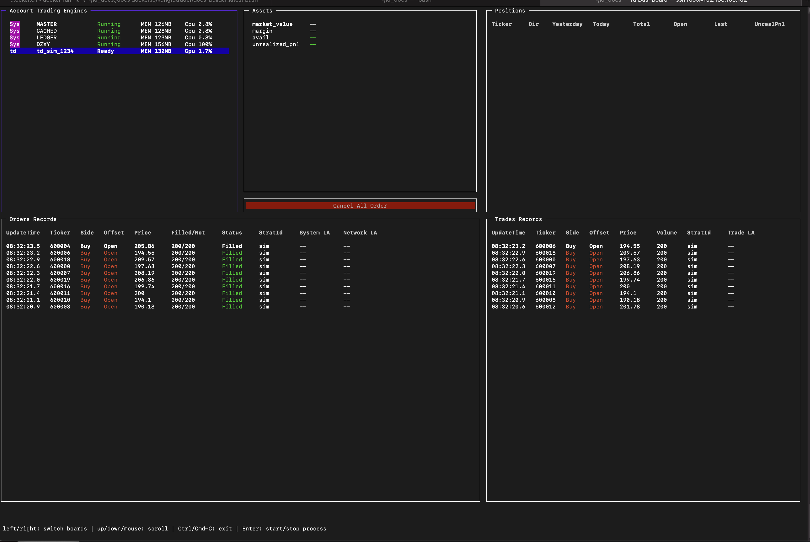

- :ref:`Assets窗口`，显示当前账户资金盈亏信息

- :ref:`Positions窗口`，显示当前账户的持仓信息

- :ref:`Order Records窗口`，显示该账户的委托记录

- :ref:`Trade Records窗口`，显示该账户的成交记录

- Cancel All Order：撤单按钮，选中撤单按钮后，通过回车键可以对该账户下所有未完成委托进行撤单操作

当选中策略进程，界面会显示该策略的详细情况，在界面的左上方会显示策略的运行情况，可以通过回车键进行启动和关闭进程

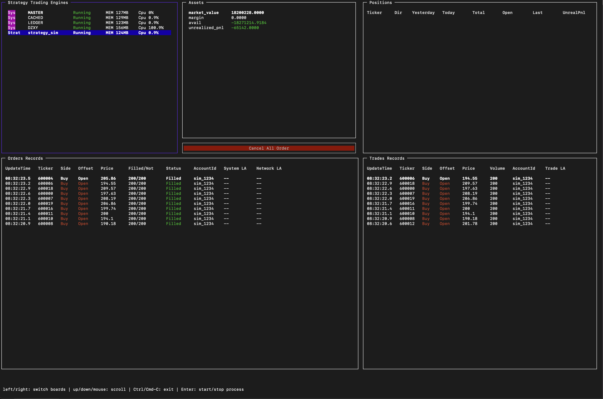

- :ref:`Assets窗口`，显示当前策略资金盈亏信息

- :ref:`Positions窗口`，显示当前策略的持仓信息

- :ref:`Order Records窗口`，显示该策略的委托记录

- :ref:`Trade Records窗口`，显示该策略的成交记录

- Cancel All Order：撤单按钮，选中撤单按钮后，通过回车键可以对该策略下所有未完成委托进行撤单操作

-----

关闭功夫进程
~~~~~~~~~~~~~~~~~~~~~~

在Kungfu CLI文件目录内，输入命令

::

    $ ./kfc cli shutdown

-----

定时启停
~~~~~~~~~~~~~~

开启定时启停任务
^^^^^^^^^^^^^^^^^^

注意 :
    - **定时启停默认是关闭的,使用需要先开启**
    - **system 主控进程只能重启 , td/md/strategy 可以设置开启与停止**
    - **添加任务之后需要重启schedule进程**
    - **如果要 system/td/md/strategy  按顺序启动,每个之间时间间隔60s左右**

::

    $ ./kfc cli schedule active

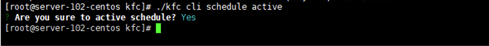

-----

关闭定时启停任务
^^^^^^^^^^^^^^^^^

::

    $ ./kfc cli schedule  inactive

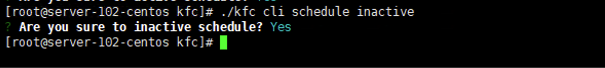

-----

添加定时启停任务
^^^^^^^^^^^^^^^^^^^^^

::

    $ ./kfc cli schedule  add

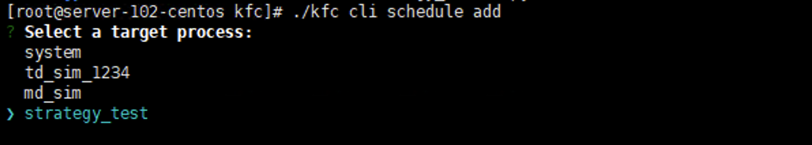

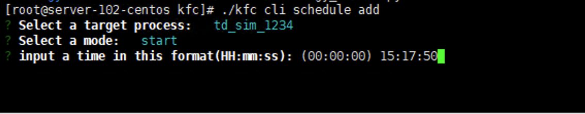

-----

更改定时启停任务
^^^^^^^^^^^^^^^^^

::

    $ ./kfc cli schedule  update

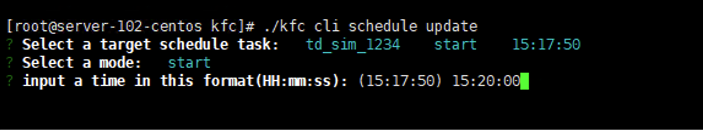

-----

删除定时启停任务
^^^^^^^^^^^^^^^^^^

::

    $ ./kfc cli schedule  delete

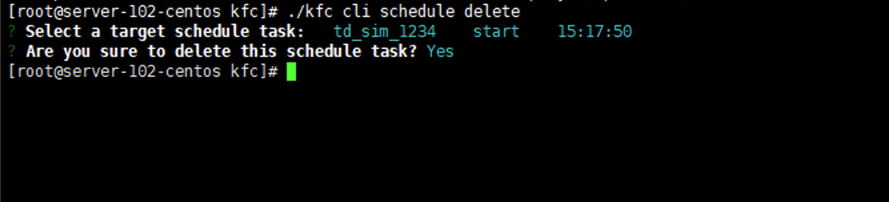

查看定时启停任务
^^^^^^^^^^^^^^^^^^

::

    $ ./kfc cli schedule  show

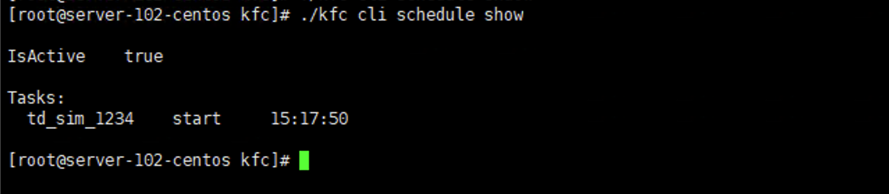

全局设置
~~~~~~~~~~~~~~

在Kungfu CLI文件目录内，输入命令

::

    $ ./kfc cli config

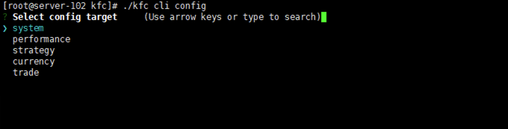

- system : 系统设置

- performance : 性能设置

- strategy : 使用本地python

- currency : 币种展示

- trade : 交易设置

- code : 代码编辑器设置

系统设置
^^^^^^^^^^^^

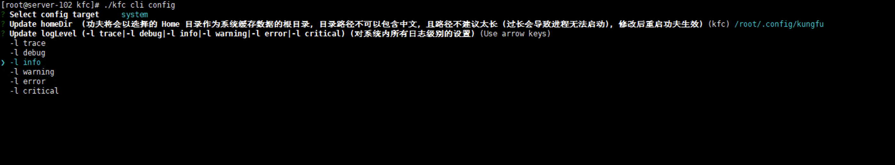

- Update homeDir : 功夫将会以选择的 Home 目录作为系统缓存数据的根目录, 目录路径不可以包含中文, 且路径不建议太长 (过长会导致进程无法启动), 修改后重启功夫生效

- Update logLevel   : 全局日志设置 (日志有6个级别，日志文件只会记录等于和高于设置级别的日志内容。日志级别从低到高分别为：)

    - trace
    - debug
    - info
    - warning
    - error
    - critical

- Update language : 选择语言，修改后重启功夫生效

- Update autoRestartTd  : 交易进程断开时是否自动重启, 如果打开, 则当交易进程出错后, 会尝试重连三次, 如果关闭, 则不会；在重启过程中（重启开始到交易进程就绪）, 策略内查询到的持仓会为0, 需要在策略内通过 on_deregister, on_broker_state_change这两个方法来判断柜台状态是否断开/重启就绪

- Update bypassArchive : 跳过归档 (仅删除上个交易日留下的journal与log文件, 不再压缩打包, 归档后无法恢复之前的内存数据,会加快启动速度)

性能设置
^^^^^^^^^^^^

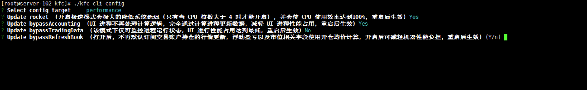

- Rocket : 开启极速模式 ：cpu利用率将达到100%，能够极大降低系统延迟。(只有当 CPU 核数大于 4 时才能开启)

- BypassAccounting : 跳过UI进程计算 ：UI进程不再处理计算逻辑, 完全通过计算进程更新数据, 减轻UI进程性能占用, 重启后生效。

- BypassTradingData : 纯监控模式:该模式下仅可监控进程运行状态, UI进行性能占用达到最低, 重启后生效

- BypassRefreshBook : 跳过持仓行情订阅 : 打开后, 不再默认订阅交易账户持仓的行情更新, 且交易账户列表不再显示浮动盈亏, 市值相关字段使用开仓均价计算, 开启后可减轻机器性能负担, 重启后生效

使用本地python
^^^^^^^^^^^^^^

当要使用功夫的python中没有的模块,可以使用本地python,下载安装模块到本地.本地Python版本必须为 3.9.x

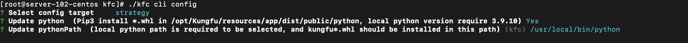

- 使用本地python并下载 .whl 依赖  (不再使用的时候选择 no)

- 填写本地python路径

- 下载依赖 ： pip install /opt/Kungfu/resources/app/dist/public/python/Kungfu-xxx.whl

交易设置
^^^^^^^^^^^^

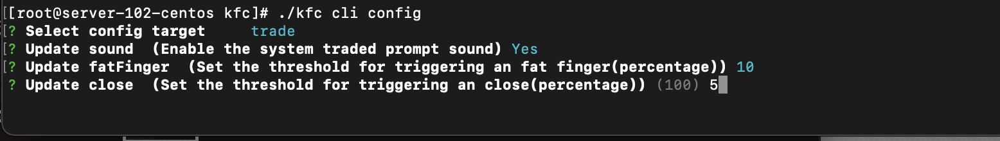

- 成交提示音 ：Linux命令行版本不支持

- 乌龙指阈值 ：Linux命令行版本不支持

- 平仓阈值 : Linux命令行版本不支持

- 设置交易限制 : Linux命令行版本不支持

- 两融 : Linux命令行版本不支持

编辑器设置
^^^^^^^^^^^^^^

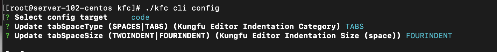

- 缩进类别 ：Linux命令行版本不支持

- 缩进长度 ：Linux命令行版本不支持

获取帮助
~~~~~~~~~~~~~~

在Kungfu CLI文件夹内，输入命令行
::

    $ ./kfc cli -h

界面会显示Kungfu CLI所有支持的命令以及相应的解释

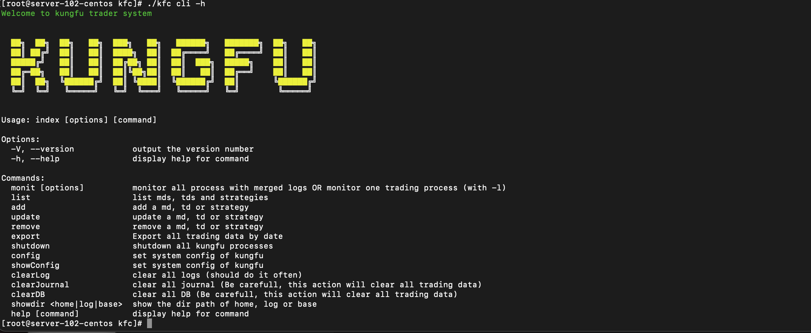

窗口字段
--------

.. _Assets窗口:

Assets 窗口
~~~~~~~~~~~~~~~~~

.. list-table::
   :width: 100%
   :align: left

   * - 字段
     - 字段含义
   * - UnRealizedPnl
     - 未实现盈亏
   * - Avail
     - 可用资金
   * - MarketValue
     - 市值（股票）
   * - Margin
     - 保证金（期货）

.. _Positions窗口:

Positions 窗口
~~~~~~~~~~~~~~~~~

.. list-table::
   :width: 100%
   :align: left

   * - 字段
     - 字段含义
   * - Ticker
     - 标的代码
   * - Dir
     - 仓位状态(多空)
   * - Yesterday
     - 昨仓
   * - Today
     - 今仓
   * - Total
     - 总持仓
   * - Open
     - 开仓均价
   * - Last
     - 最新价
   * - UnrealPnl
     - 未实现盈亏

.. _Order Records窗口:

Order Records 窗口
~~~~~~~~~~~~~~~~~~~~~~~~~~~

.. list-table::
   :width: 100%
   :align: left

   * - 字段
     - 字段含义
   * - UpdateTime
     - 更新时间
   * - Ticker
     - 标的代码
   * - Side
     - 买卖方向
   * - Offset
     - 开平方向
   * - Price
     - 委托价格
   * - Filled/Not
     - 已完成/全部
   * - Status
     - 委托状态
   * - StratId(AccountId)
     - 发出委托的策略 or 账户
   * - System LA
     - 系统延迟
   * - Network LA
     - 网络延迟

.. _Trade Records窗口:

Trade Records 窗口
~~~~~~~~~~~~~~~~~~~~~~~~~~~

.. list-table::
   :width: 100%
   :align: left

   * - 字段
     - 字段含义
   * - UpdateTime
     - 更新时间
   * - Ticker
     - 标的代码
   * - Side
     - 买卖方向
   * - Offset
     - 开平方向
   * - Price
     - 成交价格
   * - Volume
     - 数量
   * - StratId(AccountId)
     - 发出委托的策略 or 账户
   * - Trade LA
     - 成交延迟