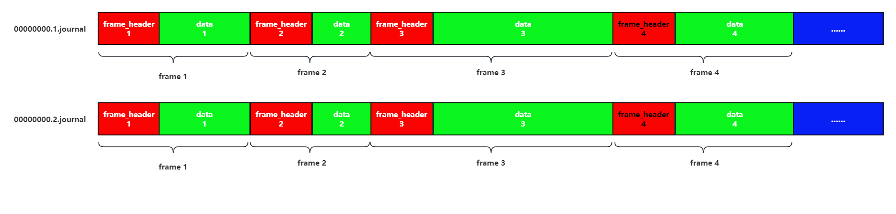

前置注意事项
===============================

本节主要介绍以下内容,

1. Kungfu共享内存结构, 理解该结构有助于处理柜台的参数 `kungfu::event_ptr&`
#. `kungfu::event_ptr` 的内容和使用方式
#. 柜台回调函数的多线程处理, 通过journal把数据转到主线程处理, 避免加锁, 同时支持回放

kungfu共享内存结构
------------------------

kungfu框架中进程间通信采用共享内存队列的形式, 一个进程将数据写入共享内存文件, 其他多个进程可以同时读取.

一条信道对应一个逻辑上的journal文件, 表示逻辑上一个无限大的队列.

具体实现时将一个journal切分为多个固定大小的page, 只要磁盘足够大就可以无限的增加page的个数, 每一个page文件的命名规则为 **"dest_id的十六进制进程.page数.journal"**.

存放在写入进程的目录下, 实盘模式下写入进程的journal所属目录命名规则为 **"$KF_HOME/runtime/journal/{category}/{group}/{name}/{mode}"**.

范例

.. code-block:: shell
    :linenos: 

    $KF_HOME/runtime/journal/td/CTP/089270/live, 表示实盘模式的CTP柜台对应账户为089270的共享内存文件目录    

每一个page存放具体的数据, 每一个数据视为一个frame, frame由frame_header和data组成.

journal的结构如下图所示, 

------------------------

kungfu::event_ptr
----------------------

在kungfu系统中, 所有的"typename_ptr"都实际表示std::shared_ptr<typename>, 
即kungfu::event_ptr表示std::shared_ptr<kungfu::event>.

当A进程往共享内存里写入一个数据时, 会生成一个frame, 里面包含了frame_header和具体的数据内容, 
当B进程读到该数据时, 也会将frame_header和后面的数据封装成一个frame, kungfu::event_ptr就是指向这个frame的指针, 
B进程会根据frame_header里面的数据类型msg_type触发不同的函数.

例如当策略调用下单时, 会往共享内存里写入一个OrderInput数据, TD读取到这个数据时, 会把frame_header和OrderInput封装在一个frame里, 
然后调用虚函数insert_order函数, 并且把指向这个frame的指针kungfu::event_ptr作为参数传入,
在override的insert_order函数里通过调用event的对应函数, 可以获取到这个frame里面的frame_header和具体数据OrderInput的信息.

范例

.. code-block:: cpp
    :linenos: 

    //ctp的insert_order实现
    bool TraderCTP::insert_order(const event_ptr &event) {
        const OrderInput &input = event->data<OrderInput>();
        SPDLOG_DEBUG("OrderInput: {}", input.to_string());

        int request_id = get_request_id();
        int error_id = 0;
        uint64_t orderRef_key = 0;

        CThostFtdcInputOrderField ctp_input{};
        to_ctp(ctp_input, input);
        strcpy(ctp_input.BrokerID, config_.broker_id.c_str());
        strcpy(ctp_input.InvestorID, config_.account_id.c_str());
        strcpy(ctp_input.OrderRef, std::to_string(++order_ref_).c_str());
        SPDLOG_DEBUG("CThostFtdcInputOrderField: {}", to_string(ctp_input));
        error_id = api_->ReqOrderInsert(&ctp_input, request_id);
        orderRef_key = get_orderRef_key(front_id_, session_id_, ctp_input.OrderRef);

        auto nano = time::now_in_nano();
        auto writer = get_writer(event->source());
        Order &order = writer->open_data<Order>(event->gen_time());
        order_from_input(input, order);
        order.insert_time = nano;
        order.update_time = nano;
        order.time_condition = from_ctp_time_condition(ctp_input.TimeCondition);

        if (error_id != 0) {
            order.error_id = error_id;
            order.status = OrderStatus::Error;
        }

        SPDLOG_DEBUG("Order: {}", order.to_string());
        writer->close_data();
        map_request_id_to_kf_order_id_.insert_or_assign(request_id, uint64_t(input.order_id));
        map_OrderRefKey_to_kf_order_id_.insert_or_assign(orderRef_key, uint64_t(input.order_id));
        map_kf_order_id_to_OrderRef_.insert_or_assign(input.order_id, ctp_input.OrderRef);
        return error_id == 0;
    }

------------------------------------    

.. frame_header, event和frame的定义如下:

.. .. code-block:: cpp
..     :linenos:    

..     // frame_header的数据结构
..     KF_DEFINE_PACK_TYPE(                                           //
..         frame_header, 0, PK(gen_time), TIMESTAMP(gen_time),        //
..         /** total frame length (including header and data body) */ //
..         (volatile uint32_t, length),                               //
..         /** header length */                                       //
..         (uint32_t, header_length),                                 //
..         /** generate time of the frame data */                     //
..         (int64_t, gen_time),                                       //
..         /** trigger time for this frame, use for latency stats */  //
..         (int64_t, trigger_time),                                   //
..         /** msg type of the data in frame */                       //
..         (volatile int32_t, msg_type),                              //
..         /** source of this frame */                                //
..         (uint32_t, source),                                        //
..         /** dest of this frame */                                  //
..         (uint32_t, dest),                                          //
..         /** json or raw struct */                                  //
..         (enums::FrameDataType, data_type),                         //
..         /** the real writer of this frame */                       //
..         (uint32_t, initial_source),                                //
..         /** key of frame */                                        //
..         (uint64_t, frame_uid),                                     //
..         /** current_frame of reader when generate this frame */    //
..         (uint64_t, trigger_frame_uid)                              //
..     );

..     struct event {
..         virtual ~event() = default;

..         [[nodiscard]] virtual int64_t gen_time() const = 0;         

..         [[nodiscard]] virtual int64_t trigger_time() const = 0;     

..         [[nodiscard]] virtual int32_t msg_type() const = 0;         

..         [[nodiscard]] virtual uint32_t source() const = 0;          

..         [[nodiscard]] virtual uint32_t initial_source() const = 0;  

..         [[nodiscard]] virtual uint32_t dest() const = 0;            

..         [[nodiscard]] virtual uint32_t data_length() const = 0;     

..         [[nodiscard]] virtual const void *data_address() const = 0; 

..         [[nodiscard]] virtual const char *data_as_bytes() const = 0; 

..         [[nodiscard]] virtual std::vector<uint8_t> data_as_byte_array() const = 0; 

..         [[nodiscard]] virtual std::string data_as_string() const = 0; 

..         [[nodiscard]] virtual std::string to_string() const = 0;      

..         [[nodiscard]] virtual int8_t data_type() const = 0;

..         [[nodiscard]] virtual bool is_json() const = 0;

..         [[nodiscard]] virtual uint64_t frame_uid() const = 0;

..         [[nodiscard]] virtual uint64_t trigger_frame_uid() const = 0;

..         /**
..         * Using auto with the return mess up the reference with the undlerying memory address, DO NOT USE it.
..         * @tparam T
..         * @return a casted reference to the underlying memory address
..         */
..         template <typename T> std::enable_if_t<size_fixed_v<T> or std::is_same_v<T, nlohmann::json>, const T &> data() const {
..             return *(reinterpret_cast<const T *>(data_address()));
..         }

..         template <typename T>
..         std::enable_if_t<not size_fixed_v<T> and not std::is_same_v<T, nlohmann::json>, const T> data() const {
..             return T(data_as_bytes(), data_length());
..         }

..         template <class T> const T &custom_data() const { return *(reinterpret_cast<const T *>(data_address())); }
..     };

..     struct frame : event {
..         ~frame() override = default;

..         [[nodiscard]] bool has_data() const { return header_->length > 0 && header_->msg_type > 0; }

..         [[nodiscard]] uintptr_t address() const { return reinterpret_cast<uintptr_t>(header_); }

..         [[nodiscard]] uint32_t frame_length() const { return header_->length; }

..         [[nodiscard]] uint32_t header_length() const { return header_->header_length; }

..         [[nodiscard]] uint32_t data_length() const override { return frame_length() - header_length(); }

..         [[nodiscard]] int64_t gen_time() const override { return header_->gen_time; }

..         [[nodiscard]] int64_t trigger_time() const override { return header_->trigger_time; }

..         [[nodiscard]] int32_t msg_type() const override { return header_->msg_type; }

..         [[nodiscard]] uint32_t source() const override { return header_->source; }

..         [[nodiscard]] uint32_t initial_source() const override { return header_->initial_source; }

..         [[nodiscard]] uint32_t dest() const override { return header_->dest; }

..         [[nodiscard]] const void *data_address() const override {
..             return reinterpret_cast<void *>(address() + header_length());
..         }

..         [[nodiscard]] const char *data_as_bytes() const override {
..             return reinterpret_cast<char *>(address() + header_length());
..         }

..         [[nodiscard]] std::vector<uint8_t> data_as_byte_array() const override {
..             return {data_as_bytes(), data_as_bytes() + data_length()};
..         }

..         [[nodiscard]] std::string data_as_string() const override { return std::string{data_as_bytes(), data_length()}; }

..         [[nodiscard]] std::string to_string() const override {
..             auto j = header_->to_json();
..             j["data"] = data_as_string();
..             return j.dump(-1, ' ', false, nlohmann::json::basic_json::error_handler_t::replace);
..         }

..         [[nodiscard]] int8_t data_type() const override { return int8_t(header_->data_type); }

..         [[nodiscard]] bool is_json() const override { return data_type() == longfist::enums::FrameDataType::Json; }

..         [[nodiscard]] uint64_t frame_uid() const override { return header_->frame_uid; }

..         [[nodiscard]] uint64_t trigger_frame_uid() const override { return header_->trigger_frame_uid; }

..         template <typename T> size_t copy_data(const T &data) {
..             size_t length = sizeof(T);
..             memcpy(const_cast<void *>(data_address()), &data, length);
..             return length;
..         }

..         private:
..         longfist::types::frame_header *header_ = nullptr;

..         frame() = default;

..         void set_address(uintptr_t address) { header_ = reinterpret_cast<longfist::types::frame_header *>(address); }

..         void move_to_next() { set_address(address() + frame_length()); }

..         void set_header_length() { header_->header_length = sizeof(longfist::types::frame_header); }

..         void set_data_length(uint32_t length) { header_->length = header_length() + length; }

..         void set_gen_time(int64_t gen_time) { header_->gen_time = gen_time; }

..         void set_trigger_time(int64_t trigger_time) { header_->trigger_time = trigger_time; }

..         void set_msg_type(int32_t msg_type) { header_->msg_type = msg_type; }

..         void set_data_type(longfist::enums::FrameDataType data_type) { header_->data_type = data_type; }

..         void set_source(uint32_t source) { header_->source = source; }

..         void set_initial_source(uint32_t initial_source) { header_->initial_source = initial_source; }

..         void set_dest(uint32_t dest) { header_->dest = dest; }

..         void set_frame_uid(uint64_t frame_uid) { header_->frame_uid = frame_uid; }

..         void set_trigger_frame_uid(uint64_t trigger_frame_uid) { header_->trigger_frame_uid = trigger_frame_uid; }

..         void copy(const frame &source) { memcpy(header_, source.header_, source.frame_length()); }

..         friend struct cloned_frame;

..         friend class journal;

..         friend class writer;

..         friend class replay_writer;
..     };

    

------------------------

柜台回调多线程处理
----------------------

一般情况下, 我们主动调用柜台API接口发送数据, 和柜台SPI回调接口是在两个不同的线程, 有的柜台API接口响应函数和数据推送函数是不同的线程, 此时是有三个线程.

对于TD我们提交委托和收到委托响应, 以及收到成交推送时, 都需要访问map <柜台委托号, Kungfu委托号> 来确定成交和委托的映射关系, 一般情况下都会选择使用加锁的方式来保证线程安全.

例如, 针对于异步下单的场景, 我们需要先构建 <下单跟踪信息, Kungfu委托号> map映射关系, 在委托报单响应回调里面访问这个map再构建 <API委托号, Kungfu委托号> 映射关系, 
当收到成交推送的时候才能找到这笔成交属于Kungfu的哪一笔委托, 此时如果不对相关的容器进行加锁, 
最容易遇到的情况就是一个线程插入数据导致stl扩容, 原来的内存地址失效, 此时另一个线程正在访问原来的内存地址, 此时会导致整个进程崩溃.

虽然通过加锁可以解决TD这一层的线程安全问题, 但是我们整个Kungfu框架的底层设计是针对于多进程单线程设计的, 底层的容器的访问绝大部分都没有加锁, 
API子线程和Kungfu主线程同时访问同一个容器时, 仍然存在线程安全问题
例如, 当柜台API成交推送在子线程推送成交数据时, 在子线程里调用get_writer(策略A)去把成交信息写给策略A, 而此时有策略B启动申请和TD通信, 主线程刚好需要添加TD写给策略B的writer, 
此时有可能会导致get_writer(策略A)访问的容器触发扩容内存失效, 导致内存崩溃, 虽然这种概率非常小, 但是也存在风险.

为了规避多线程安全问题, 以及防止频繁的加锁解锁带来的性能损耗, 我们统一将TD子线程推送的数据通过共享内存传输给主线程处理. 
其实现方式为, 定义一个 `inline static thread_local journal::writer_ptr thread_writer_;` 给每一个子线程, 
调用 `get_thread_writer()` 会获取属于当前线程的writer, Kungfu底层会做好主线程读取的处理. 
当子线程回调触发时, 调用该函数, 直接将数据原原本本的写入到共享内存, 主线程读取到后再做后续的业务处理, 
这样做的好处有两个, 

1. 所有的容器访问都在主线程, 不需要加锁
#. 柜台APi的原始数据全部落地保存, 可以随时使用回放功能查看柜台原始数据

针对于共享内存中的每一个数据, Kugnfu会针对于frame_header里的msg_type来执行不同处理函数, 
使用thread_writer将数据从子线程转到主线程处理时, 需要自己针对于不同的柜台API数据定义msg_type, 
在TD进程中, 所有不属于Kungfu系统定义的msg_type都会执行 `virtual bool on_custom_event(const event_ptr &event);` 回调.
在override中再分配针对于自定义msg_type的处理.

柜台范例, XTP的Order和Trade的回调处理

.. code-block:: cpp
    :linenos: 

    // 建议使用大于一百万的整型数作为自定义的msg_type
    static constexpr int32_t kXTPOrderInfoType = 12340001;
    static constexpr int32_t kXTPTradeReportType = 12340002;
    static constexpr int32_t kQueryXTPOrderInfoType = 12340003;
    static constexpr int32_t kQueryXTPTradeReportType = 12340004;
    static constexpr int32_t kCancelOrderErrorType = 12340005;
    static constexpr int32_t kQueryAssetType = 12340011;
    static constexpr int32_t kQueryPositionType = 12340012;

    // 自定义msg_type数据回调, 根据对应msg_type执行对应的处理
    bool TraderXTP::on_custom_event(const event_ptr &event) {
        SPDLOG_DEBUG("msg_type: {}", event->msg_type());
        switch (event->msg_type()) {
        case kXTPOrderInfoType:
            return custom_OnOrderEvent(event);
        case kXTPTradeReportType:
            return custom_OnTradeEvent(event);
        case kQueryXTPOrderInfoType:
            return custom_OnQueryOrder(event);
        case kQueryXTPTradeReportType:
            return custom_OnQueryTrade(event);
        case kCancelOrderErrorType:
            return custom_OnCancelOrderError(event);
        case kQueryAssetType:
            return custom_OnQueryAsset(event);
        case kQueryPositionType:
            return custom_OnQueryPosition(event);
        default:
            SPDLOG_ERROR("unrecognized msg_type: {}", event->msg_type());
            return false;
        }
    }

    // 对于回调参数为多个的回调接口, 需要定义一个struct一起存放
    // 成交推送和查询历史成交的数据结构相似, 共用一个struct, 多出来的字段查询历史成交用的
    struct BufferXTPTradeReport {
        XTPQueryTradeRsp trade_info;
        XTPRI error_info;
        int request_id;
        bool is_last;
        uint64_t session_id;
    };

    // 委托回调和查询历史委托的数据结构相似, 共用一个struct, 多出来的字段查询历史委托用的
    struct BufferXTPOrderInfo {
        XTPOrderInfo order_info;
        XTPRI error_info;
        int request_id;
        bool is_last;
        uint64_t session_id;
    };

    // xtp的子线程Order回调函数, 直接将数据写入共享内存, 不做任何业务处理
    void TraderXTP::OnOrderEvent(XTPOrderInfo *order_info, XTPRI *error_info, uint64_t session_id) {
        if (nullptr == order_info) {
            SPDLOG_ERROR("XTPOrderInfo is nullptr");
            return;
        }
        SPDLOG_DEBUG("XTPOrderInfo: {}", to_string(*order_info));
        auto &bf_order_info = get_thread_writer()->open_custom_data<BufferXTPOrderInfo>(kXTPOrderInfoType, now());
        memcpy(&bf_order_info.order_info, order_info, sizeof(XTPOrderInfo));
        bf_order_info.session_id = session_id;
        if (error_info != nullptr) {
            memcpy(&bf_order_info.error_info, error_info, sizeof(XTPRI));
        } else {
            memset(&bf_order_info.error_info, 0, sizeof(XTPRI));
        }
        SPDLOG_DEBUG("BufferXTPOrderInfo: {}", to_string(bf_order_info));
        get_thread_writer()->close_data();
    }

    // 主线程处理, 将自定义的struct读出, 对应的数据分解回原来的样子, 传给对应的Order处理函数
    bool TraderXTP::custom_OnOrderEvent(const event_ptr &event) {
        const auto *bf_order_info = reinterpret_cast<const BufferXTPOrderInfo *>(event->data_address());
        return custom_OnOrderEvent(bf_order_info->order_info, bf_order_info->error_info, bf_order_info->session_id);
    }

    // 主线程处理, API接口回调参数是指针, 需要做指针判空处理, 当触发该处理函数时一定是有有效数据的, 改成使用引用免去指针判空    
    bool TraderXTP::custom_OnOrderEvent(const XTPOrderInfo &order_info, const XTPRI &error_info, uint64_t session_id) {
        SPDLOG_DEBUG("XTPOrderInfo: {}", to_string(order_info));
        SPDLOG_DEBUG("session_id: {}, XTPRI: {}", session_id, to_string(error_info));

        // 所有容器访问不需要加锁
        auto order_xtp_id_iter = map_xtp_to_kf_order_id_.find(order_info.order_xtp_id);
        if (order_xtp_id_iter == map_xtp_to_kf_order_id_.end()) {
            SPDLOG_WARN("unrecognized order_xtp_id {}@{}", order_info.order_xtp_id, trading_day_);
            return generate_external_order(order_info);
        }

        uint64_t kf_order_id = order_xtp_id_iter->second;
        if (not has_order(kf_order_id)) {
            return generate_external_order(order_info);
        }

        auto &order_state = get_order(kf_order_id);
        if (not is_final_status(order_state.data.status) or order_state.data.status == OrderStatus::Lost) {
            from_xtp_no_price_type(order_info, order_state.data);
            order_state.data.update_time = yijinjing::time::now_in_nano();
            if (error_info.error_id != 0) {
            order_state.data.error_id = error_info.error_id;
            order_state.data.error_msg = error_info.error_msg;
            }
            try_write_to(order_state.data, order_state.dest);
            SPDLOG_DEBUG("Order: {}", order_state.data.to_string());
            try_deal_XTPTradeReport(order_info.order_xtp_id);
        }
        return true;
    }

    
    // xtp的子线程成交推送回调函数, 直接将数据写入共享内存, 不做任何业务处理
    void TraderXTP::OnTradeEvent(XTPTradeReport *trade_info, uint64_t session_id) {
        if (nullptr == trade_info) {
            SPDLOG_ERROR("XTPTradeReport is nullptr");
            return;
        }
        SPDLOG_DEBUG("XTPTradeReport: {}", to_string(*trade_info));

        auto &bf_trade_info = get_thread_writer()->open_custom_data<BufferXTPTradeReport>(kXTPTradeReportType, now());
        memcpy(&bf_trade_info.trade_info, trade_info, sizeof(XTPTradeReport));
        bf_trade_info.session_id = session_id;
        SPDLOG_DEBUG("BufferXTPOrderInfo: {}", to_string(bf_trade_info));
        get_thread_writer()->close_data();
    }

    // 主线程处理, 将自定义的struct读出, 对应的数据分解回原来的样子, 传给对应的Trade处理函数
    bool TraderXTP::custom_OnTradeEvent(const event_ptr &event) {
        const auto *bf_trade_info = reinterpret_cast<const BufferXTPTradeReport *>(event->data_address());
        return custom_OnTradeEvent(bf_trade_info->trade_info, bf_trade_info->session_id);
    }

    // 主线程处理, API接口回调参数是指针, 需要做指针判空处理, 当触发该处理函数时一定是有有效数据的, 改成使用引用免去指针判空  
    bool TraderXTP::custom_OnTradeEvent(const XTPTradeReport &trade_info, uint64_t session_id) {
        SPDLOG_DEBUG("XTPTradeReport: {}", to_string(trade_info));
        SPDLOG_DEBUG("session_id: {}", session_id);

        // 所有容器访问不需要加锁
        auto order_xtp_id_iter = map_xtp_to_kf_order_id_.find(trade_info.order_xtp_id);
        if (order_xtp_id_iter == map_xtp_to_kf_order_id_.end()) {
            SPDLOG_WARN("unrecognized order_xtp_id {}, store in map_xtp_order_id_to_XTPTradeReports_", trade_info.order_xtp_id);
            add_XTPTradeReport(trade_info);
            return false;
        }

        if (has_dealt_trade(trade_info.order_xtp_id, trade_info.exec_id)) {
            SPDLOG_DEBUG("order_xtp_id:{}, exec_id: {}, has dealt", trade_info.order_xtp_id, trade_info.exec_id);
            return false;
        }

        uint64_t kf_order_id = order_xtp_id_iter->second;
        if (not has_order(kf_order_id)) {
            SPDLOG_ERROR("no order_id {} in orders_", kf_order_id);
            return false;
        }

        add_dealt_trade(trade_info.order_xtp_id, trade_info.exec_id);
        auto &order_state = get_order(kf_order_id);

        if (has_writer(order_state.dest)) {
            auto writer = get_writer(order_state.dest);
            Trade &trade = writer->open_data<Trade>(now());
            from_xtp(trade_info, trade);
            trade.trade_id = writer->current_frame_uid();
            trade.order_id = kf_order_id;
            add_traded_volume(trade_info.order_xtp_id, trade.volume);
            SPDLOG_DEBUG("Trade: {}", trade.to_string());
            writer->close_data();
        } else {
            Trade trade{};
            from_xtp(trade_info, trade);
            trade.trade_id = get_public_writer()->current_frame_uid() xor (time::now_in_nano() & 0xFFFFFFFF);
            trade.order_id = kf_order_id;
            add_traded_volume(trade_info.order_xtp_id, trade.volume);
            SPDLOG_DEBUG("Trade: {}", trade.to_string());
            try_write_to(trade, order_state.dest);
        }

        if (not is_final_status(order_state.data.status) or order_state.data.status == OrderStatus::Lost) {
            order_state.data.volume_left = std::min<int64_t>(
                order_state.data.volume_left, order_state.data.volume - get_traded_volume(trade_info.order_xtp_id));
            if (order_state.data.volume_left > 0) {
            order_state.data.status = OrderStatus::PartialFilledActive;
            }
            order_state.data.update_time = now();
            SPDLOG_DEBUG("Order: {}", order_state.data.to_string());
            try_write_to(order_state.data, order_state.dest);
        }
        return true;
    }

-----------------------------

