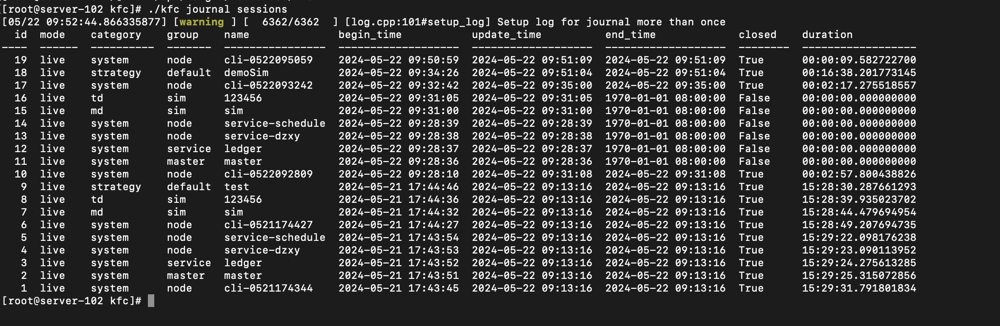
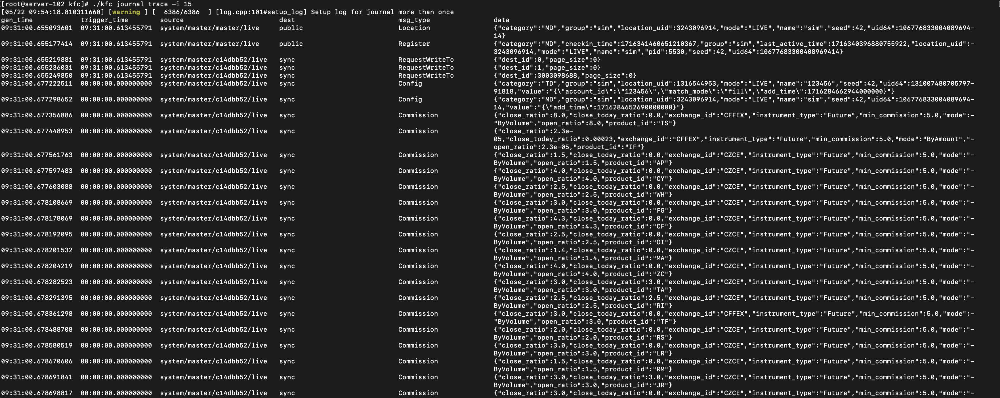
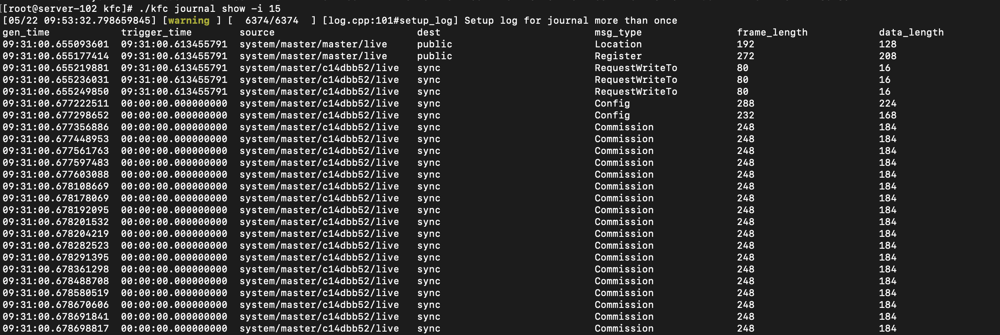

================
模块功能
================

==========================================

kfs模块功能
==============

|   kfs是基于Python和JavaScript封装的可执行程序，其作用是辅助管理插件的编译，
    只需要写好package.json文件的配置信息，执行kfs extension build就可以自动识别插件的代码类型是cpp还是python，
    自动生成CMakeLists.txt文件，根据配置编译生成CPython模块或可执行程序。

kfs文件路径
------------------

::

    Windows: {kungfu安装目录}/resources/kfc/kfs.exe

    Linux: {kungfu安装目录}/resources/kfc/kfs

    MacOS: {kungfu安装目录}/Contents/Resources/kfc/kfs

.. tip:: 
  
  Windows与MacOS版本可通过图形化界面的菜单栏, **文件->打开功夫安装目录**, 可以直接打开 **{kungfu安装目录}/resources** 目录

------------------

extension模块
----------------

.. include:: kfs/extension_module.rst

kfc模块功能
==============

  kfc: 用于启动功夫功夫进程

kfc文件路径
------------------

::

    Windows: {kungfu安装目录}/resources/kfc/kfc.exe

    Linux: {kungfu安装目录}/resources/kfc/kfc

    MacOS: {kungfu安装目录}/Contents/Resources/kfc/kfc

linux下的journal数据读取
-----------------------------

  journal文件是功夫交易系统中记录进程行为的数据文件。journal文件具有极其丰富的数据信息，如Quote行情信息中记录了档位报价详细信息，可用于盘后复盘。

获取sessions列表 
^^^^^^^^^^^^^^^^^^^^^^^

::

    $ ./kfc journal sessions 

数据详情展示 
^^^^^^^^^^^^^^^^

::

    $ ./kfc journal trace -i session_id 

数据展示 
^^^^^^^^^^^^

::

    $ ./kfc journal show -i session_id 

进程启动
------------

  进程分为主进程 , 柜台进程 , 策略进程

主进程启动
^^^^^^^^^^^^

  主进程分为 : master (主控进程), ledger (计算进程)

::

    $ ./kfc -l info run -c system -g master -n master -m live 

.. note:: 参数介绍
  
  -l : 是日志级别, 共有5个级别: trace , debug , info , warning , error , critical

  -c : 进程类别:  system 

  -g : 组:  master进程为 master ; ledger 进程为 service

  -n : 名称: master (主控进程), ledger (计算进程)

  -m : 启动模式: live (实时交易) 

柜台进程启动
^^^^^^^^^^^^^^^^^

  柜台进程为: 交易账户进程(TD) , 行情源进程(MD)

::

    # 比如: 启动账户为123456的sim测试柜台的交易账户进程
    $ ./kfc -l info run -x '/opt/Kungfu/resources/app/kungfu-extensions/sim/' -c td -g sim -n 123456 -m live

    # 比如: 启动sim测试柜台的行情源进程
    $ ./kfc -l info run -x '/opt/Kungfu/resources/app/kungfu-extensions/sim/' -c md -g sim -n sim -m live

.. note:: 参数介绍
  
  -l : 是日志级别, 共有5个级别: trace , debug , info , warning , error , critical

  -x : 柜台插件模块路径(绝对路径),比如上面例子中的sim柜台,柜台插件所在路径为 "/opt/Kungfu/resources/app/kungfu-extensions/sim/" 

  -c : 进程类别: 交易进程为 td ; 行情进程为 md 

  -g : 组: sim(测试柜台) 

  -n : 名称: sim

  -m : 启动模式: live (实时交易) 

策略进程启动
^^^^^^^^^^^^^^^^^

::

    $ ./kfc -l info run -c strategy -g default -n test '/home/sim.py' -m live 

.. note:: 参数介绍
  
  -l : 是日志级别, 共有5个级别: trace , debug , info , warning , error , critical

  -c : 进程类别: 策略进程为 strategy

  -g : 组: 策略为 default

  -n : 名称: 策略ID 

  -m : 启动模式: live (实时交易) 

  策略路径为绝对路径
