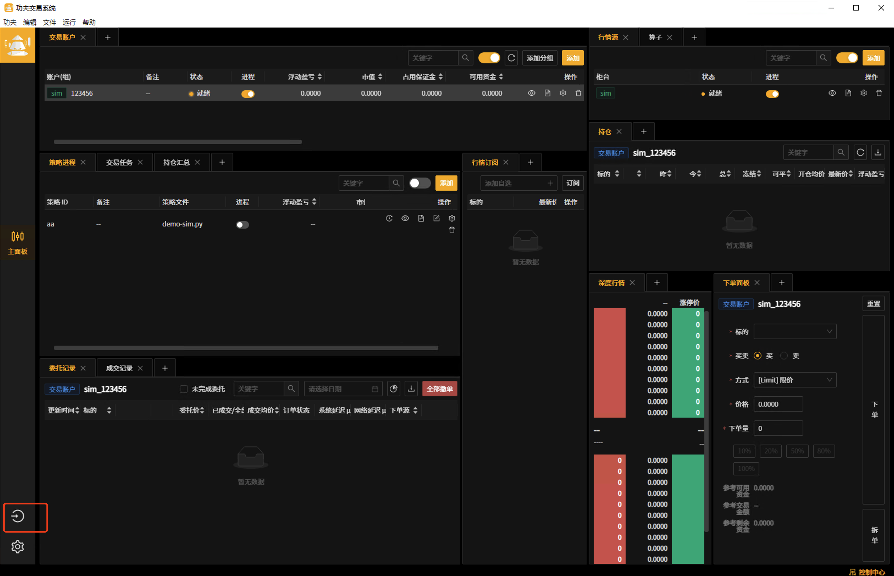

天山算力
======================

.. note:: 功夫高精回测的优势 

   - **全场景覆盖的自研撮合引擎** ：优秀的撮合与 tick 级数据使得回测结果能够与实盘结果无限接近，功夫提供自研回测撮合引擎对 集合竞价撮合、换日委托失效、分笔成交、涨跌停过滤等场景均有覆盖，更加精准地模拟策略表现，接近实盘表现。
   - **高质量行情数据** ：使用经过深度清洗处理的高质量逐笔行情数据，用户无需再经历繁琐的数据预处理阶段。
   - **高效存储与执行机制** ：搭载自研易筋经内存数据库，利用共享内存实现数据高速存取，避免频繁磁盘操作。系统仅需即时读取内存数据，可逼近 IO 极限，显著提升回测效率，缩短回测用时。
   - **无缝对接实盘交易** ：回测使用与实盘一致的数据流。回测结束后，策略代码无需调整即可直接应用于实盘环境。免去代码转写的繁琐。
   - **私有化部署与定制扩展能力** ：功夫回测支持本地私有化部署，保障策略安全。同时，撮合引擎、数据工具及回测报告等多个模块均支持自定义开发，满足个性化需求。如有合作意向或咨询需求，欢迎 `联系我们 <https://www.kungfu-trader.com/index.php/consult/>`_  。

命令行回测
---------------

    可以使用kfc模块在命令行进行回测

kfc文件路径
~~~~~~~~~~~~~

::

    Windows: {kungfu安装目录}/resources/kfc/kfc.exe

    Linux: {kungfu安装目录}/resources/kfc/kfc

    MacOS: {kungfu安装目录}/Contents/Resources/kfc/kfc

.. tip:: 
  
  Windows与MacOS版本可通过图形化界面的菜单栏， **文件->打开功夫安装目录**， 可以直接打开 **{kungfu安装目录}/resources** 目录

使用说明
~~~~~~~~~~~~~

登录
^^^^^^^^

    必须先完成登录才能进行后续操作

::

    kfc -s {stage} login -A {phone}

    # stage: 回测环境， 默认为 "prod"
    # phone: 登录手机号

例如 : 

    以安装在Windows电脑为例，安装目录为下载(Downloads)目录下

::

    C:\Users\kf\Downloads\kungfu\resources\kfc\kfc.exe login -A 18686868886

    # 然后填写验证码，回车完成登录

提交回测
^^^^^^^^^^

::

    kfc -s {stage} backtest submit -f {strategy} -b {begin_time} -e {end_time} -l {level}

    # stage: 回测环境， "prod"
    # strategy: 策略所在路径，建议绝对路径
    # begin_time: 开始时间， 如: 2023-01-03
    # end_time: 结束时间， 如: 2023-01-31 
    # level: 数据， "level1" 或 "level2"

例如 : 

    以安装在Windows电脑为例，安装目录为下载(Downloads)目录下; 策略路径为桌面的Strategy/strategy_demo/文件夹下

::

    C:\Users\kf\Downloads\kungfu\resources\kfc\kfc.exe -s "prod" backtest submit -f C:\Users\zmc\Desktop\Strategy\strategy_demo\MAStrategy.py -b 2023-01-03 -e 2023-01-31 -l "level2"

查看回测可用数据
^^^^^^^^^^^^^^^^

    跟提交回测submit里的开始时间-b，结束时间-e强相关

::

    kfc -s {stage} backtest datarange   

    # stage: 回测环境，"prod"

例如 : 

    以安装在Windows电脑为例，安装目录为下载(Downloads)目录下

::

    C:\Users\kf\Downloads\kungfu\resources\kfc\kfc.exe -s "prod" backtest datarange   

.. image:: _images/datarange.png

因子数据
-------------

    获取因子数据

.. note:: 

   - 需要先登录

     - kungfu客户端直接登录
     - 命令登录

   - 获取的数据为每日提供的精选因子数据

   - 可在 jupyter notebook中运行

     - 建议在Anaconda环境中运行，Python为3.9版本
     - 下载jupyter notebook，如: pip install jupyter notebook   
     - 下载安装kungfu.whl文件，如: pip install {kungfu安装目录}\resources\kfc\kungfu-wheel\kungfu-x.x.x-cp39-cp39-win_amd64.whl
     - 运行 jupyter notebook，如: python -m jupyter notebook

登录客户端
~~~~~~~~~~~~~

(1) 点击左侧边栏“登录功夫”按钮

(2) 选择“登录功夫”

(3) 输入手机号、验证码, 点击确认完成登录

模块引用
~~~~~~~~~~~~~

    引用kungfu模块

::

    from kungfu.serverless.store import FeatureStore

选择环境
~~~~~~~~~~~~~

::

    fs = FeatureStore("prod")

登录账户
~~~~~~~~~~~~~

    手机号、验证码登录方式(客户端登录后可不用再次登录)

::

    fs.login(18686868886)

因子类型获取
~~~~~~~~~~~~~

::

    fs.list_public_features()

    # [{'key': 'examples-cross-section-factor', 'name': '横截面多因子'}, {'key': 'main-inflow-factor', 'name': '主力流入因子'}]

因子时间范围获取
~~~~~~~~~~~~~~~~~

::

    fs.get_public_feature_date_range("main-inflow-factor")

    # 获取 主力流入因子 的时间范围
    # [datetime.datetime(2023, 1, 5, 0, 0), datetime.datetime(2023, 1, 4, 0, 0)]

因子数据获取
~~~~~~~~~~~~~

::

    fs.get_public_feature_data("main-inflow-factor")

    # 获取 主力流入因子 在其时间段内的数据
