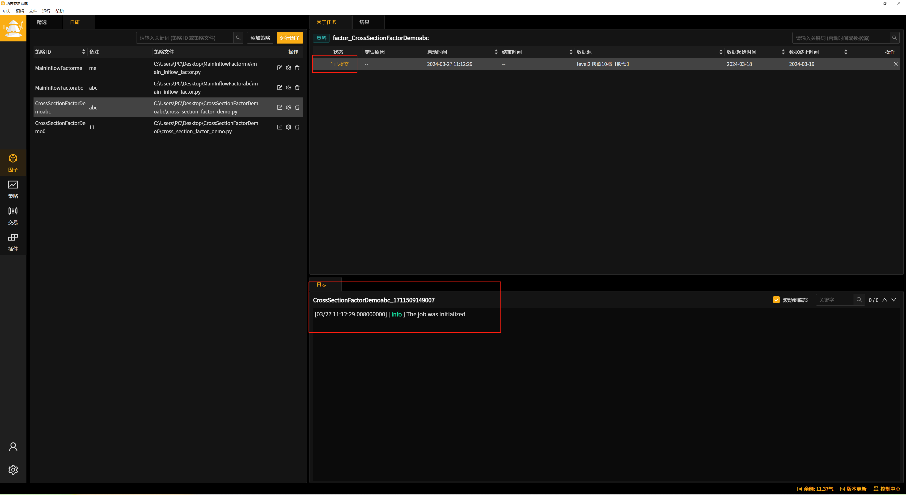
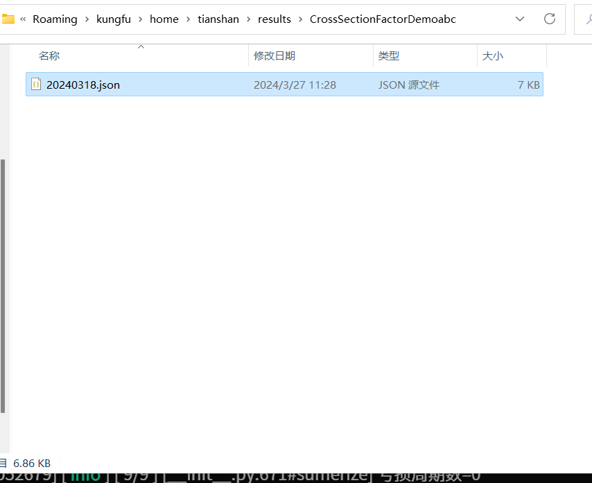
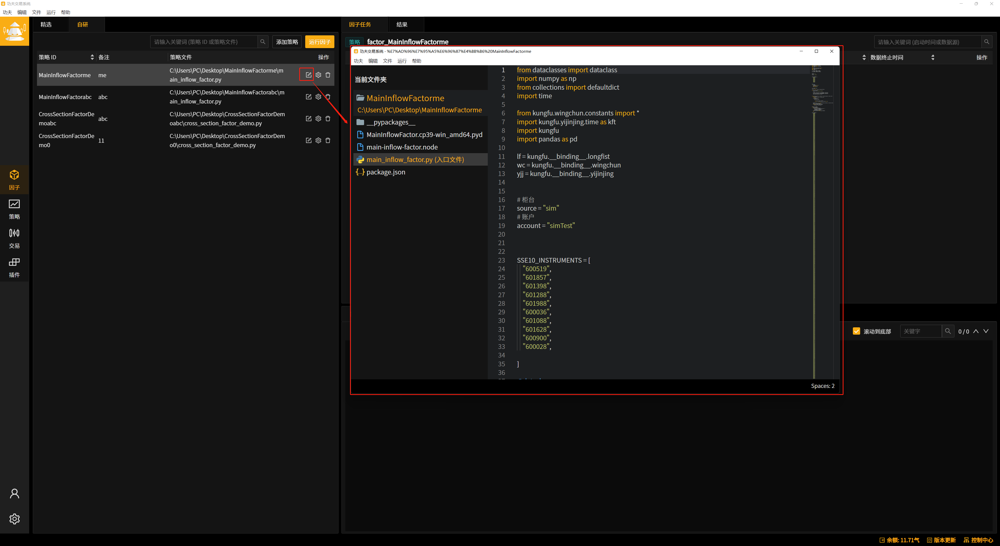

天山算力
======================

因子研究
-----------

功夫因子研究的优势
~~~~~~~~~~~~~~~~~~~

.. note:: 功夫因子挖掘的优势 

   - **高精度数据免费提供** ：提供市面上最高精度Level 2快照十档/逐笔数据，助力挖掘因子。

   - **轻松融入现有工作流** ：兼容已有固定工作流，支持功夫中运行回测任务，其他环境（如notebook）通过接口调用结果。无需全面替换现有工作流。

精选因子是什么
~~~~~~~~~~~~~~~~~~

.. note:: 精选因子是什么？
    
    - 精选因子是功夫官方提供的因子示例，功夫每天将定时更新精选因子的数据，欢迎关注！

    - 通过“一键自研”可以下载精选因子源码，参考源码写出你自己的alpha因子！

【客户端】获取因子结果
~~~~~~~~~~~~~~~~~~~~~~~~~~~

精选因子
^^^^^^^^^^^^^^^^^^

(1) 点击左侧边栏“因子” 进入因子界面

(2) 在“精选列表”中选择自己想查看的因子

(3) 选择日期，查看对应日期的结果

自研因子
^^^^^^^^^^^^^^^^^^

(1) 在“自研”面板点击“添加策略”添加因子策略，若已添加，请跳到下一步

(2) 选中想运行的因子任务，点击“运行因子”

(3) 选择想运行的因子日期、数据源，点击确定

(4) 任务提交后，将实时更新任务状态、日志。

(5) 状态变为“已完成”，点击“结果”面板

(6) 点击“查看结果”，查看对应日期的因子结果

.. attention:: 每个因子策略 **仅保留每个日期的最新结果** ，如需对比因子数据，请手动保存每次的运行结果！

    

【命令行】获取因子结果
~~~~~~~~~~~~~~~~~~~~~~~~~~~~~

.. note:: 支持在jupyter notebook中获取精选/自研因子结果、运行因子任务

    - 建议在Anaconda环境中运行，Python为3.9版本

    - 下载jupyter notebook，如: pip install jupyter notebook   

    - 下载安装kungfu.whl文件，如: pip install {kungfu安装目录}\resources\kfc\kungfu-wheel\kungfu-x.x.x-cp39-cp39-win_amd64.whl

    - 运行 jupyter notebook，如: python -m jupyter notebook

模块引用
^^^^^^^^^

    引用kungfu模块

::

    import kungfu
    from kungfu.serverless.store import FeatureStore

选择环境
^^^^^^^^^^^

::

    fs = FeatureStore("prod")

登录账户
^^^^^^^^^^^

    手机号、验证码登录方式(客户端登录后可不用再次登录)

::

    fs.login(18686868886)

精选因子
^^^^^^^^^^^

获取精选因子列表
++++++++++++++++++

::

    fs.list_public_features()

    # 接口返回精选因子列表，如下，想查看的精选因子使用key值调用
    # [{'key': 'examples-cross-section-factor', 'name': '横截面多因子'}, {'key': 'main-inflow-factor', 'name': '主力流入因子'}]

获取精选因子可调用结果范围
+++++++++++++++++++++++++++

::

    fs.get_public_feature_date_range(key)
    
    # 例如 : fs.get_public_feature_date_range("main-inflow-factor")
    # 说明 : 接口返回以下内容：表示主力流入因子有20230105、20230104两日的数据
    # 结果 : [datetime.datetime(2023, 1, 5, 0, 0), datetime.datetime(2023, 1, 4, 0, 0)]

获取精选因子数据
++++++++++++++++++
::

    fs.get_public_feature_data(key)

    # 例如 : fs.get_public_feature_data("main-inflow-factor")
    # 说明：获取 主力流入因子 在设定日期内的数据

自研因子
^^^^^^^^^^^

.. note:: 

    - 获取自研因子的前提是在客户端上运行了自研因子

获取自研因子列表
++++++++++++++++++

::

    fs.list_features()

    # 说明 : 接口返回自研因子列表如下，想查看的自研因子使用key值调用(key为策略ID)
    # 结果 : [{'key': '111', 'name': '111'}, {'key': 'CrossSectionFactorDemo', 'name': 'CrossSectionFactorDemo'}]

获取自研因子可调用结果范围
++++++++++++++++++++++++++++++++++++

::

    fs.get_feature_date_range(key)
    
    # 例如 : fs.get_feature_date_range("CrossSectionFactorDemo")
    # 说明 : 获取key为 CrossSectionFactorDemo 这个策略的
    # 结果 : [datetime.datetime(2024, 3, 14, 0, 0), datetime.datetime(2024, 3, 18, 0, 0)]

获取自研因子数据
++++++++++++++++++
::

    fs.get_feature_data(key)

    # 例如 : fs.get_feature_data("CrossSectionFactorDemo")
    # 说明 : 获取key为 CrossSectionFactorDemo 这个策略的

获取精选因子源码
~~~~~~~~~~~~~~~~~~~~~~~~~~

精选因子源码支持拷贝到本地，可以通过源码参考写法/修改参数改造为自己的alpha！

(1) 在“精选”面板，选中想拷贝的 **精选因子**

(2) 点击 **一键自研，选择保存路径，填写备注** ，点击确定

(3) 精选因子源码已拷贝成功，可在客户端内点击“编辑”查看源码

